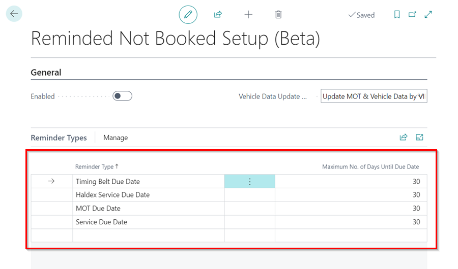
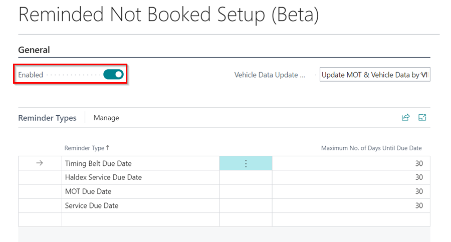
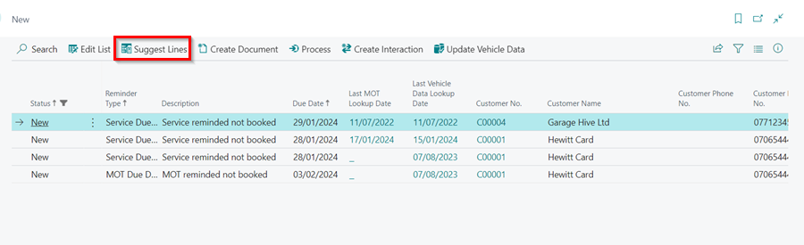
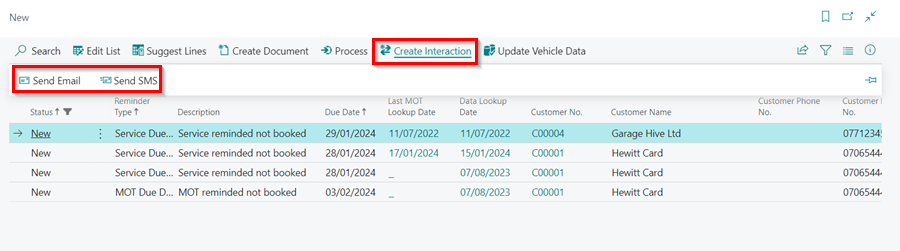
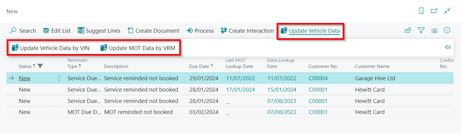

# We are still working on this article!
We are currently reviewing this article before it is published, check back later.

# Setting up Reminders for "Reminded Not Booked" Notifications
The primary goal of sending reminders to customers is to prompt them to book the service they were notified about. However, in some cases, the customer may not book as expected and require further follow-up. This is where the **Reminded Not Booked** setup is useful. It creates notifications within the system to help you keep track of which customers need follow-up action regarding their booking.

## In this article
1. [Reminded Not Booked Set Up](#reminded-not-booked-set-up)
2. [Reviewing Reminded Not Booked Tiles](#reviewing-reminded-not-booked-tiles)

### Reminded Not Booked Set Up
This setup can be only be done by a **System Admin**. To Setup the **Reminded Not Booked** Setup:
1. In the top right corner, choose the  icon, enter **Reminded Not Booked Setup**, and select the related link.

   

2. In the **Reminded Not Booked Setup** page, select the **Reminder Type** that you want to setup.
3. The **maximum number of days until the due date** will be automatically retrieved from the system, but you can adjust it if necessary. 
4. In the **Check reminders sent within the last No. of days** field, specify the number of days you would like to receive a **Reminded Not Booked** notification after the initial reminder has been sent.

   

5. Then, in the **General** FastTab, you have the option to choose the **Vehicle Data Update Method** for when the **Reminded Not Booked** notification is sent.
   - **None**: No vehicle data updates will occur when this option is selected.
   - **Update MOT**: Vehicle data will be updated for the MOT Due Date only. Standard lookup charges will apply.
   - **Update MOT & Vehicle Data by VIN**: All vehicle data for the service dates will be updated using the vehicle VIN. Standard lookup charges will apply. 

      

6. Once you've completed the setup, click the **Enabled** slider to enable the setup in the system.

   

[Go back to top](#top)

### Reviewing Reminded Not Booked Tiles
1. When the **Reminded Not Booked Setup** is enabled, you'll see the following tiles under the **Reminded Not Booked** heading in your Role Centre.

   

2. In the **New** tile, you'll find the recently sent **Reminded Not Booked** notifications and in the **In Process** tile, you'll find the **Reminded Not Booked** notifications that you've already begun working on.
3. Click on the **New** tile to view the reminders.
4. From the menu bar, there are several actions to use. When you click on the **Suggest Lines**, it refreshes the notifications to retrieve new ones.

   

5. To create a new document for the customer, click on the **Create Document** action. You can choose to create an **Estimate** or a **Jobsheet**.

   

6. To move the reminder to the **In Process** tile or mark it as closed, select **Process** and choose either **Set In Process** to move it to the **In Process** tile, or **Mark as Closed** to close it.

   

7. To send an Email or SMS to the customer, select **Create Interaction** and choose **Send Email** to send an email or **Send SMS** to send an SMS to the customer. To learn more on how to use the emailing feature, click [here](/docs/garagehive-using-emailing-feature.html#using-the-emailing-feature){:target="_blank"}.

   

8. To add a review comment in the reminder, scroll to the left of the reminders to the **Review Comment** column, and click on the line in which you want to add the comment. A comment pop-up box will appear, where you can write your comment and close it.

   

[Go back to top](#top)

