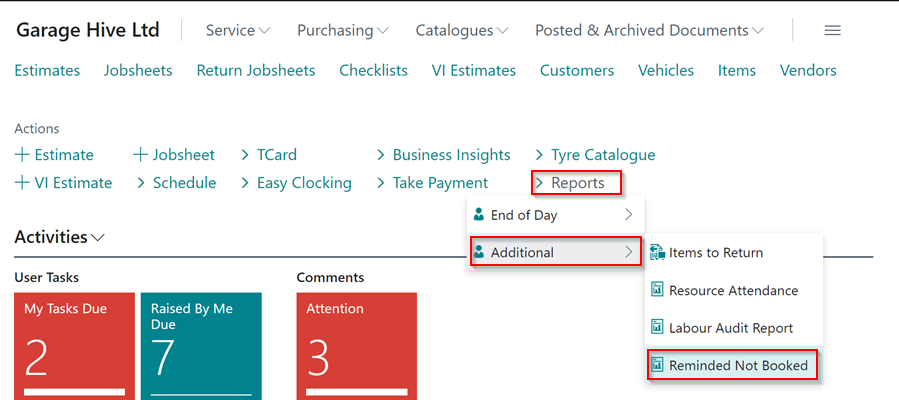
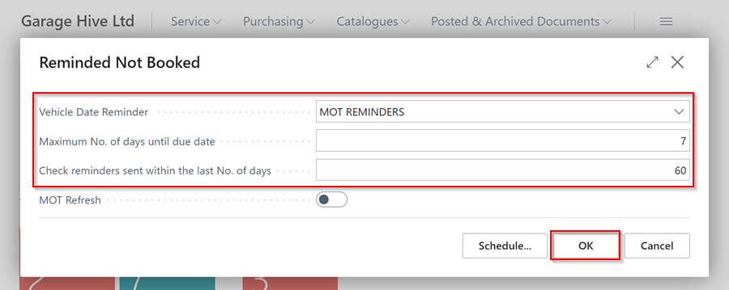
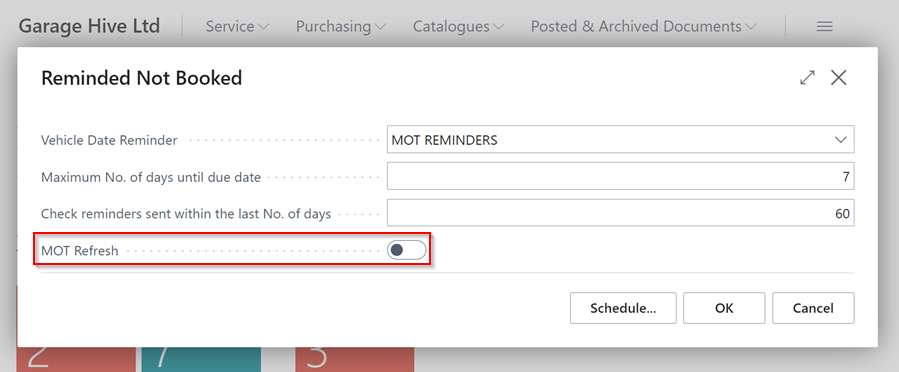

# View the Report on Reminders Sent and Not Booked
This report enables you to view the **Booking Reminders** that have been sent, and they haven't been booked. To view this report:
1. From the home page, select **Reports**, followed by **Additional** and then **Reminded Not Booked**.

   

2. Select the **Booking Reminder** that you want to view the report on in the **Vehicle Date Reminder** field. For a reminder to appear in this list, it has to be **Enabled**.
3. Enter the number of days until the reminder is due in the **Maximum No. of Days until due date** field.
4. Enter the period within which you sent the reminders in the **Check reminders sent within the last No. of days**. Click **OK**.

   

5. If you want to refresh the **MOT** Data when running the **MOT Reminders** report, select the **MOT Refresh** slider.

   

[Go back to top](#top)