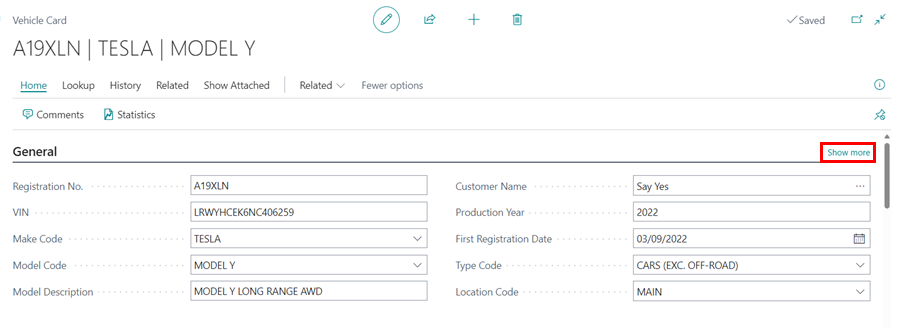
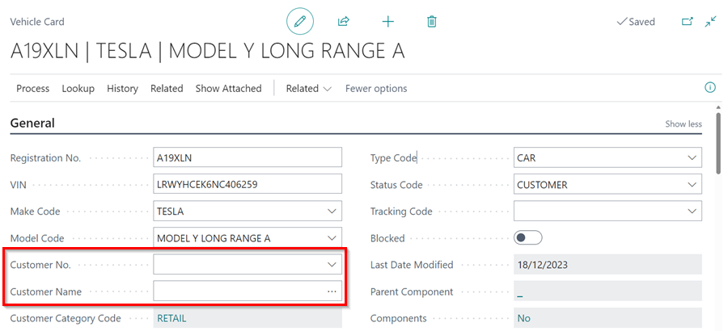
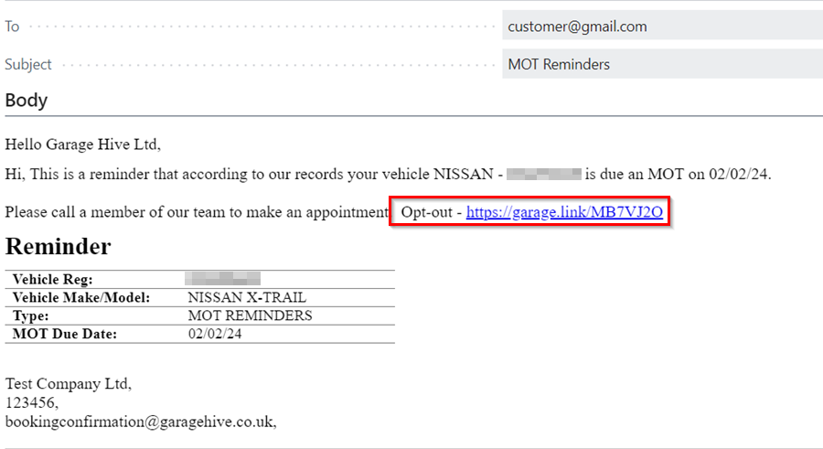
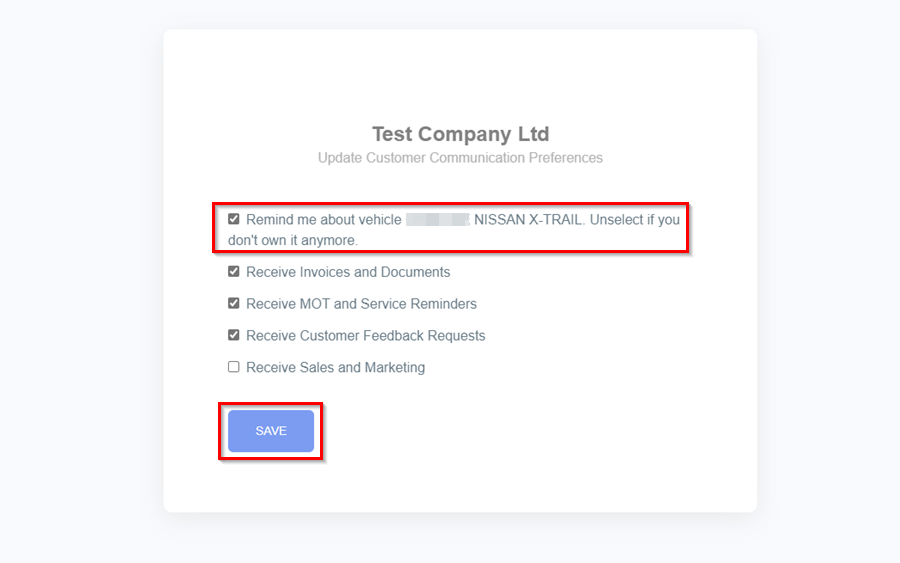

# How to Remove Customer Ownership of a Vehicle from Garage Hive
When a vehicle changes ownership, the previous owner may still receive reminders about the vehicle, even if they are no longer the owner. There are two ways to remove the customer ownership of a vehicle.
1. [From the Vehicle Card](#removing-customer-ownership-from-the-vehicle-card)
2. [Customer Opt Out Link](#using-the-customer-opt-out-link-in-the-reminder-message)

## Removing Customer Ownership From the Vehicle Card
 Here's how to remove the ownership from the vehicle:

1. Open the **Vehicle Card** in which the the ownership of the vehicle has changed, by selecting it from the Vehicles list in the Role Centre.

   

2. If you can't see all the details in the Vehicle card, click on **Show More** on the **General** FastTab located on the right-hand side. 

   

3. Scroll down to the **Customer No.** field and delete the customer that is currently associated with the vehicle.

   

4. This will remove the customer from the ownership of the vehicle and they will no longer receive reminders related with the vehicle.

[Go back to top](#top)

## Using the Customer Opt Out Link in the Reminder Message
1. When customers receive email or SMS reminders, they can use the **Opt-Out Link** to indicate they no longer own the vehicle.

   

2. The customer should deselect the first option if they no longer own the vehicle and click **Save**.
  
   

[Go back to top](#top)