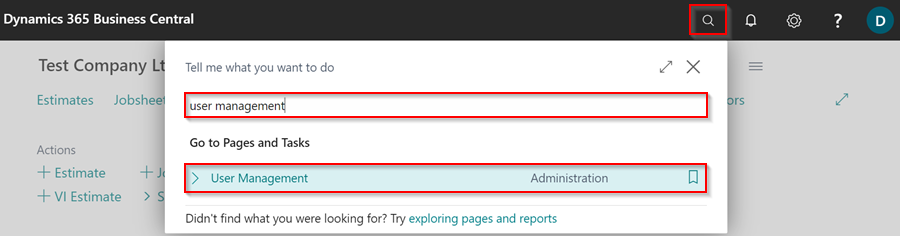
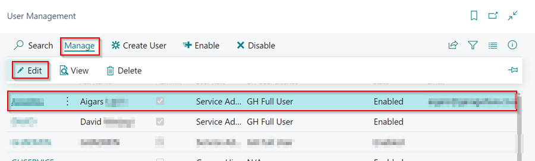
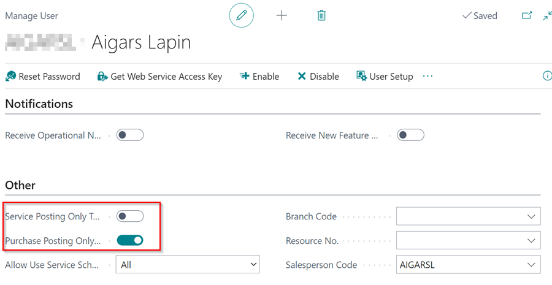

## Removing and Adding Posting Restrictions
Garage Hive is set up by default with a posting restriction for both Sales and Purchase Invoices. This is done to prevent documents from being posted to the original document date rather than the actual date when they are posted to the ledgers. 

This can be removed, but it is recommended that you return the restriction once you have completed any rectification work. 

### To remove the posting restriction:
1. In the top right corner, choose the  icon, enter **User Management** and select the related link. 

   

2. Select the relevant user name from the list who needs the restriction removed, and then select **Manage** followed by **Edit** from the menu bar.

   

3. Scroll down to the **Other** FastTab on the **Manage User** page to find the **Service Posting Only Today** and **Purchase Posting Only Today** sliders. By removing this slider option, the User will now be able to post a document to a previous date. 

   

### To return the posting restriction:

1. Confirm that the sliders for **Service Posting Only Today** and **Purchase Posting Only Today** have been reselected.  


