

# Re-ordering Policies and Requisition Worksheets
Reordering policies and requisition worksheets help manage your stock by suggesting **Items to Order** and creating purchase orders based on your available inventory.

## In this article
1. [Setting up the Item Card](#setting-up-the-item-card)
2. [Setting up the Item Card for multiple locations](#setting-up-the-item-card-for-multiple-locations)
3. [Using the Requisition Worksheet Express](#using-the-requisition-worksheet-express)
4. [Setting up Automatic Recalculation](#setting-up-automatic-recalculation)

### Setting up the Item Card
To use the requisition worksheet you must first setup the item cards:
1. Open the **Item Card** to setup and scroll down to the **Planning** FastTab. 
2. Set the **Reordering Policy** field to **Maximum Qty** from the available options; this will enable the **Reorder Point** field.
3. The **Reorder Point** is the quantity at which the Item must be reordered. This is the data that the Garage Hive system will use to recommend an order. Add the quantity.
4. You do not need to enter your **Maximum Inventory**. 

   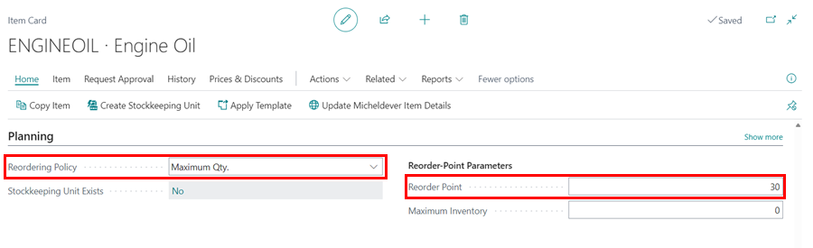

[Go back to top](#top)

### Setting up the Item Card for multiple locations
1. For garages with multiple locations with different **Reorder Points**, you can use the **Stockkeeping Units** feature to specify different **Reorder Points**.
2. From the **Item Card's** menu bar, select **Related** (click **More Options** to view **Related** if not visible), followed by **Warehouse**, and choose **Stock Keeping Units**.

   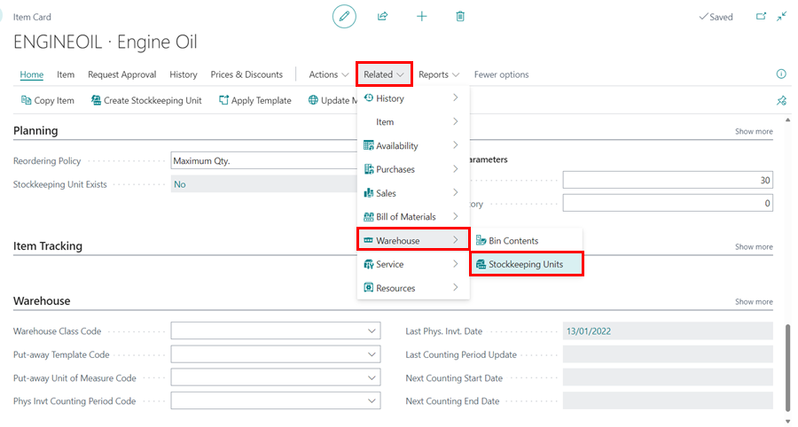

3. Select **New**, to create a new **Stockkeeping Unit**, which functions similarly to the item card for the same item but per location.

   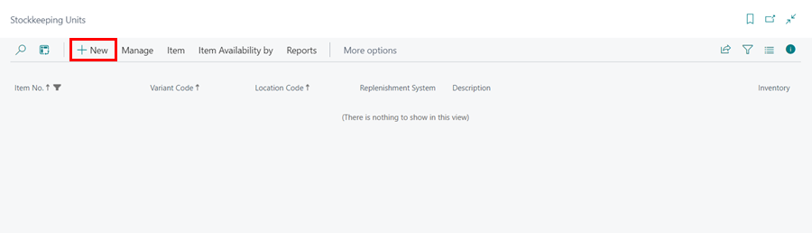

4. Select the location to specify the **Reorder Point** in the **Location Code** field.

   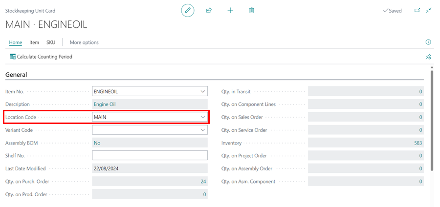

5. Scroll down to the **Planning** FastTab and select **Maximum Quantity** as the **Reordering Policy** and enter the quantity at which to place an order in the **Reorder Point** field.

   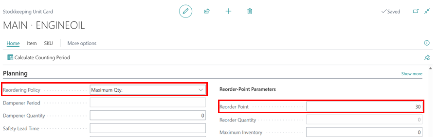

6.  Repeat steps **3**, **4**, and **5** for all the locations.

## Using the Requisition Worksheet Express
The **Requisition Worksheet** can be accessed from the Service Advisor's **Role Centre** tiles:
1. Scroll down through the tiles in the **Role Centre**, to the **Purchasing** section, and select **Items to Order** tile.

   

2. From the **Requisition Worksheet Express** Page, select **Calculate Plan** from the menu bar.

   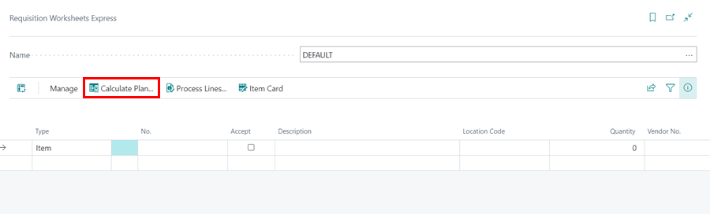

3. If you have multiple sites, select the specific location in the **Location Code** field. Click **Ok**. 

   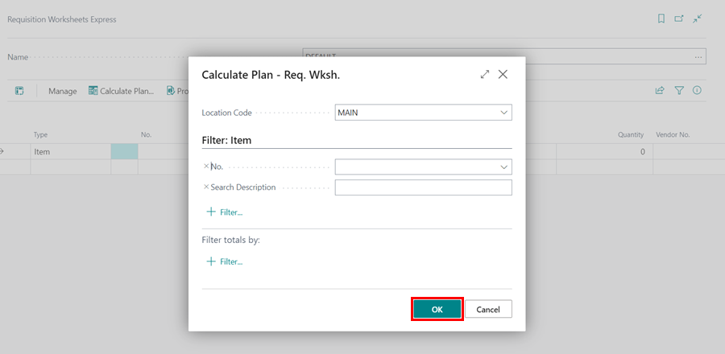 

4. A list of suggested items to be ordered will be generated. The **Item Card** may be accessed from the menu bar, and the **Item Policies** can be viewed from the **FactBox** on the right (if not visible, click on the **FactBox** icon).

   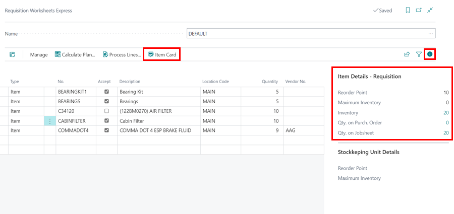

5. Select the checkboxes for the lines you want to process in the **Accept** column, choose a vendor in the **Vendor No.** column, and then choose **Process Lines** from the menu bar. 

   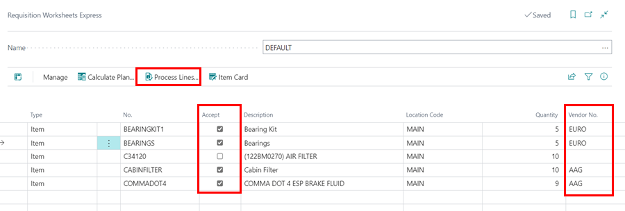

6. Select whether to print the Purchase Orders in the pop-up notification, and click **OK**.

   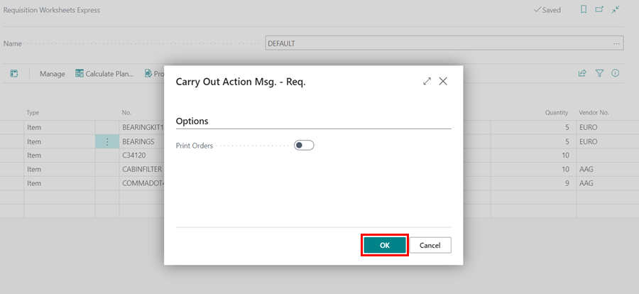

7. Purchase orders for the relevant suppliers will be generated and you can find them in the Purchase Orders list.

[Go back to top](#top)

### Setting up Automatic Recalculation
1. To setup for an automated recalculation of what to order every morning at 4:00am, select **Purchasing** from the **Navigation** menu, then **Requisition Worksheet Express**.

   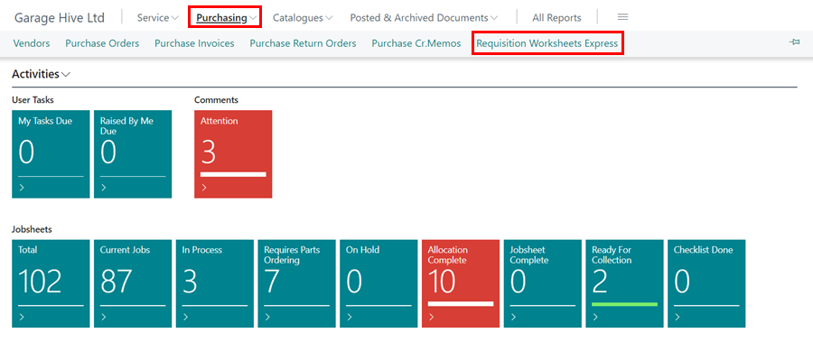

2. Select **Edit List** in the **Requisition Worksheets Express** page.
   
   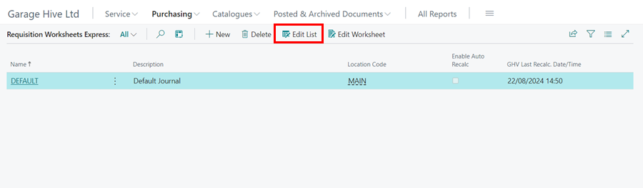

3. Set the **Location Code** and check the **Enable Auto Recalc.** option on the **Default** line.

   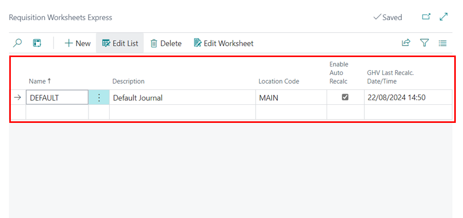

[Go back to top](#top)

### **See Also**

[Video - Requisition Worksheet Express (V1) & Stock Control in Garage Hive](https://www.youtube.com/watch?v=-RptpsLg2kk){:target="_blank"} \
[Set up of the Cues and Actions tiles on the Role Centre](/docs/garagehive-cue-setup.html)
