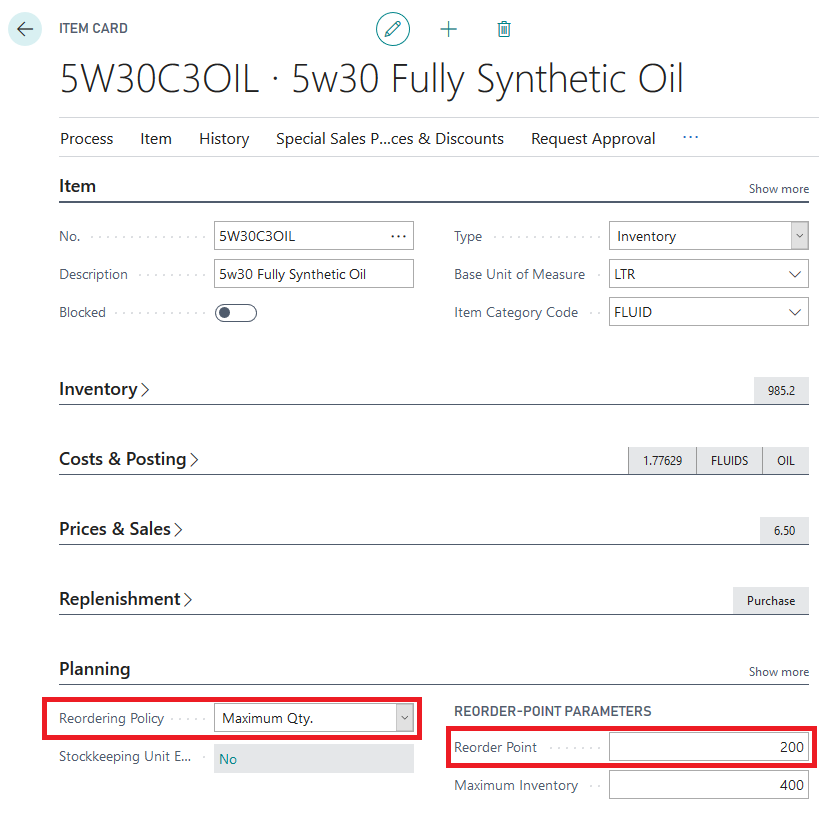
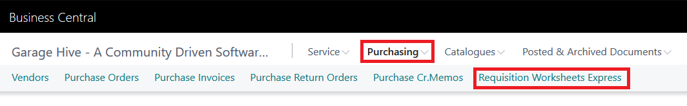
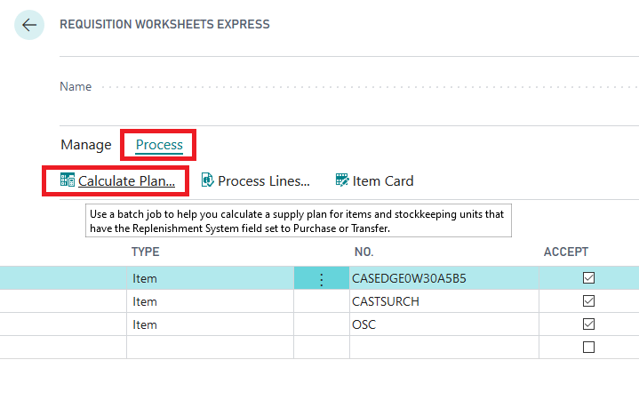
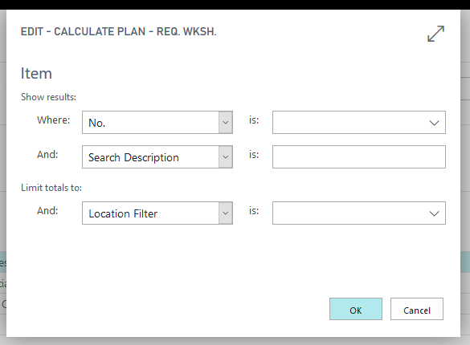
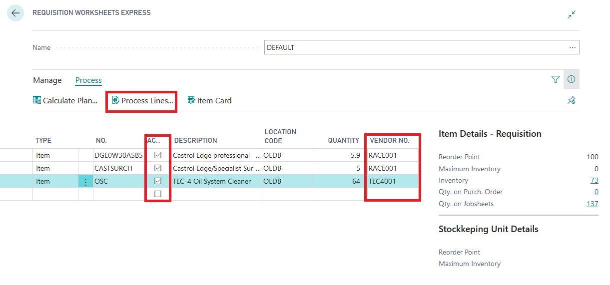



Reordering policies and requisition worksheets will manage your stock, suggest orders and create purhcase orders based on available stock. It is recommended you run the requisition worksheet each day. 

# Setting up the Item Card

To use the requisition worksheet you must first setup the item cards - the setup is simple and can be found under the planning section of the item card. 

The Reordering policy must be set to "Maximum Qty", this will enable the "Reorder Point" field. The Reorder point is the information Garage Hive will use to suggest an order. You do not need to enter your "Maximum Inventory" 

# Using the Requisition Worksheet

The Requisition Worksheet can be accessed from the Service Advisors role centre, select Purchasing -> Requisition Worksheets Express.

Select the Default Journal

Once the Journal has opened, select Process, Calculate Plan. 

If you are single site, leave the filters blanks. 

This will produce a list of recommended orders, accept the lines you want to process, select a vendor and then select Process Lines, this will generate purchase orders for the relevant suppliers. 

You can also access the Item card from the action bar and view the Item Policies from the fact box. 