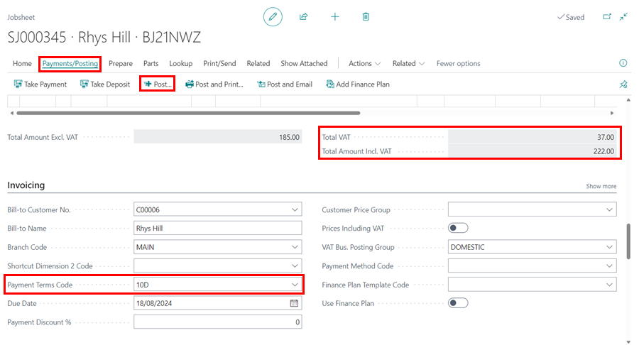

> **Important**:
>
> There are several other ways to return parts to the vendor under warranty, but this is a common method.

## Scenario
You sold the customer a set of PAGID Brake Pads, and three days later, the customer calls the garage to complain that the brake pads that were fitted were squeaking heavily. So, you tell the customer to return the vehicle to change the brake pads to a different type.

### How to return parts to the vendor under warranty
1. Create a jobsheet for the customer as normal, add a **MISC** item for the brake pads, create a **Purchase Order** to order the brake pads, and order in the new brake pads that you will be fitting.

   

2. After receiving the brake pads and completing the job as required, before you post the jobsheet, create [**Return Jobsheet**](garagehive-service-return-order.html) for that customer and the vehicle and enter the labour and parts that you originally fitted. Post the **Return Jobsheet**.

   

3. Now, make the jobsheet you opened for the new set of brakepads the same amount as the posted **Return Jobsheet**, and post the jobsheet with credit terms.

   

4. Open, the customer's account and apply the **Credit Memo** that was generated by posting the **Return Jobsheet** to the invoice that you just posted and therefore the customer's balance is zero.

   

5. You can now create a **Purchase Return Order** for the originally fitted brake pads that were returned to stock when the **Return Jobsheet** was posted, post the return order, and ship the brake pads back to the vendor.

   