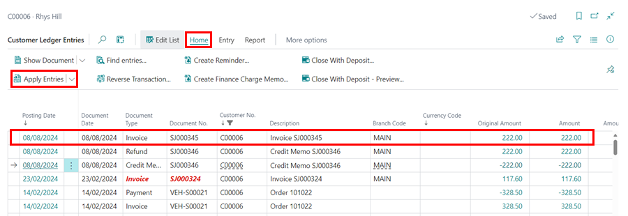
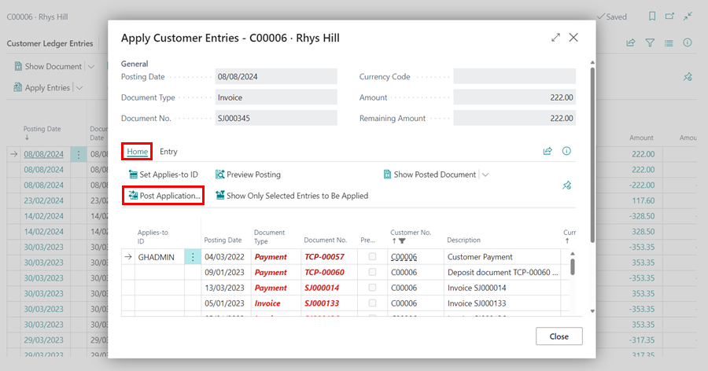



## Scenario
A customer purchased a set of PAGID brake pads, but three days later, they contact the garage to complain about a loud squeaking noise coming from the pads. You instruct the customer to bring the vehicle back to the garage so the brake pads can be replaced with a different type.

## How to Return Parts to the Vendor Under Warranty
1. Start by creating a **Purchase Order** to order the replacement brake pads you’ll be fitting. Once the new brake pads arrive, **Post** the order to confirm receipt.

   

2. Create a Jobsheet for the customer as usual, adding the new brake pads and the associated labour for fitting them.

   

3. After completing the job as required, before you post the **Jobsheet**, create a [**Return Jobsheet**](garagehive-service-return-order.html){:target="_blank"} for that customer and the vehicle. Enter the labour and parts originally fitted, then post the **Return Jobsheet**.

   

4. Adjust the **Jobsheet** for the new brake pads to match the amount on the posted **Return Jobsheet**, then post the Jobsheet using credit terms.

   

5. Open the customer's card to apply the **Credit Memo** generated by the Return Jobsheet to the newly posted invoice, ensuring the customer’s balance is zero.
6. Select **Customer** in the menu bar, then choose **Ledger Entries** from the Customer card.

   

7. In the **Customer Ledger Entries** page, select the invoice you just posted, click **Home** in the menu bar, and then choose **Apply Entries**.

   

7. Click **Home**, then select **Set Applies-to ID**, followed by **Post Application** to complete the process.

   

8. Finally, create a **Purchase Return Order** for the originally fitted brake pads that were returned to stock when the Return Jobsheet was posted. Post the return order and ship the brake pads back to the vendor.

   

   [Go back to top](#top)