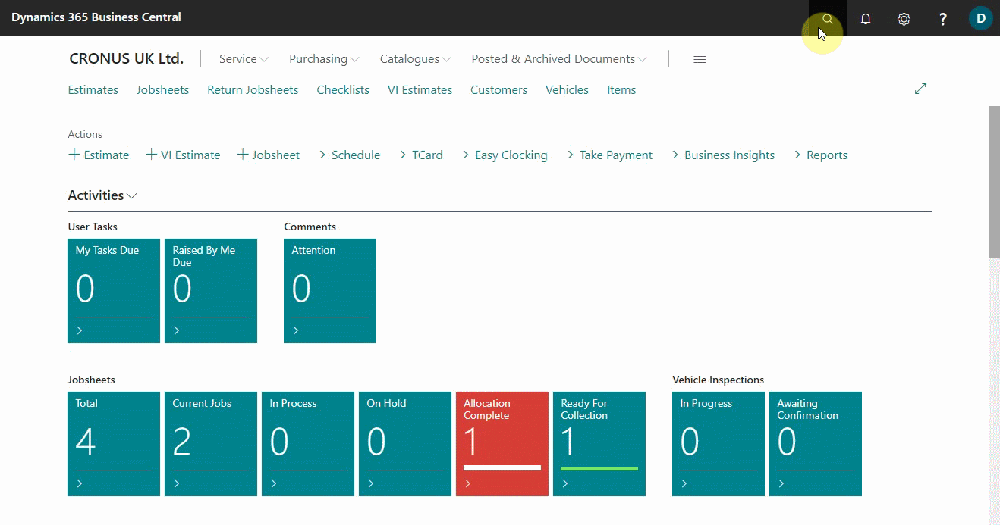
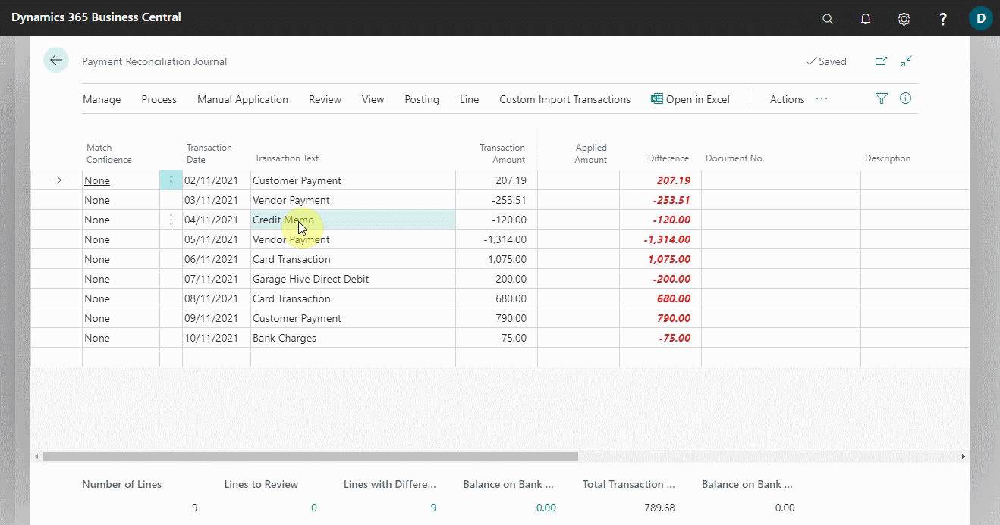
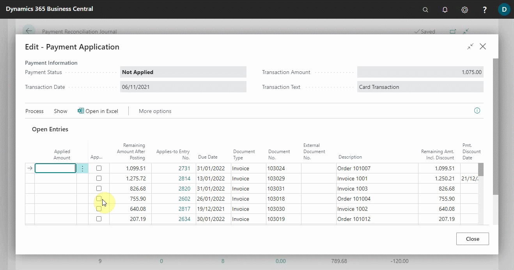
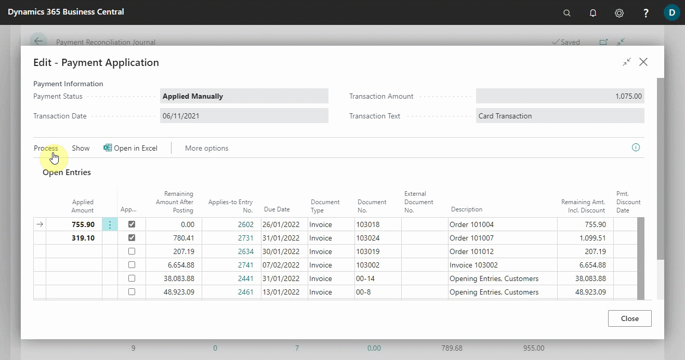

# Review or Apply Payments after Automatic Application 
Some payment applications require your review as defined by the used matching rule, such as lines with Low match confidence. Other lines require your review and manual change because there is a value in the Difference field. The following describes how to review or apply payments after automatic application:
1. Choose the  icon, on the top-right corner, enter **Payment Reconciliation Journals**, and select the related link.
2. Open the payment reconciliation journal for a bank account that you want to reconcile payments for. For more information, see Reconcile Payments Using Automatic Application.

   

3. On the **Payment Reconciliation Journal** page, select a payment that you want to review or manually apply to one or more open entries, and then select **Manual Application** from the actions bar, and choose the **Apply Manually** action.
4. Select the **Applied** check box on the line for the open entry that you want to apply the payment to.
5. The payment amount, which is also shown in the **Transaction Amount** field on the **Payment Application** page, is inserted in the **Applied Amount** field, but you can modify the field, for example if you want to apply the amount to several open entries.

   

6. To apply a part of the paid amount to another open entry for the account, for example to apply a lump-sum payment, select the **Applied** check box for the line. The applied amount is automatically deducted from the transactions amount to reflect the distribution on the two open entries.

   

7. When you have reviewed a payment application or manually applied to one or more open entries, choose the **Accept Application** action.
8. The **Payment Application** page closes, and on the **Payment Reconciliation Journal** page, the value in the **Match Confidence** field is changed to **Accepted** to indicate to you that you have reviewed or manually applied the payment.

   

 

### **See Also**

[Video: How to perform a Payment Reconciliation Journal in Microsoft Dynamics Business Central](https://www.youtube.com/watch?v=WiAnm_VUQVQ){:target="_blank"} \
[Reconcile payments using the automatic application](garagehive-reconcile-payments-using-automatic-application.html) \
[Reconcile payments that cannot be applied automatically](garagehive-reconcile-payments-that-cannot-be-applied-automatically.html) \
[Map text on recurring payments to accounts for automatic reconciliation](garagehive-map-text-on-recurring-payments-to-accounts-for-automatic-reconciliation.html) 