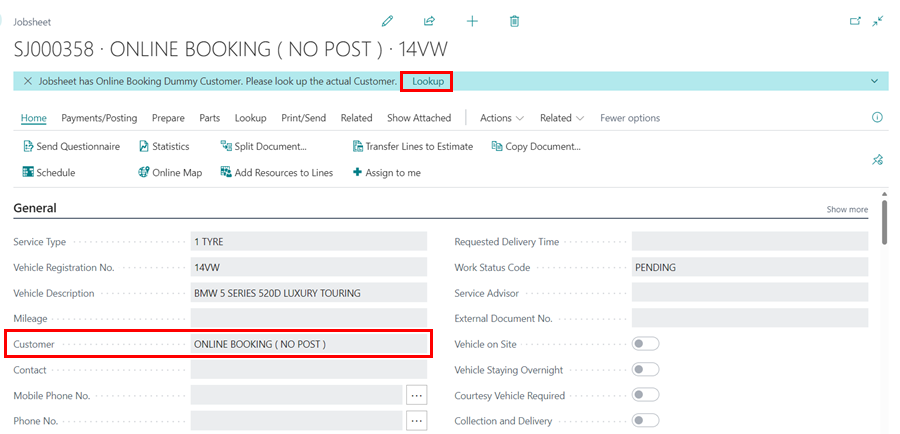
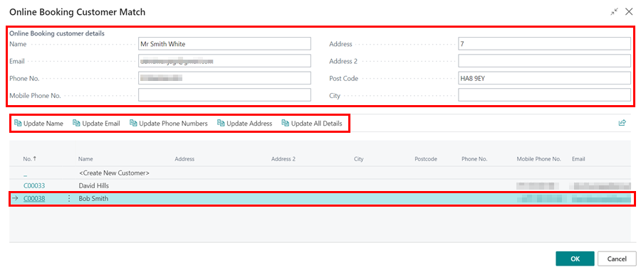
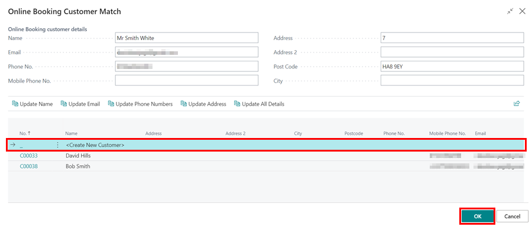

# Reviewing Online Bookings and Enquiries
1. When an **Online Booking or Enquiry** is made, the notification appears in the **To Review** tile under the Online Booking section.

   

2. To view the bookings and enquiries, click on the tile. Each line shows the **Items Booked**, which means the customer created a Jobsheet, and the **Items to Estimate**, which means the customer created an estimate.
3. To open the relevant documents, click on the **Jobsheet No.** or **Estimate No.**.

   

4. Within the document, the system assigns a dummy customer card, **Online Booking (No Post)**. You can update this to the actual customer by clicking **Lookup** in the notification at the top.

   

5. This will open the **Online Booking Customer Match** page, where you have the option to link an existing customer to the document, update details of the existing customer from the online booking, or create a new customer.
6. To update the existing customer’s information, select the customer from the list and choose one of the following options: **Update Name, Update Email, Update Phone Numbers, Update Address, or Update All Details**.
7. The new customer details are show at the **Online Booking Customer Details** section where they can be edited. 

   

8. To create a new customer from the online booking, select the **Create New Customer** option. Click **OK** when done.

   

9. After reviewing a line, select it and choose **Mark as Reviewed** from the menu bar.

   

[Go back to top](#top)