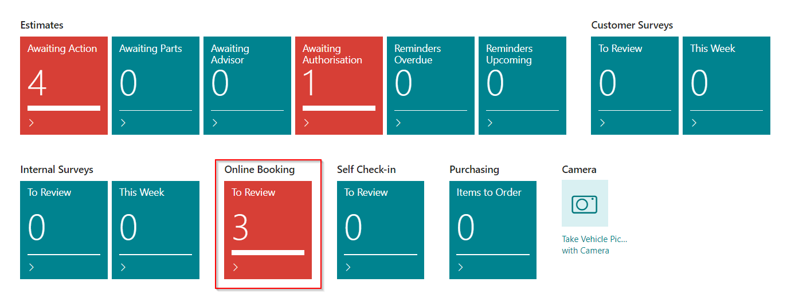
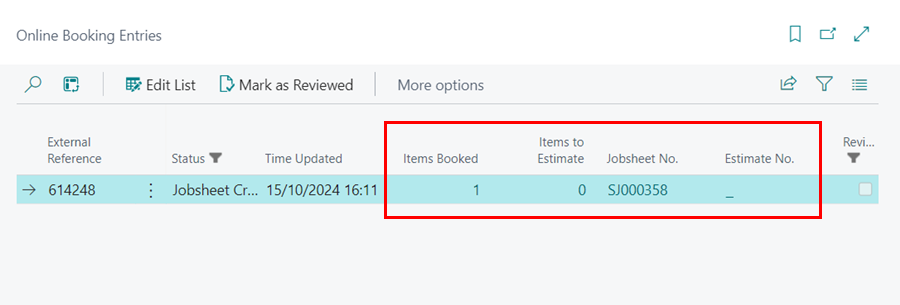
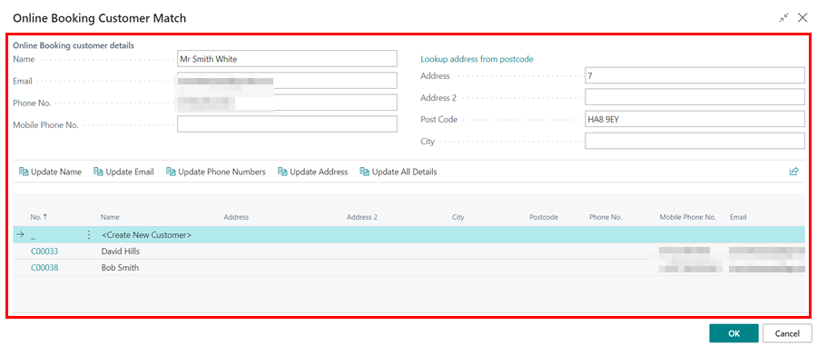
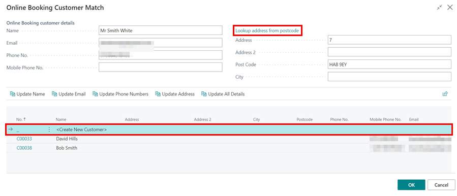
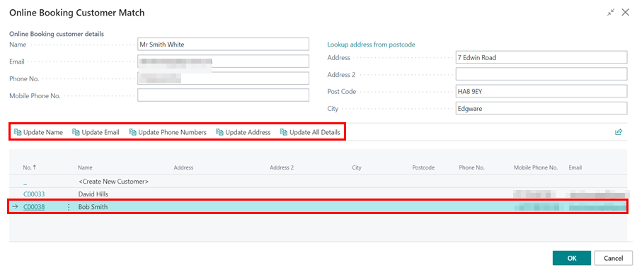
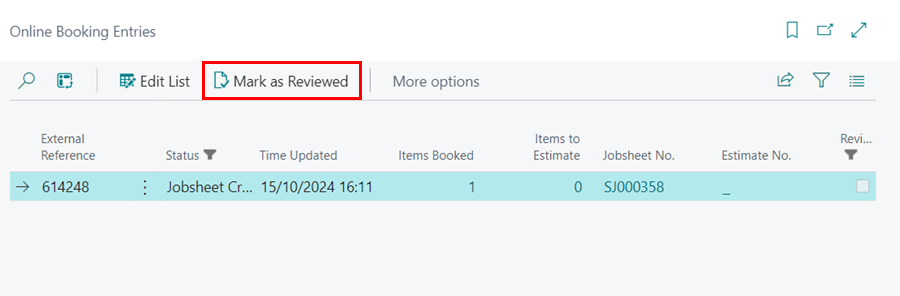

# Reviewing Online Bookings and Enquiries
1. When an **Online Booking or Enquiry** is made, the notification appears in the **To Review** tile under the Online Booking section.

   

2. To view the bookings and enquiries, click on the tile. Each line shows the **Items Booked**, which means the customer created a Jobsheet, and the **Items to Estimate**, which means the customer created an estimate.
3. To open the relevant documents, click on the **Jobsheet No.** or **Estimate No.**.

   

4. Within the document, the system assigns a dummy customer card, **Online Booking (No Post)**. You can update this to the actual customer by clicking **Lookup** in the notification at the top.

   

5. This will open the **Online Booking Customer Match** page, where you have the option to create a new customer, link an existing customer to the document or update details of the existing customer from the online booking.

   

6. The details provided by the customer in online booking form are show at the **Online Booking Customer Details** section where they can be edited.
7. Use the **Lookup address from postcode** to update the customers address.
8. To create a new customer from the online booking details, select the **Create New Customer** option. Click **OK** when done.

   

8. If the customer details from the online booking match an existing customer in the system, select the customer from the list and choose one of the following options: **Update Name, Update Email, Update Phone Numbers, Update Address, or Update All Details**. Click **OK** when done.

   

9. After reviewing a line, select it and choose **Mark as Reviewed** from the menu bar.

   

[Go back to top](#top)