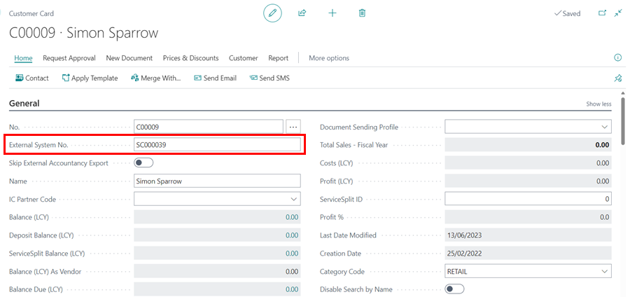
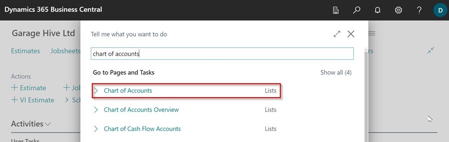
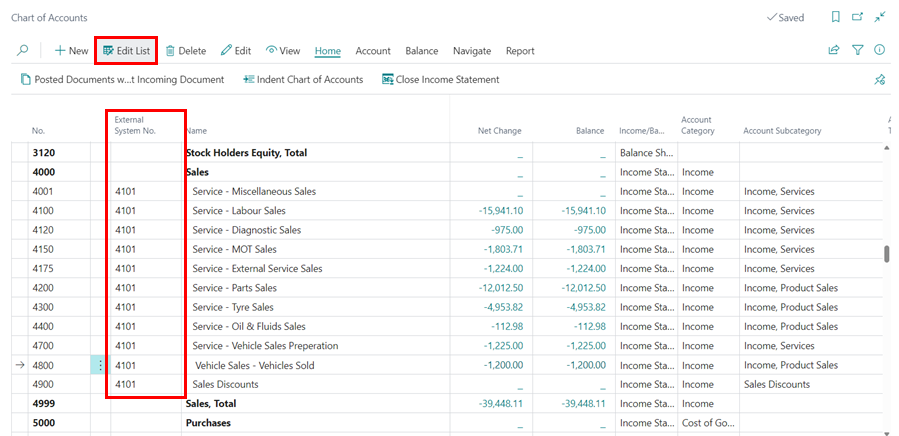

# How to Integrate Garage Hive With Sage 50 Cloud Accounts
Garage Hive has enabled the seamless integration of the Sage 50 Accounts accounting system, allowing you to continue performing your accounting procedures with efficiency and accuracy.

## In this article
1. [Initial Setup](#initial-setup)
2. [Integrate Chart of Accounts](#integrate-chart-of-accounts)
3. [Integrate Payment Methods](#integrate-payment-methods)
4. [Integrate VAT Posting](#integrate-vat-posting)
5. [How to run the export](#how-to-run-the-export)

### Initial Setup
To integrate **Sage 50 Cloud Accounts** with Garage Hive:
1. In the top-right corner, choose the  icon, enter **Accountancy Integration Setup**, and select the related link.

   

2. In the **General** FastTab, select **Sage 50 Cloud Accounts** as your accounting system in the **Accountancy System** field.

   

3. Turn on the **Integration Enabled** slider and select **Document Date** in both the **Export Customer Ledger by** and **Export Vendor Ledger by** fields.

   

4. From the menu bar Select **Init. Customers** and **Init. Vendors**, then click **Yes** in the pop-up windows. This generates an **External System No.** for all **Customer** and **Vendor** cards in Garage Hive. Exit the page.

   

5. When you open any **Customer** or **Vendor** card, you will see the **External System No.** as shown below.

   * Customer Card:
  
      

   * Vendor Card:

      

[Go back to top](#top)

### Integrate Chart of Accounts
To integrate the **Chart of Accounts** to **Sage 50 Cloud Accounts** accounting system: 
1. In the top-right corner, choose the  icon, enter **Chart of Accounts** and select the related link.

   

2. In the **Chart of Accounts** page, select **Edit List** from the menu bar.
3. In the **External System No.** column, enter the account number for the accounts you want to integrate with **Sage 50 Cloud Accounts**. In this case, we'll integrate all of the **4000s** accounts.

   

   

[Go back to top](#top)

### Integrate Payment Methods
To add the **External System No.** to the **Payments Methods**: 
1. In the top-right corner, choose the  icon, enter **Payment Methods** and select the related link.

   

2. In the **External System No.** column, click on the three dots to select the corresponding code for the **Payment Methods** that you use in your external system.

   

[Go back to top](#top)

### Integrate VAT Posting
To integrate the VAT posting in your system: 
1. In the top-right corner, choose the  icon, enter **VAT Posting Setup** and select the related link.

   

2. In the **External VAT Identifier Code** column, click on the three dots to select the corresponding code for the **VAT Posting** that you use in your external system.

   

[Go back to top](#top)

### How to run the export 
1. In the top right corner, choose the  icon, enter **Export to Accountancy System**, and select the related link.

    

2. Select the following options:
   * **Export Customer Invoices/Credit Memos** - This will export all Customer invoices/credit memos for the given date range. 
   * **Export Customer Payments/Refunds** - This will export Invoice payments/refunds as well as payments to accounts within the specified date range.
   * **Export Vendor Invoices/Credit Memos** - This will export all posted purchase orders/purchase invoices as well as posted purchase return orders/purchase credit memos within the given date range.
   * **Export Type** - All or New. Select **New**. Selecting **New** will exclude any previously exported documents. When using **New**, a transaction that has already been exported, will not be exported again.
   * **Date From** and **Date To** - Choose your date range.

3. Under Catalogs:
   * **Export All Customers** - This will generate an export of all customers in the system (**It is highly recommended that you never select this**).
   * **Export All Vendors** - This will generate an export of all vendors in the system (**It is highly recommended that you never select this**).

4. Click **OK**, to start exporting the data.

   

[Go back to top](#top)

 

### **See Also**

[Accounting System Integrations](garagehive-external-accountancy-integration.html){:target="_blank"} \
[How to Export to Your External Accountancy System](garagehive-finance-accountancy-export.html){:target="_blank"} \
[How to Import Your Exported Data Into Sage 50 Accounts](garagehive-import-exported-data-to-sage-50-accounts.html){:target="_blank"} \
[Accountancy System Integrations](garagehive-external-accountancy-integration.html)

