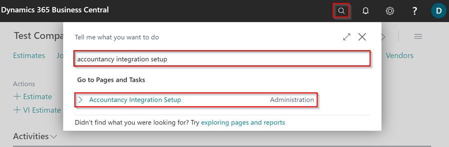
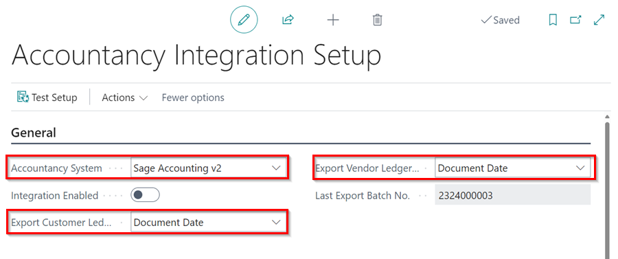
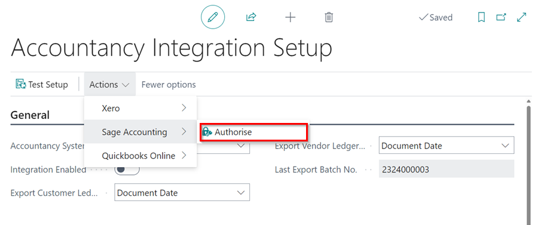
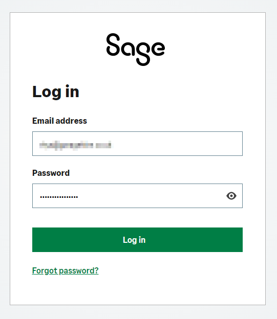
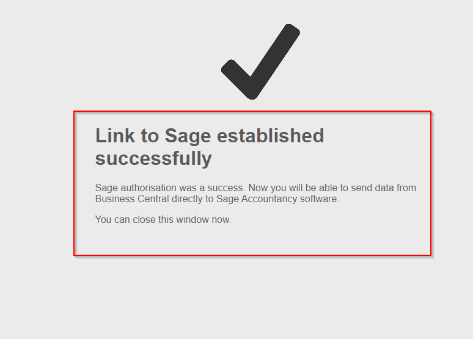
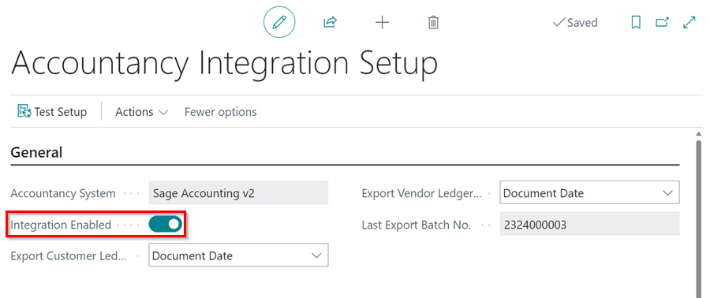
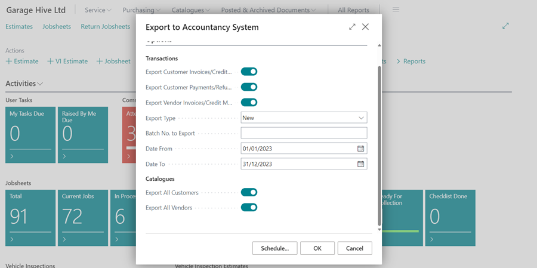
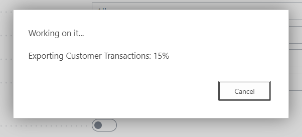

## In this article
1. [What you can export via the Sage Accounting integration](#what-you-can-export-via-the-sage-accounting-integration)
2. [Initial Setup](#initial-setup)
3. [How to run the export](#how-to-run-the-export)

### What you can export via the Sage Accounting integration

Garage Hive allows you to export your data to Sage Accounting; you can export the following:

* Customer Invoices
* Customer Credit Memos
* Customer Payments
* Customer Refunds
* Vendor Invoices
* Vendor Credit memos



### Initial Setup
1. In the top right corner, choose the  icon, enter **Accountancy Integration Setup**, and select the related link.

   

1. Select **Sage Accounting** as the **Accountancy System** in the **General** FastTab.
1. Specify whether the data should be exported using the posting date or the document date in the **Export Customer Ledger by** and **Export Vendor Ledger by** fields. The most commonly used approach is by **Document Date**. Garage Hive users are often limited to only posting within the current date, therefore the posting date may differ from the date on the invoice from the supplier, whereas the document date would match.

   

1. To authorise data sharing with **Sage Accounting** software, select **Actions** from the menu bar, then **Sage Accounting**, and then **Authorise**. 

   

1. This opens **Sage Accounting** software, where you must log in to successfully authorise sending data directly to Sage Accounting software.

   

1. After logging in, you will see a notification that says *Link to Sage established successfully* and you can close the window.

   

1. Return to Garage Hive and enable the integration by selecting the **Integration Enabled** slider.

   

### How to run the export 
1. In the top right corner, choose the  icon, enter **Export to Accountancy System**, and select the related link.

    

2. Select the following options:
   * **Export Customer Invoices/Credit Memos** - This will export all Customer invoices/credit memos for the given date range. 
   * **Export Customer Payments/Refunds** - This will export Invoice payments/refunds as well as payments to accounts within the specified date range.
   * **Export Vendor Invoices/Credit Memos** - This will export all posted purchase orders/purchase invoices as well as posted purchase return orders/purchase credit memos within the given date range.
   * **Export Type** - All or New. You may either export **All** of the documents within the date range or only the **New** documents. Selecting **New** will exclude any previously exported documents. This implies that it is **important** that you keep all prior exported files secure since they will never be reproduced. When using **New**, a transaction that has already been exported will be flagged and will not be exported again.
   * **Date From** and **Date To** - Choose your date range.

3. Under Catalogs:
   * **Export All Customers** - This will generate an export of all customers in the system (**It is highly recommended that you never select this**).
   * **Export All Vendors** - This will generate an export of all vendors in the system (**It is highly recommended that you never select this**).

4. Click **OK**, to start exporting the data.

   

 

### **See Also**

[Video: Garage Hive Integration with Sage Accounting](https://www.youtube.com/watch?v=-UMuQjqTgmQ){:target="_blank"} \
[Accounting System Integrations](garagehive-external-accountancy-integration.html){:target="_blank"} \
[How to Export to Your External Accountancy System](garagehive-finance-accountancy-export.html){:target="_blank"} \
[How to Import Your Exported Data Into Sage Accounting](garagehive-import-exported-data-to-sage-accounting.html){:target="_blank"}

