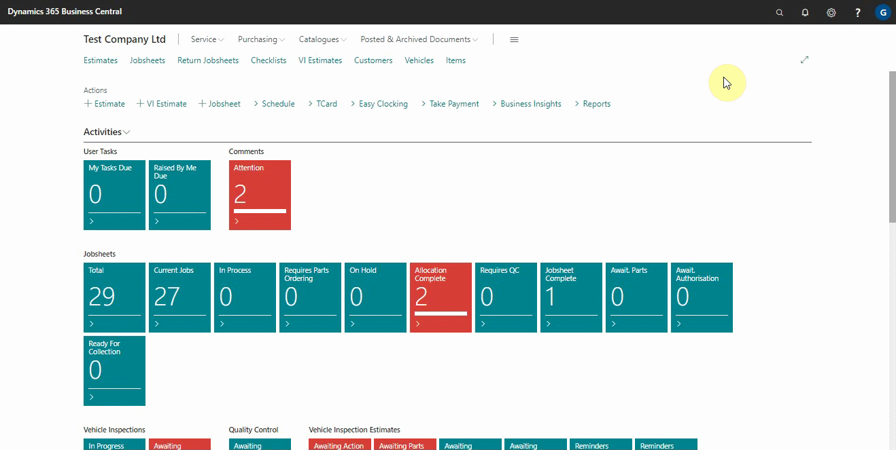

# Scheduling Recurring Internal Surveys

If the information being collected is needed on a regular basis, such as daily, weekly, monthly, quarterly, or yearly, you can set up an Internal Survey to be a recurring survey. The following is how to set up a recurring survey:
1. In the top-right corner, choose the search icon, enter **Surveys**, and choose the related link.
2. From the **Surveys List** page, choose the **New** action.

   

3. After adding all the other details in the **General** FastTab, select the **Recurring** slider. This enables a new FastTab in the **Survey Card** called **Recurrence Settings**.
4. From the **Recurrence Settings** FastTab, select the **Frequency** of the survey.
5. The starting date and time of sending the survey will be automatically filled based on the frequency you select, but you can change it to your preference.
6. Choose **Enable** action, to enable the survey.

   

    

### **See Also**

[Setting up and sending internal surveys](garagehive-setting-up-and-sending-internal-surveys.html) \
[How to get started with external consultant survey](garagehive-how-to-get-started-with-external-consultant-survey.html) \
[Reviewing internal surveys](reviewing-internal-surveys.html) \
[Exporting an internal survey](garagehive-exporting-an-internal-survey.html) \
[Importing an internal survey](garagehive-importing-an-internal-survey.html)