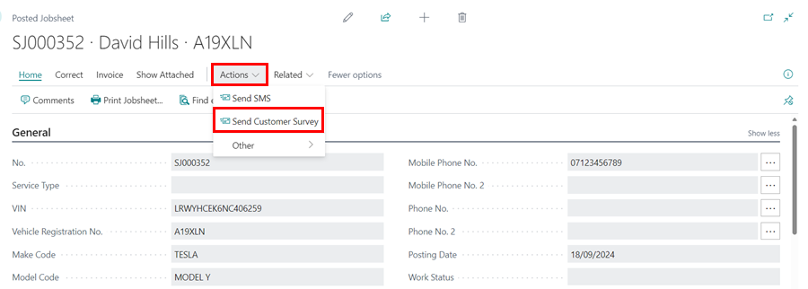

# How to Send Customer Surveys from a Posted Jobsheet
Customer surveys are usually sent when a Jobsheet is posted, but Garage Hive allows for flexibility to send them later from the posted Jobsheet if needed. Here is how:
1. Select **Posted & Archived Documents** from the Role Centre navigation menu, then click on **Posted Jobsheets** to view a list of all posted Jobsheets.

   

2. Choose the **Posted Jobsheet** from which you want to send the **Customer Survey** and click on it to open it.
3. Select **Actions** from the menu bar (if not visible, click **More Options**) and then **Send Customer Survey**.

   

4. Select **Survey** as the **Customer Notification Code** and **Yes for all** in the **Send Duplicates** field on the **Create Customer Survey** page. Click **OK**.

   

5. The customer survey will be sent.

   

[Go back to top](#top)