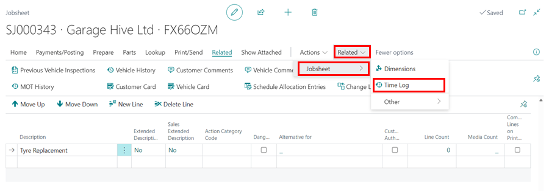
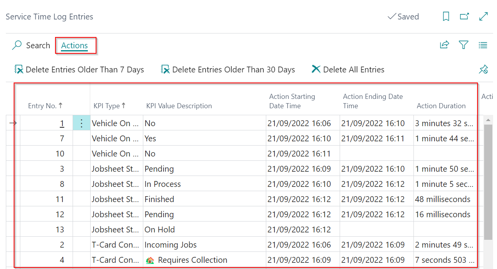

# Enabling Service Advisor Time Logs and How It Works in Garage Hive
**Service Advisor Time Logs** is a feature in Garage Hive that records the duration of an action that the Service Advisor takes in the system, which in turn helps in the creation of PowerBI reports on **Service Advisor KPIs**. The following actions are recorded in the time logs:
   * **Vehicle On-Site** - Records the duration the vehicle has been on-site.
   * **Work Status Code** - Records the duration a vehicle has been in a specific status on the Jobsheet.
   * **Estimate and VI Estimate Status** - Records the duration a vehicle has been in a specific status on the Estimate and VI Estimate.
   * **Checklist Confirmed by Advisor** - Records how long it takes for the Checklist to be confirmed by the Advisor.
   * **T-Card Planner Status** - Records the duration it takes a vehicle to complete a specific T-Card Planner Status.

To enable the **Service Time Logging**:
1. Search for **Service Mgt. Setup GH** in the top right corner  icon, and select the related link.
2. Scroll down to the **Enable Service Time Logging** slider in the **General** FastTab and enable it.

   

3. Time logging for the above- mentioned actions will now be recorded in your system for all Jobsheets, Estimates, and VI Estimates that you create from now on.
4. To view a vehicle's **Time Logs** in a document, open the document and select **Related** (under more options in the menu bar), then **Jobsheet** (for a Jobsheet), and then **Time Log**.

   

5. This opens the **Service Time Log Entries** page for the vehicle in the document. 
6. You can delete entries that are older than **7** or **30** days, or all available entries, by using the **Actions** menu in the menu bar.

   

7. PowerBI generates a report based on the **Service Advisor KPIs**.

   

