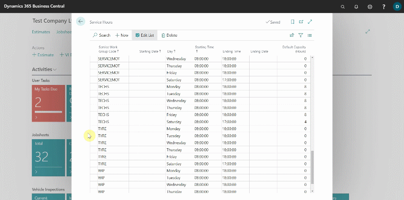
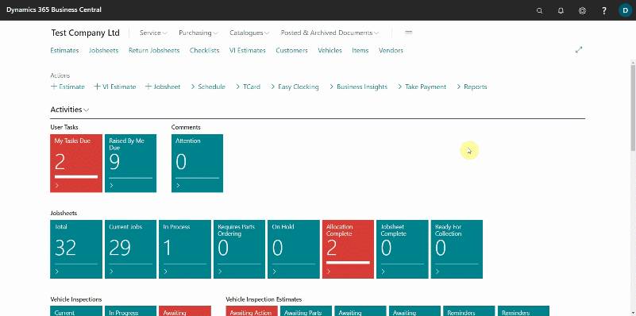
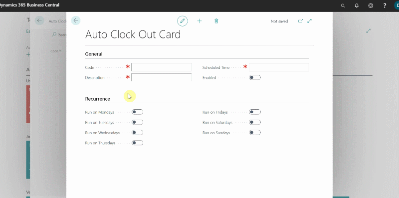
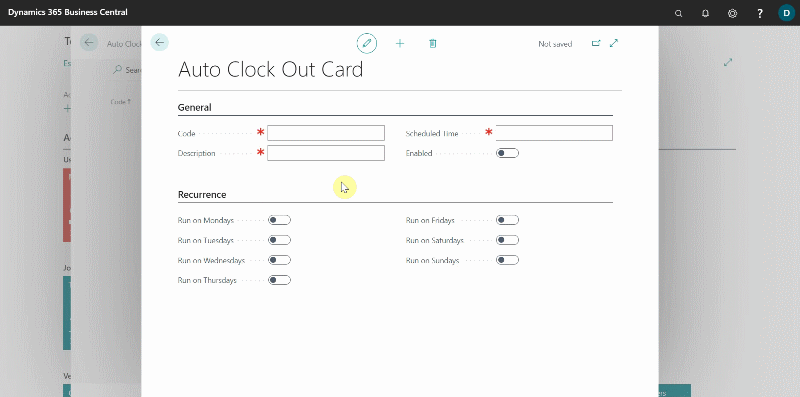

**Service Hours** are the scheduled hours during which the resources are available for work. For example, you may setup the technicians' working hours as 08:00 a.m. to 17:00 p.m. every day. **Auto Clock Out**, on the other hand, is the time when all resources in the system are expected to be clocked out. If they forget to clock out, the system will automatically clock them out.

## In this article
1. [Setup Resource Service Hours](#Setup-resource-service-hours)
2. [Setup Auto Clock Out](#Setup-auto-clock-out)

### Setup Resource Service Hours  
1. In the top-right corner, choose the  icon, enter **Service Hours** and select related result.
2. The list that appears contains all the **Service Work Groups** that have been added in the system, with their service hours specified for various days of the week.

   

3. Scroll to the **Service Work Group Code** for which you want to change the service hours, and then click on the line with the **Day** you want to change the time, enter the **Starting Time** and **Ending Time**.
4. The schedule layout is updated to reflect this change.

   

### Setup Auto Clock Out
1. In the top-right corner, choose the  icon, enter **Auto Clock Out** and select related result.
2. Select **New** from the menu bar.

   

3. You may set a daily clock out time or only specify for weekdays and weekends. To set a daily clock out time, enter the day's code, such as **MON** for Monday, and then the **Description** as **Monday**.
4. Enter the **Scheduled Time** as the time you want the **Auto Clock Out** to happen, and then under the **Recurrence** FastTab, select the **Run on Mondays** slider to the right. Select the **Enabled** slider.
5. Repeat the process for each day you want to set a daily clock out time.

   

6. To set the **Auto Clock Out** for weekdays and weekends, enter the code for weekdays, such as **WD**, and the description as **Weekdays**.
7. Enter the **Scheduled Time** as the time you want the **Auto Clock Out** to happen on weekdays, and then select all of the **Weekdays** sliders to the right, under the **Recurrence** FastTab. Select the **Enabled** slider.
8. Repeat the process for the weekend days.

   

 

### **See Also**
[Understanding the Schedule](garagehive-understanding-the-schedule.html){:target="_blank"}
