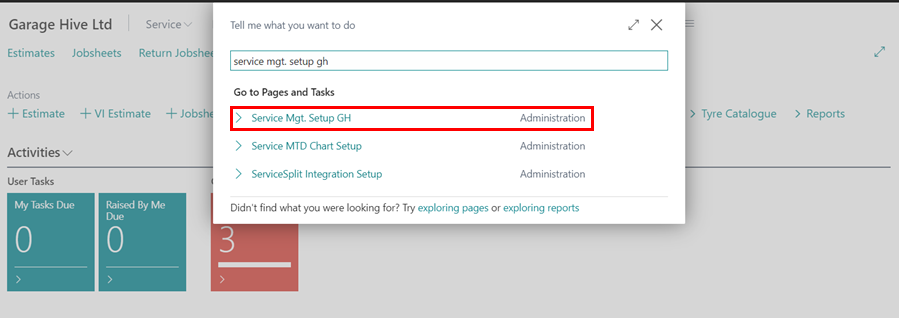
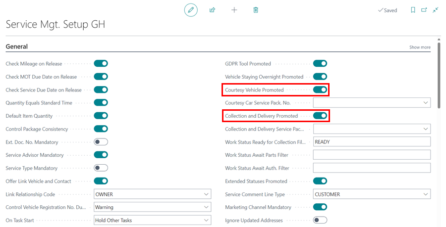
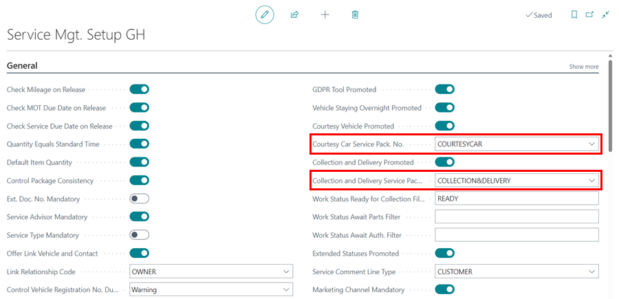
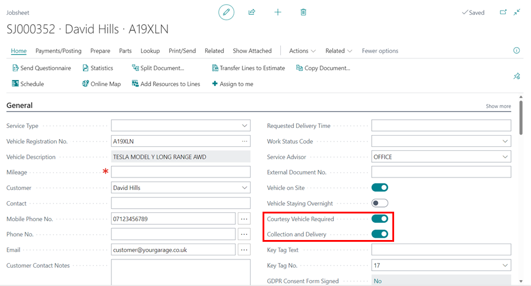

# Automatically Adding Courtesy Car and Collection and Delivery Service Packages
Most customer requests, like 'Requires Courtesy Car,' need to be included in the final invoice, but it's easy to forget them. The system can now be setup so that any time a customer requests a courtesy car, it is automatically added to the invoice. The same applies for 'Collection and Delivery' requests as well.

## In this article

1. [Enabling Courtesy Car and Collection and Delivery Feature](#enabling-courtesy-car-and-collection-and-delivery-feature)
2. [Using Courtesy Car and Collection and Delivery Feature](#using-courtesy-car-and-collection-and-delivery-feature)

### Enabling Courtesy Car and Collection and Delivery Feature
To enable the courtesy car and collection and delivery features:
1. In the top right corner, choose the  icon, enter **Service Mgt. Setup GH** and select the related link.

   

2. Scroll down to the **Courtesy Vehicle Promoted** and **Collection and Delivery Promoted** fields and enable the slider.

   

3. Create service packages for both courtesy car and collection and delivery. See [How to Make a Service Package in Garage Hive](garagehive-service-packages.html){:target="_blank"}.
4. Enter the courtesy car service packages you've created in the **Courtesy Car Service Pack. No.** field below the **Courtesy Vehicle Promoted** and the collection and delivery service package in the **Collection and Delivery Service Pack. No.** field below the **Collection and Delivery Promoted**.

   

[Go back to top](#top)

### Using Courtesy Car and Collection and Delivery Feature
After you've finished setting up the feature, you can begin using it by:
1. Choosing the **Courtesy Vehicle Required** or **Collection and Delivery** slider from a Jobsheet's **General** FastTab.
2. When selected, the service packages are automatically added to the Jobsheet and included in the final bill.

   

[Go back to top](#top)

 

### **See Also**

[How to create Service Packages in Garage Hive](garagehive-service-packages.html){:target="_blank"} \
[Service Packages conditions](service-package-conditions.html){:target="_blank"} \
[Setting up online booking "Service Packages"](garagehive-onlinebooking-service-packages.html){:target="_blank"} \
[Automatically adding Service Packages in documents](/docs/garagehive-automatically-adding-service-packages.html){:target="_blank"}
