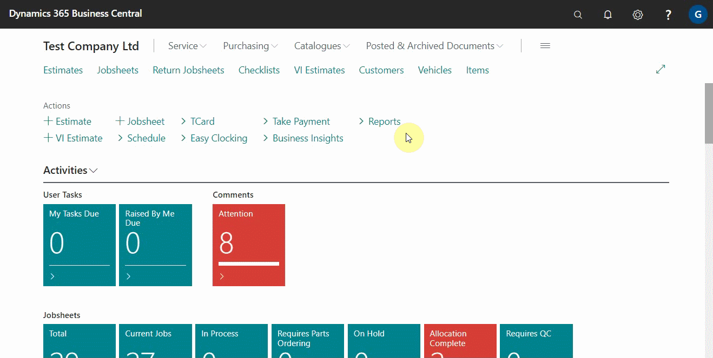
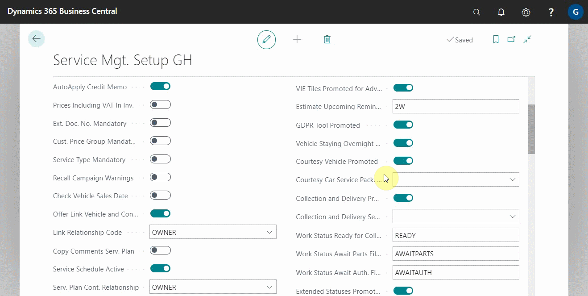

# Automatically Adding Courtesy Car and Collection and Delivery Service Packages

Most customer requests, such as 'Requires Courtesy Car,' must be remembered to include in the invoice when it is complete, which can be overlooked at times. The system can now be setup so that whenever a customer requests a courtesy car, the request is automatically added to the invoice; the same is true when the customer requests 'Collection and Delivery.'

## In this article

1. [Enabling courtesy car and collection and delivery feature](#enabling-courtesy-car-and-collection-and-delivery-feature)
2. [Using courtesy car and collection and delivery feature](#using-courtesy-car-and-collection-and-delivery-feature)

### Enabling courtesy car and collection and delivery feature
To enable the courtesy car and collection and delivery features:
1. From the top-right corner, search for **Service Mgt. Setup GH** and select it from the results.
2. Scroll down to the **Courtesy Vehicle Promoted** and **Collection and Delivery Promoted** fields and enable the slider.

   

3. Create service packages for both courtesy car and collection and delivery. See [How to Make a Service Package in Garagehive](garagehive-service-packages.html).
4. Enter the courtesy car service packages you've created in the **Courtesy Car Service Pack. No.** field below the **Courtesy Vehicle Promoted** and the collection and delivery service package in the **Collection and Delivery Service Pack. No.** field below the **Collection and Delivery Promoted**.

   

### Using courtesy car and collection and delivery feature
After you've finished setting up the feature, you can begin using it by:
1. Choosing the **Courtesy Vehicle Required** or **Collection and Delivery** slider from a jobsheet's **General** FastTab.
2. When selected, the service packages are automatically added to the jobsheet and included in the final bill.

   

 

### **See Also**

[How to create Service Packages in Garage Hive](garagehive-service-packages.html) \
[Service Packages conditions](service-package-conditions.html) \
[Setting up online booking "Service Packages"](garagehive-onlinebooking-service-packages.html) \
[Automatically adding Service Packages in documents](/docs/garagehive-automatically-adding-service-packages.html)
