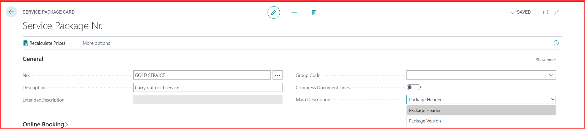

# How to make a service package in Garage Hive.
Service packages are a powerful tool to help you build jobs faster, simplify pricing of jobs and add consistency. 

To watch the video guide for this document, please click here -> [**Service Package Video**](http://www.youtube.com/watch?v=J1-KVnbnBLs){:target="_blank"}

To create or edit a service package, open the service package list. 

In the service package card add a number (often an abbreviation of the description) and a description for the package. 
In the general tab, you will see a slider for " compress document lines" with this on all the lines form this package will be compressed on the printed document to show just the description of the package and its value.
There is also a "main description" section with two options "package header" and package version" this dictates what description is added to the document, either the description in the general tab (the header) or the description of the version that you are about to set up. 

N.B the extended description field in the general tab is used to elaborate or add more detailed information to the job. It is displayed on printouts this again is used if the main description is set to "package header" otherwise there are extended descriptions available for each version line. 

Now you can create any version of this package that you want, add a description and an extended description for this version if you wish then click on the amount to the right to open the version lines. 

Here you can build the version up just as if it was lines on a job sheet, and we recommend using "MISC" items to hold the place of items that will be needed for this version. 

At the bottom of the service package card, there is an "Invoicing" tab and a "fixed price and Discounts" slider.

If you slide this on you will be able to amend the prices and discounts within the versions, and when versions are added to documents the price or discounts in the versions will be added to the document instead of pulling that information from the related labour or item card or any pricing matrix's that are set up. If you try to change this price on the document, you will be warned that it's from a fixed price package and asked if you want to break that special pricing. 

In addition to this you will get an additional column within the version lines "Allow fixed price Qty. Change" if selected the system will allow you to change the quantity of that line. It will adjust the unit price to maintain the line value keeping the package the same price. This is ideal for items like engine oil where exact quantity cannot be foreseen.

Once you start creating new versions, you may find the need or want to copy versions if each version is very similar, to do this select "manage" next to Versions. You will see two options "copy" copied the selected version to the line beneath and "Copy From" allows you to choose versions to form other packages and copy them into this package.

For information about setting up service packages conditions [click here](/docs/service-package-conditions.html)

For information about setting up service packages for online booking [click here](/docs/garagehive-onlinebooking-service-packages.html)
