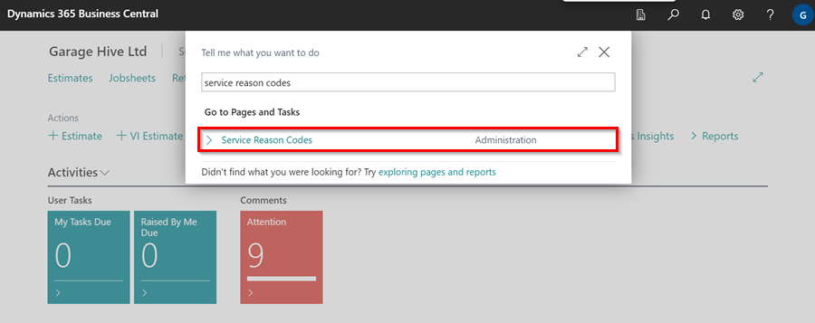
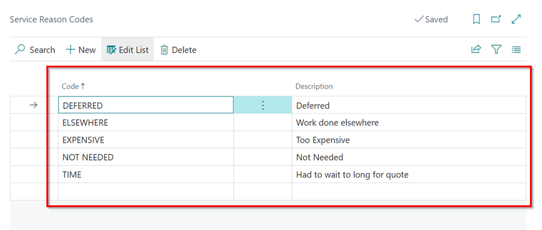

# Creating Service Reason Codes in Garage Hive
The **Service Reason Codes**  are used to explain why a customer did not proceed with the service booking. Here is how to create the **Service Reason Codes** in the system:
1. In the top right corner, choose the  icon, enter **Service Reason Codes**, and select the related link.

   

2. In the page that opens, you'll need to add a **Code** along with a **description**. This is for the specific reason that explains why a service booking did not proceed.

   

3. Exit the page, when done.

[Go back to top](#top)
