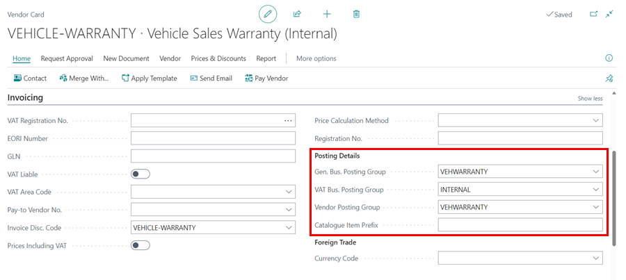
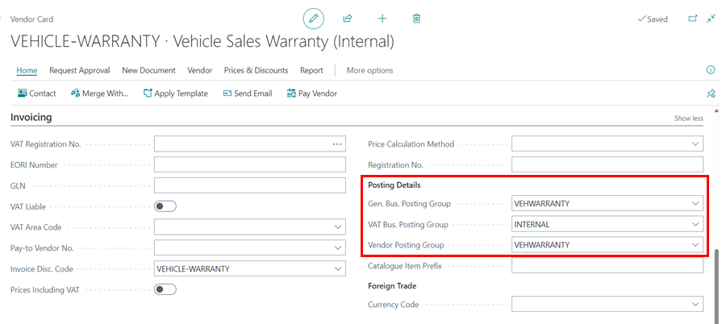

# How to Use Service Recharge for Internal Charging
Service recharge is a feature available in Garage Hive to help record internal transactions between departments or added costs such as vehicle sales preparations, vehicle sales warranty, etc., so that when you charge an internal customer the system will automatically generate a corresponding purchase invoice for a complete internal process.

### In this article
1. [Internal charging using the Item Charges](#internal-charging-using-the-item-charges)
2. [Internal charging using the General Ledger account](#internal-charging-using-the-general-ledger-account)

### Internal charging using the Item Charges
The Item Charges features is used in the following:

* Recording the added cost in your inventory value, for example vehicle preparations for a vehicle on sale.
* Identify the landed cost of an item for making more accurate decisions on how to optimize the distribution network.
* Break down the unit cost or unit price of an item for analysis purposes.
* Include purchase allowances into the unit cost and sales allowances into the unit price.

In this article, we'll look at recording the added cost in your inventory value.  
Before you can assign item charges, you must set up item charge numbers for the different types of item charges, including where G/L account costs related to sales, purchases, and inventory adjustments are posted. An item charge number contains a combination of general product posting group, VAT product posting group, and item charge. When you enter the item charge number on a purchase or sales document, the relevant G/L account is retrieved based on the setup of the item charge number and the information on the document.

> **Note**
>
> For help in setting up the item charges correctly, please get in touch with our support team.
 

To set up the item charges:
1. Search **Item charges** from the search icon in the top-right corner to set up the item charges. 
2. Create a new item charge number for vehicle sales preparation **VEHICLEPREP**, with vehicle description as **Vehicle Sales Preparation**. 
3. Add the Gen. Prod. Posting Group as **VEHSALES** and the VAT Prod. Posting Group as **STANDARD** (depends on financial set up required).

After setting up the item charges, you will need to set up a "customer" in the system who gets the internal bills for the added cost in the inventory value:
1. Create a customer card under the No. **INTERNAL-VEHSALES** and the description **Vehicle Sales Preparation(Internal)**.
2. You can now be able to do internal transactions with the "customer" created.

On the other hand, you need to set up a corresponding "vendor" in the system where the internal purchase invoices are automatically generated and posted:
1. Create a vendor card under the No. **VEHICLE-PREP** and the description **Vehicle Sales Preparation (Internal)**. 
2. You can now be able to create internal purchase orders with the "vendor" created.

    

3. Ensure the **Posting Details**, from the invoicing section, for the vendor and the customer you have set up, are as follows (these details depends on your financial set up):
    - General Bus. Posting Group as **VEHSALES**
    - VAT Bus. Posting Group **INTERNAL** (No VAT)
    - Vendor Posting Group as **VEHSALES**

Customer card:

Vendor card:

To set up the use of Item Charges:
1. From the invoicing section of the customer card you have created, add **Service Recharge Item Charge No.** as **VEHICLEPREP**.
2. Add the **Corresponding Vendor No.** as **VEHICLE-PREP** (as set up above).

    

3. From the **Payment** section, add the payment method as **VEHPREP** to both the customer and vendor card to ensures that when the sales invoice is posted, it's paid off automatically and the record closed. 
4. On the other hand, the purchase invoice is also paid off and counters the sales invoice bill, ensuring that the debit and credit accounts are balanced off and closed down.

Customer Card:

Vendor Card:

When you post a sales invoice/jobsheet for the customer **Vehicle Sales Preparation(Internal)**, the total bill of the invoice is added to the total value of the vehicle, and a corresponding purchase invoice **Vehicle Sales Preparation (Internal)** is created and posted.

### Internal charging using the General Ledger account
General ledger accounts are used in internal charging when doing internal transactions between departments. For example, when a business with two departs - vehicle sales departments and service department - sells a vehicle through the vehicle sales department and later returns for warranty work, the service department will do the warranty work and charge it to the vehicle sales department. For this article, we'll use the example of warranty work but this feature can be used in other several ways.

 

1. Start by setting up a customer card under the No. **VEHSALES-WARRANTY** and the description to be **Vehicle Sales Warranty(Internal)**; this is the customer where all the warranty work bill will be charged for the vehicle sold.

    

2. Next, create a corresponding vendor card with the No. **VEHICLE-WARRANTY** and the description to be **Vehicle Sales Warranty (Internal)**; this is where a corresponding purchase invoice is created and posted when the internal customer is charged.

    

3. Ensure the **Posting Details**, from the invoicing section, for the vendor and the customer you have set up, are as follows (these details depends on your financial set up):
    - General Bus. Posting Group as **VEHWARRANTY**
    - VAT Bus. Posting Group **INTERNAL** (No VAT)
    - Vendor Posting Group as **VEHWARRANTY**

Customer card:

Vendor card:

To set up the use G/L account No.:
1. From the invoicing section of the customer card you have created, add **Service Recharge G/L Account No.** as the account where the warranty costs are accounted for in your business (depends on your financial set up).
2. Add the **Service Recharge Location Code** as **VEHSALES** (depends on whether you have set up the department in different locations).
3. And the **Corresponding Vendor No.** as **VEHICLE-WARRANTY** (as set up above).

> **Note**
>
> Remember to add payment details for both the customer and vendor card you have created, just like for the item charges set up.

When you post a sales invoice/jobsheet (warranty work) for the customer **Vehicle Sales Warranty(Internal)**, the total bill of the invoice is charged to the vehicle sales department, and the service department gets the revenue for the warranty work done. A corresponding purchase invoice **Vehicle Sales Warranty (Internal)** is created and posted.