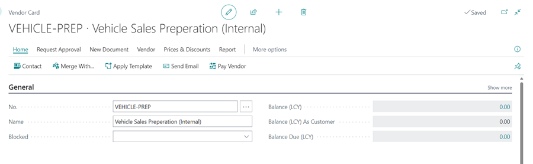
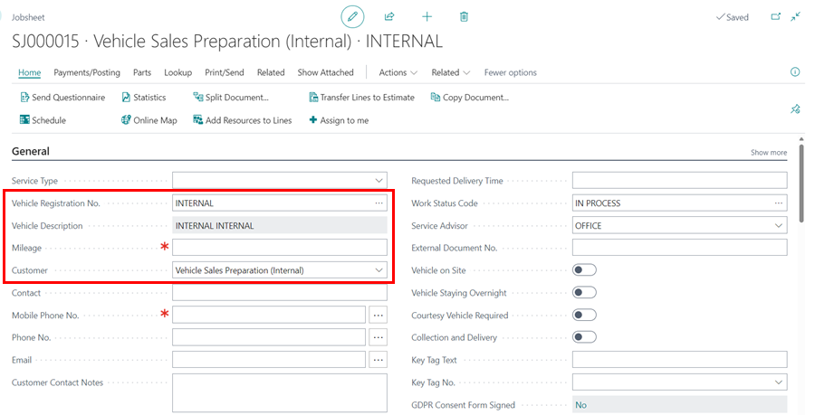
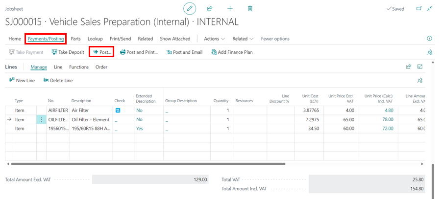
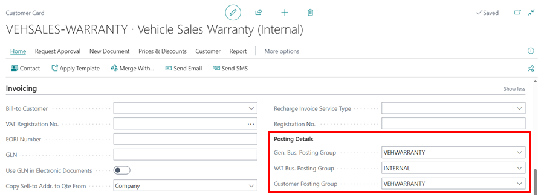
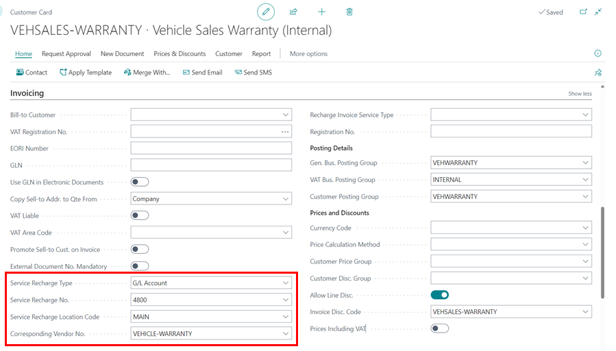
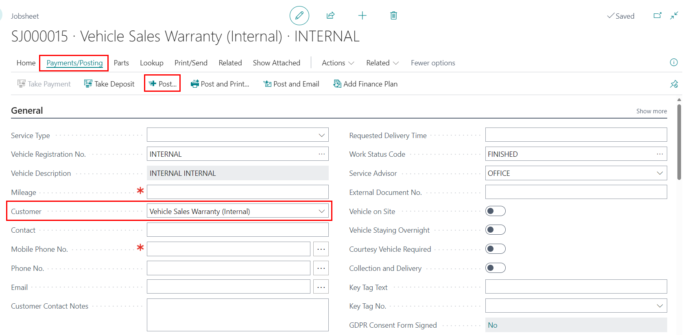
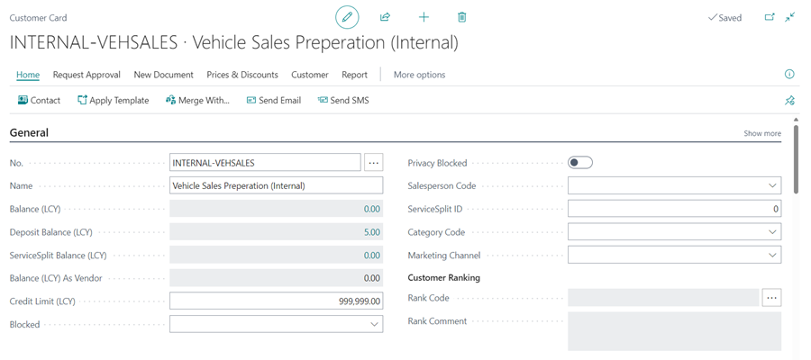
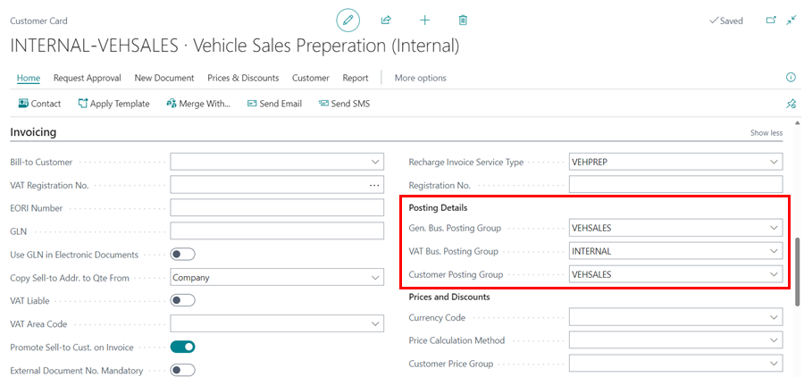

# We are still working on this article!
We are currently reviewing this article before it is published, check back later.

# How to Use Service Recharge for Internal Charging
Service recharge is a feature available in Garage Hive to help record internal transactions between departments or added costs such as vehicle sales preparations, vehicle sales warranty, etc., so that when you charge an internal customer the system will automatically generate a corresponding purchase invoice for a complete internal process. There are three types of **Service Recharge**:
  1. **Item** - the value of an internal service document is recharged to an **Item**.
  2. **G/L Account** - the value of an internal service document is recharged to a **G/L Account**, for example a G/L account for the sales department.
  3. **Item Charge** - the value of an internal service document is recharged using **Item Charges** that are setup in the system, for example **Vehicle Preparations**.

### In this article
1. [Internal Charging using the Item](#internal-charging-using-the-item)
2. [Internal charging using the General Ledger account](#internal-charging-using-the-general-ledger-account)
3. [Internal charging using the Item Charges](#internal-charging-using-the-item-charges)

### Internal charging using the Item
Internal charging using the **Item** can be used to increase the value of an item that is already in stock. Here is how to setup:
1. Start by creating a **Vendor Card** with the No. **VEHICLE-PREP** and the description to be **Vehicle Sales Preparation (Internal)**.
2. This is where a corresponding purchase invoice is created and posted when the internal customer is charged.

   

3. The **Posting Details**, under the **Invoicing** FastTab, should be as follows (these details depends on your financial set up):
      - General Bus. Posting Group as **VEHSALES**
      - VAT Bus. Posting Group **INTERNAL**
      - Vendor Posting Group as **VEHSALES**

      

4. Then, create customer card with the No. **VEHSALES-PREP** and the description to be **Vehicle Sales Preparation (Internal)**.
5. This is the customer where all the bill will be charged.

   

6. Under the **Invoicing**FastTab, set the **Customer Card** as follows:
      - Service Recharge Type as **Item**
      - Service Recharge Number as the **Vehicle Item** that you are doing preparation
      - Service Recharge Location Code as the **Location** for the preparation
      - Corresponding Vendor No. as the **Vendor** that you created, that is **VEHSALES-PREP**
    Posting Details (these details depends on your financial set up):
      - General Bus. Posting Group as **VEHSALES**
      - VAT Bus. Posting Group **INTERNAL**
      - Vendor Posting Group as **VEHSALES**

      

7. With the setup of the **Customer Card** and the **Vendor Card** you can now create an internal Jobsheet with the **Vehicle Registration No.** as **Internal** and the customer to be the customer you have just created.

   

8. Enter all the **Items** and **Labour** for the vehicle preparation in this Jobsheet. It is important to note that the **Unit Price** can be the same as the **Cost Price** or  you can add a margin for the **Unit Price**. This depends on the garage operations.
9. To post the Jobsheet, ensure you have the **Payment Terms Code**, and then post the Jobsheet.

   

10. When the Jobsheet is posted, the value of the Jobsheet is added onto the cost price of the **Item**.

[Go back to top](#top)

### Internal charging using the General Ledger account
General ledger accounts are used in internal charging when doing internal transactions between departments. For example, when a business with two departs - vehicle sales departments and service department - sells a vehicle through the vehicle sales department and later returns for warranty work, the service department will do the warranty work and charge it to the vehicle sales department. For this article, we'll use the example of warranty work but this feature can be used in other several ways.

 

1. Start by creating a **Vendor Card** with the No. **VEHICLE-WARRANTY** and the description to be **Vehicle Sales Warranty (Internal)**; this is where a corresponding purchase invoice is created and posted when the internal customer is charged.

   

Ensure the **Posting Details**, from the invoicing section for the vendor card, are as follows (these details depends on your financial set up):
    - General Bus. Posting Group as **VEHWARRANTY**
    - VAT Bus. Posting Group **INTERNAL** (No VAT)
    - Vendor Posting Group as **VEHWARRANTY**

   

1. Next, you need to create a customer card under the No. **VEHSALES-WARRANTY** and the description to be **Vehicle Sales Warranty(Internal)**; this is the customer where all the warranty work bill will be charged for the vehicle sold.

    

2. Ensure the **Posting Details**, from the invoicing section for the customer card, are as follows (these details depends on your financial set up):
    - General Bus. Posting Group as **VEHWARRANTY**
    - VAT Bus. Posting Group **INTERNAL** (No VAT)
    - Vendor Posting Group as **VEHWARRANTY**

    

3. From the invoicing section of the customer card you have created, select **Service Recharge Type** as **G/L Account**, and **Service Recharge No.** as the account where the warranty costs are accounted for in your business (depends on your financial set up).
4. Add the **Service Recharge Location Code** as the location for the transaction and the **Corresponding Vendor No.** as **VEHICLE-WARRANTY** (as created above).

   

5. From the Payment section, add the payment method as **VEHPREP** to both the customer and vendor card to ensures that when the sales invoice is posted, it’s paid off automatically and the record closed.
- Customer Card:

    

- Vendor Card:

     

6. When you post a Sales Invoice/Jobsheet (warranty work) for the customer **Vehicle Sales Warranty(Internal)**, the total bill of the invoice is charged to the vehicle sales department, and the service department gets the revenue for the warranty work done. A corresponding purchase invoice **Vehicle Sales Warranty (Internal)** is created and posted.

    

[Go back to top](#top)

### Internal charging using the Item Charges
The Item Charges features is used in the following:

* Recording the added cost in your inventory value, for example vehicle preparations for a vehicle on sale.
* Identify the landed cost of an item for making more accurate decisions on how to optimize the distribution network.
* Break down the unit cost or unit price of an item for analysis purposes.
* Include purchase allowances into the unit cost and sales allowances into the unit price.

In this article, we'll look at recording the added cost in your inventory value.

 

{% include tip.html title="Note" text="Before you can assign item charges, you must set up item charge numbers for the different types of item charges, including where G/L account costs related to sales, purchases, and inventory adjustments are posted. An item charge number contains a combination of general product posting group, VAT product posting group, and item charge. When you enter the item charge number on a purchase or sales document, the relevant G/L account is retrieved based on the setup of the item charge number and the information on the document. For help in setting up the item charges correctly, please get in touch with our support team." %}

 

To set up the item charges:
1. Search **Item charges** from the  icon in the top-right corner to set up the item charges.

   

1. Create a new item charge number for vehicle sales preparation **VEHICLEPREP**, with vehicle description as **Vehicle Sales Preparation**. 
1. Add the **Gen. Prod. Posting Group** as **VEHSALES** and the **VAT Prod. Posting Group** as **STANDARD** (depends on financial set up required).

   

1. After setting up the item charges, you need to create a **Vendor Card** in the system where the internal purchase invoices are automatically generated and posted. Create a vendor card under the No. **VEHICLE-PREP** and the description **Vehicle Sales Preparation (Internal)**.

   

1. Ensure the **Posting Details**, from the invoicing section for the vendor you have created, are as follows (these details depends on your financial set up):
    - General Bus. Posting Group as **VEHSALES**
    - VAT Bus. Posting Group **INTERNAL** (No VAT)
    - Vendor Posting Group as **VEHSALES**

   

1. On the other hand, you will need to create a **Customer Card** in the system where the internal bills for the added costs are billed. Create a customer Card under the No. **INTERNAL-VEHSALES** and the description **Vehicle Sales Preparation (Internal)**.

   

1. Ensure the **Posting Details**, from the invoicing section for the customer you have set up, are as follows (these details depends on your financial set up):
    - General Bus. Posting Group as **VEHSALES**
    - VAT Bus. Posting Group **INTERNAL** (No VAT)
    - Vendor Posting Group as **VEHSALES**

   

1. From the invoicing section of the customer card you have created, select **Service Recharge Type** as **Item Charge**, **Service Recharge No.** as **VEHICLEPREP**, **Service Recharge Location Code** as the location where the preparation is taking place and select the **Corresponding Vendor No.** as **VEHICLE-PREP** (as set up above).

    

1. From the **Payment** section, add the payment method as **VEHPREP** to both the customer and vendor card to ensures that when the sales invoice is posted, it's paid off automatically and the record closed. 
1. On the other hand, the purchase invoice is also paid off and counters the sales invoice bill, ensuring that the debit and credit accounts are balanced off and closed down.
- Customer Card:

   
 
- Vendor Card:

   

1. When you post a Sales Invoice/Jobsheet for the customer **Vehicle Sales Preparation(Internal)**, the total bill of the invoice is added to the total value of the vehicle, and a corresponding purchase invoice **Vehicle Sales Preparation (Internal)** is created and posted.

   

[Go back to top](#top)