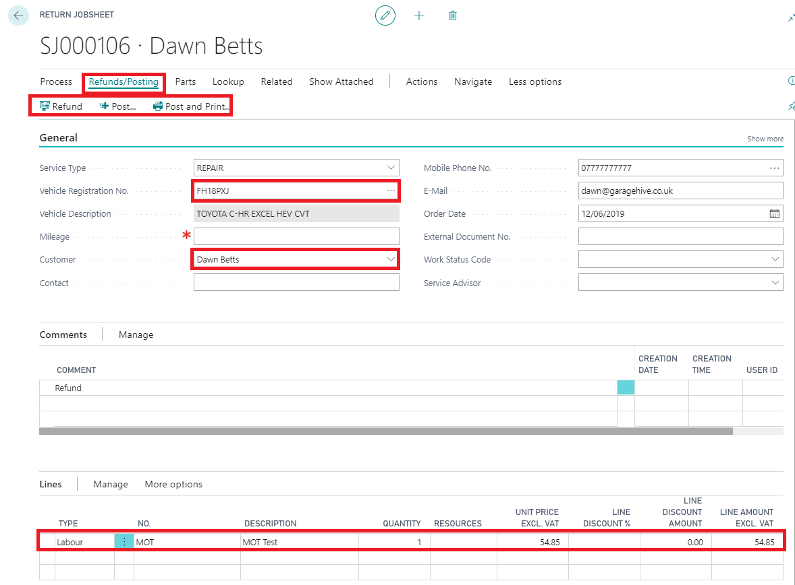

# What is a Return Jobsheet?

A Return Jobsheet is the document you use to issue your customers a refund, essentially its the opposite of a Jobsheet. It has the same functionality as a Jobsheet, such as labour allocation and take payment functions. 

# How to create a Return Jobsheet

1. Ensure **Service** is selected, then select the **Return Jobsheet** option from the home screen, followed by **+ New** 

2. Start by selecting a vehicle registration number which will pre-populate your customer details 

4.	Decide on the item lines what you are refunding, you can choose from Items, Labour or External Service.  

5.	If you are issuing a service return order for a non account customer, you may need to use the "Refund" functionality to account for the financial refund (Cash/Card Refund).  
  
6. Once the document is complete, simply press "post" or "post & print" located in the Action Bar. 

