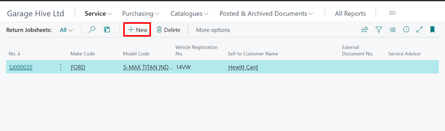
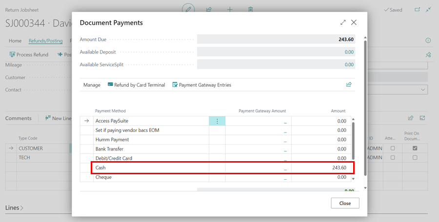
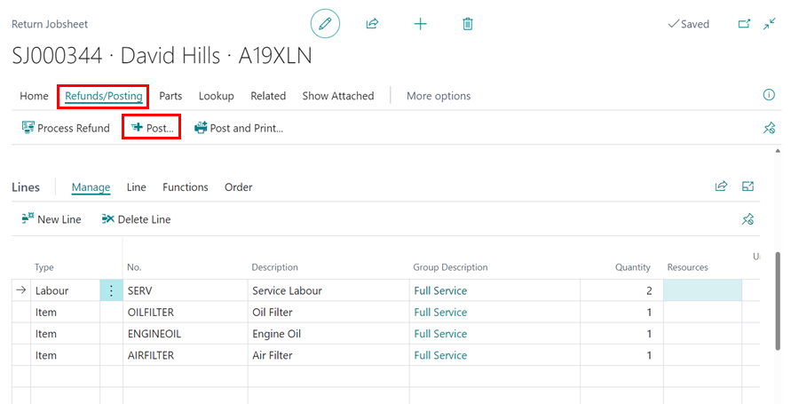

# What is a Return Jobsheet

A Return Jobsheet is a document used to issue refunds to customers, essentially serving as the reverse of a standard Jobsheet. It offers the same functionalities as a Jobsheet, including labour allocation and payment processing.

   

## How to create a New Return Jobsheet
1. Select **Service** from the Role Centre, then choose the **Return Jobsheet** option.

   

2. In the Return Jobsheet list, click on **+ New** to create a new Return Jobsheet. 

   

3. Start by selecting a vehicle registration number which will pre-populate your customer details associated with the vehicle.
4. Enter the Items, Labour or External Service to be returned in the **Lines** FastTab.
5. From the menu bar, select **Refunds/Payments** from the menu bar, followed by **Process Refund**.

   

6. Enter the amount to refund, and then close the **Document Payments** page.

   

7. Select the **Post** option in the menu bar to post the **Return Jobsheet**.

   

8. If issuing a service return order for a non-account customer, you may need to use the "Refund" functionality to process the financial refund (Cash/Card Refund).

[Go back to top](#top)

## How to create a Return Jobsheet from Another Document
1. From the Role Centre, select **Service**, then choose the **Return Jobsheet** option.

   

2. In the Return Jobsheet list, click **+New** to create a new Return Jobsheet. 

   

3. Select **Home** from the menu bar, then choose **Copy Document**.

   

4. Choose the appropriate **Document Type** and the **Document No.** to copy from. Enable the **Include Header** slider to include vehicle and customer details, and the **Copy Comments** slider to include any comments from the original document. Click **OK**.

   

5. From the menu bar, select **Refunds/Payments**, then click **Process Refund**.

   

6. Enter the refund amount, then close the **Document Payments** page.

   

7. Finally, select the **Post** option in the menu bar to post the Return Jobsheet.

   

[Go back to top](#top)
