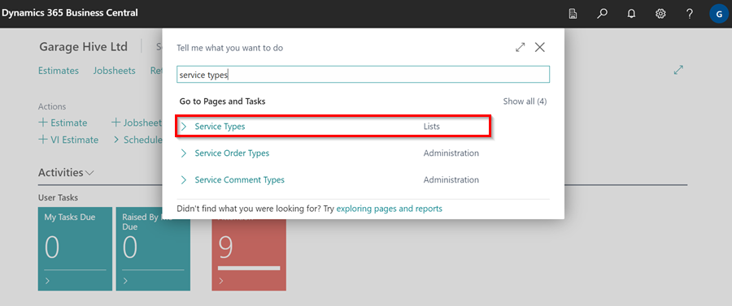
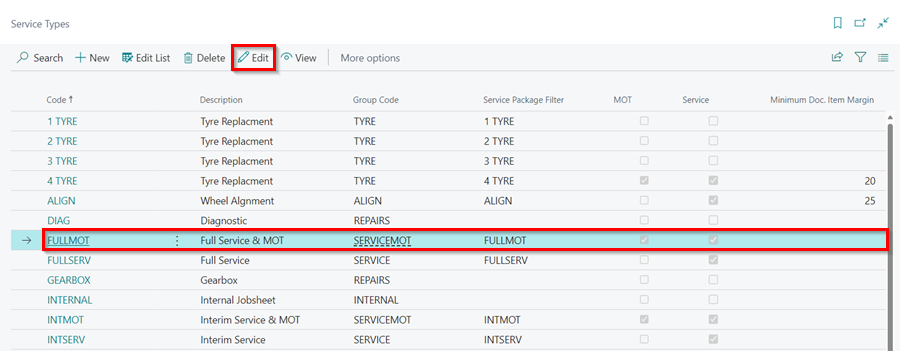
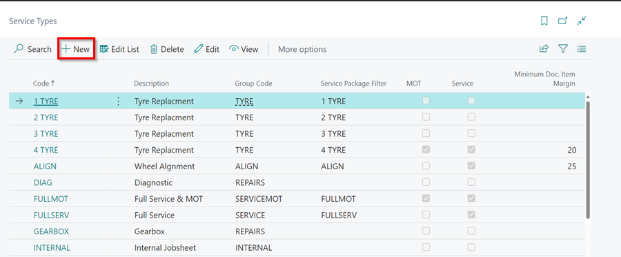
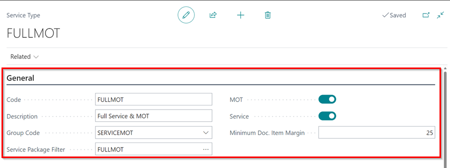
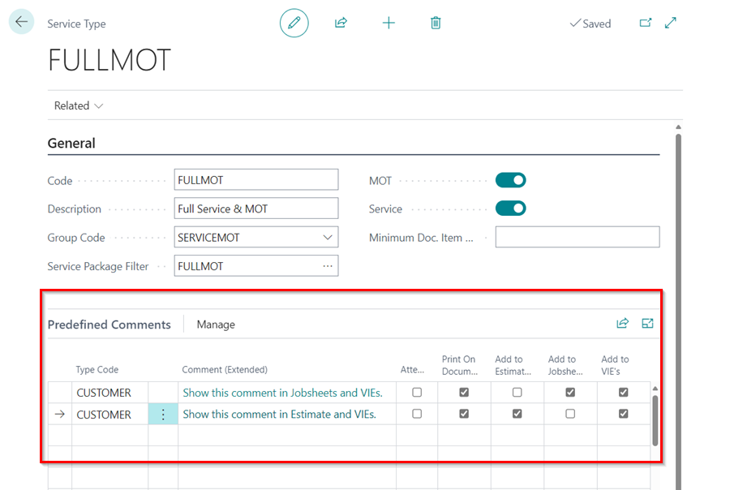

# How to Create Service Types in Garage Hive
**Service Types** are essential for organising and categorising the services offered by your garage. They greatly assist in creating Jobsheets and Estimates. You have the flexibility to set up service types based on your garage's specific requirements. For instance, you can create a **Full MOT** Service Type, which, when selected in a document, automatically populates with relevant Service Package or **Comments** related to MOT. To create **Service Types** in your system:

1. In the top-right corner, choose the  icon, enter **Service Types**, and select the related link.

   

2. In the page that opens, you can create a new **Service Type** or edit an existing Service Type. To edit an existing **Service Type**, select the Service Type you want to edit, and click on **Edit**.

   

3. To create a new one, select **New** from the menu bar.

   

4. Under the **General** FastTab, enter a unique **Code** for the Service Type, add a **Description** for the Service Type, select a **Group Code** for the Service Type and in the **Service Package Filter** field, choose the appropriate Service Package to link with the Service Type.
5. If the Service Type you are creating is applicable to MOT vehicle booking or service booking, you can enable the **MOT** and **Service** sliders.
6. The **Minimum Doc. Item Margin** specifies the minimum price margin to be applied when the **Service Type** is selected in a document.

   

7. Under the **Predefined Comments** FastTab, you can add comments that will be automatically included in the documents when a the **Service Type** is selected. You can choose the specific documents where these comments should appear by selecting the appropriate tick boxes on the right.

   

[Go back to top](#top)