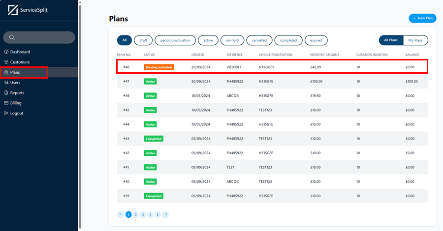

# ServiceSplit Integration with Garage Hive
The ServiceSplit integration enables Garage Hive users to offer garages monthly service plans with flexible payment options. Garages can create custom payment schedules, which are then processed and managed by ServiceSplit, simplifying the billing process for both the garage and its customers. 

## In this article
1. [Integrating ServiceSplit With Garage Hive](#integrating-servicesplit-with-garage-hive)
2. [Sending ServiceSplit Plan To Customer](#sending-servicesplit=plan-to-customer)
3. [Apply ServiceSplit as the Payment Method in a Jobsheet](#apply-servicesplit-as-the-payment-method-in-a-jobsheet)

### Integrating ServiceSplit With Garage Hive
1. To begin the integration between ServiceSplit and Garage Hive, you'll first need to contact the team at **ServiceSplit** by sending an **Email** to [**help@servicesplit.com**](mailto:help@servicesplit.com) to get the **API Key** and **Client Secret** codes that will be required in your setup.
2. Once you’ve received the codes, log in to your Garage Hive System. Choose the  icon, enter **ServiceSplit Integration Setup**, and select the related link.

   

3. On the setup page, enter the **API Key** and **Client Secret** codes provided by the ServiceSplit team in their respective fields. 
4. Choose **ServiceSplit** as the **Payment Method**, and enter the **Billing Anchor** (the point in the month to send the plan; for this setup, we'll use 1 for the 1st of the month). Set the **Plan Duration (Months)**, for example, **10 months**.
5. Once completed, enable the integration with the **Enabled** slider.

   

[Go back to top](#top)

### Sending ServiceSplit Plan To Customer
1. To send a ServiceSplit plan to a customer, open a **VI Estimate** where you’ve quoted the work to be done. Select the **Print/Send** menu and choose the **Send ServiceSplit Plan** option.

   

2. A pop-up notification will display the default values for **Plan Duration (Months)** and **Billing Anchor**. You can adjust these if needed, or if satisfied, simply click **OK**.

   

3. The Service Plan will be sent to both the customer and your ServiceSplit account, where it can be found under the **Plans** menu.

   

4. The customer will receive an email with a link and will need to click on it to complete the **payment plan sign-up**.

   

5. Once the customer has signed up and added a payment method to ServiceSplit, they will need to activate the plan by clicking **Activate Plan** to make it active.

   

6. The plan will now be active in ServiceSplit, and both the document from which the service plan was sent and the **Service Plan Contrac**t can be accessed in the **Agreement** section.

   
   

[Go back to top](#top)

### Apply ServiceSplit as the Payment Method in a Jobsheet
To apply ServiceSplit as the payment method in a Jobsheet for a customer:
1. Open the Jobsheet where you want to take payment for the customer with the service plan. Select **Payments/Posting** from the menu bar, and then choose **Take Payment**.

   

2. On the **Document Payments** page, you will see the **Available ServiceSplit** amount at the top. If you click on the amount in the **Available ServiceSplit** field, you will be able to view the details of the customer’s payment plan. 

   

3. Click on **Pay by ServiceSplit** to apply the ServiceSplit balance for payment.

   

4. Once you post the document, the ServiceSplit balance will be applied to pay the amount due, as indicated in the Document Payments page.

[Go back to top](#top)