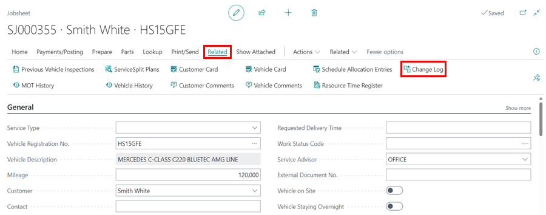
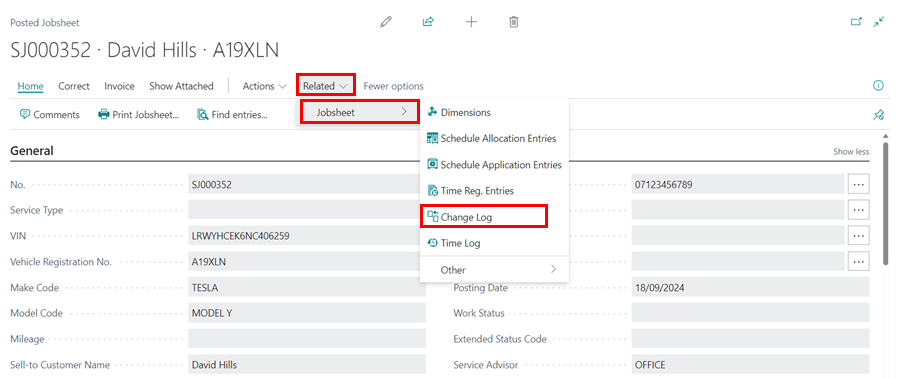

## How to Set Up Self Service Change Log
The Change Log feature is useful for tracking data changes in your Garage Hive database. Use this feature to keep track of when data is inserted, modified, or deleted on specific tables.



1. In the top-right corner, choose the  icon, enter **Self-Service Change Log Setup**, and select the related link.

   

## Enable for Service Documents
The Change Log feature is available in the Jobsheet, Vehicle Inspection Estimates, and Estimates, both unposted and posted. To enable the feature in these documents:
1. Select the **Enable for Service Documents** slider to the right on the setup page that opens.

   

2. This enables the tracking of all and some fields in the service document, such as the **General** FastTab fields, **Vehicle Reminder Dates** fields, **Group Item** fields, **Service Comment Line** fields and **Service Lines** fields.

## View Changes Made in a Service Documents
To view the changes made in a Service Document:
1. Open the document on which you want to track the changes, click **Related** in the menu bar, then select **Change Log**.

   

2. The document's changes will be shown.

   

3. This also applies to a posted Jobsheet; open the **Posted Jobsheet** in which you want to see the history of the Posted Jobsheet while it was unposted, then select **Related**, **Jobsheet**, and then **Change Log**.

   