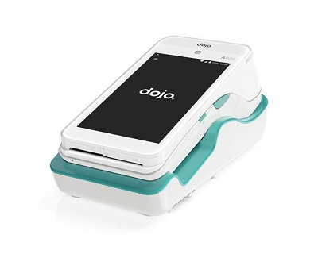

### Dojo A920 Card Terminal

   

Once your EPOS (electronic point of sale system) has been set up for integration, follow the steps below to enable integrated payments for your Dojo card machine:

- Tap the three bars at the top left of the screen on the card machine.
- Choose **Settings**, then **Integrated Payments**.
- Tap **Pay at Counter** or **Pay at Table**. To return to the **Settings** menu, use the back arrow.
- Select **Integrated Sale**.
- The card machine should now display a black Dojo screen, indicating that it is ready for integrated payments.

This will allow the card machine to integrate with your EPOS system.

### Ingenico iWL250 Card Terminal

   

To switch between till and standalone mode of the card terminal, follow these steps:

- Select F4.
- Key in the Supervisor Passcode.
- To Enter standalone mode select F4 (on).
- Press the Cancel button.
- The device will automatically reboot.

To return to till mode, repeat these steps but select F1 (off) in the standalone mode screen.

### Ingenico Move/5000 Card Terminal

   

To switch between till and standalone mode of the card terminal, follow these steps:

- Select F4.
- Key in the Supervisor Passcode.
- To Enter standalone mode select F4 (on).
- Press the Cancel button.
- The device will automatically reboot.

### Ingenico Desk/3500 Card Terminal

   

To switch between till and standalone mode of the card terminal, follow these steps:

- Select F4.
- Key in the Supervisor Passcode.
- To Enter standalone mode select F4 (on).
- Press the Cancel button.
- The device will automatically reboot.

### Ingenico Move/3500 Card Terminal

**Move3500 terminals are GPRS only and cannot be integrated, so this option is not available.**



 

### **See Also**
[Setting Up Payment by Card Terminal](garagehive-setting-up-payment-by-card-terminal.html)

