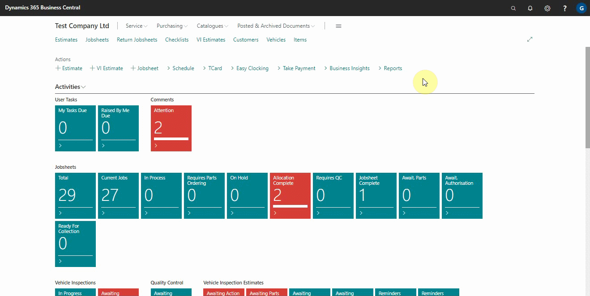
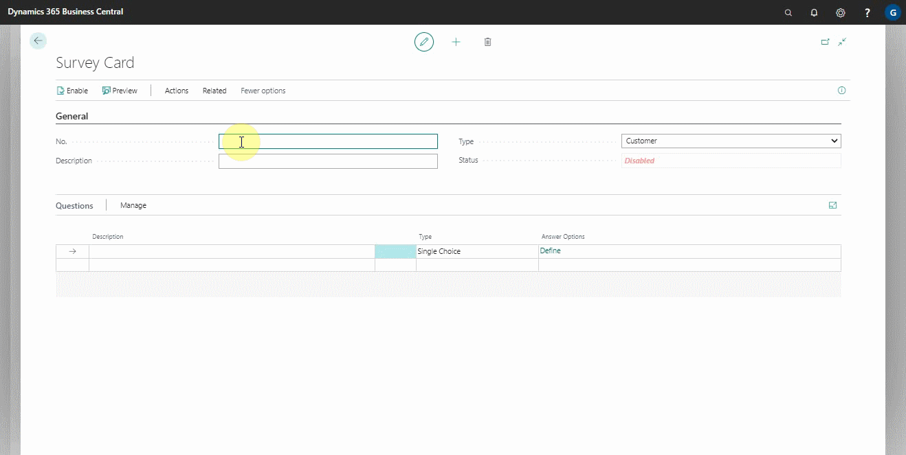

# Setting Up and Sending Internal Surveys

To enable internal surveys, you must first contact our support team to have the service activated in your system, after which you can do the following:
1. From the top-right corner search icon, search for **Survey Setup** and select it from the results.
2. If the service is enabled, the **Enabled** slider should be enabled in the window that appears.
3. Below the **Enabled** slider, there are two sliders: **Customer Surveys**, which is enabled by default when you activate the surveys service, and **Internal Surveys**, which you must enable before you can use the internal surveys.

   

3. After you've enabled internal surveys, you'll need to create an internal survey to send out. Search for **Surveys** in the top-right corner search icon, and select it from the results.
4. The resulting window displays all previously setup surveys, both customer and internal.
5. To create a new survey, click **+New** from the actions bar.

   

6. From the window that appears, you can rename the **No.** field or press the tab button to have the survey number series automatically filled in.
7. Fill out the **Description** field with a description of the survey.
8. Select **Internal** in the **Type** field, as you are creating an internal survey.

   

9. Add the questions for the employee to answer in the **Questions** section. The question should be in the **Description** column.
10. In the **Type** column, specify the type of response you anticipate from the customer and in the **Answer Options** define the answers to be selected:
   - **Single Choice** refers to a situation in which the employee selects from the available options but can only select one.
   - **Multiple Choice** refers to a situation in which the employee can select a number of options.
   - **Text** is where the employee writes down the answer in text form.
   - **Gradient** is where the employee selects between 0 to 10 the likelihood of the answer, with 0 being **not at all likely** and 10 being **extremely likely**.

   

11. It is recommend using the **Protected Data** column on all internal surveys questions, as this will ensure that only the **Owner User** (the user who has created the survey) has access to any data collected.

   

12. Select the users to whom the survey will be sent under the **Participants Settings** section, the notification method (email, SMS, or both), and whether the survey is anonymous (to encourage users to share more information in the surveys because it will not be known who gave what answers).

   

13. You can now preview the survey using the **Preview** function, enable it with the **Enable** function, and send it out using the **Send Now** function from the actions bar.

   

14. By selecting **Related** from the actions bar and clicking **Entries**, you can confirm the status of the survey(s) sent. The information from the surveys that are sent will be displayed.

   

 

### **See Also**

[Scheduling recurring internal surveys](garagehive-scheduling-recurring-internal-surveys.html) \
[Reviewing internal surveys](reviewing-internal-surveys.html) \
[How to get started with external consultant survey](garagehive-how-to-get-started-with-external-consultant-survey.html) \
[Exporting an internal survey](garagehive-exporting-an-internal-survey.html) \
[Importing an internal survey](garagehive-importing-an-internal-survey.html)