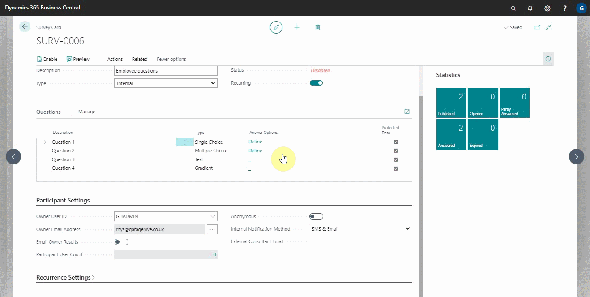

# Setting Up and Sending Internal Surveys

To enable the internal surveys, you need to call the **Garage Hive Support Team**, to help you in setting up the internal surveys. Here are contact details: **Phone:** - [**02031461164**](tel:02031461164), or **Email:** - [**help@garagehive.co.uk**](mailto:help@garagehive.co.uk).

To Create a new internal survey:
1. In the top-right corner, choose the  icon, enter **Surveys**,  and choose the related link.
2. From the **Surveys List** page, choose the **New** action.

   

3. You can manually enter the survey **No.** on the **Survey Card** page, or you can press the **Tab** or **Enter** key and the system will assign the survey **No.** from the number series.
4. Fill in the **Description** of the survey and select **Internal** as the **Type** of the survey.

   

5. Under the **Questions** sub-page, fill in the **Description** column with the survey questions, choose the response **Type** for the questions, and define the **Answer Options**.
   - **Single Choice** refers to a scenario in which the respondent selects the answer from the available options but can only select answer.
   - **Multiple Choice** refers to a scenario in which the respondent can select several answers from the available options.
   - **Text** is where the respondent writes down the answer in free text.
   - **Gradient** is where the respondent selects between 0 to 10 the likelihood of the answer, with 0 being **not at all likely** and 10 being **extremely likely** (it is an NPS style).

   

6. It is recommend using the **Protected Data** column on all internal surveys questions, as this will ensure that only the **Owner User** (the user who has created the survey) has access to the data collected.

   

7. In the **Participants Settings** FastTab, choose whether the **Owner User** should receive the survey responses by selecting the **Email Owner Results** slider.
8. Select the **Participant User Count** number to choose which users will receive the survey, and specify the **Internal Notification Method** as SMS, email or both.

     

     

9. Select the **Preview** action to preview the survey and the **Enable** action to enable the survey.
10. If you are completely satisfied with the survey, select the **Send Now** action to send it to the participants.

    

11. You can see previous surveys and their statuses by selecting **Related** and then **Entries** from the actions bar.
12. The survey statistics are provided in the FactBox on the right side. By selecting the icon in the upper-right corner, you can expand or collapse the Factbox pane.

    

 

### **See Also**

[Scheduling recurring internal surveys](garagehive-scheduling-recurring-internal-surveys.html){:target="_blank"} \
[Reviewing internal surveys](reviewing-internal-surveys.html){:target="_blank"} \
[How to get started with external consultant survey](garagehive-how-to-get-started-with-external-consultant-survey.html){:target="_blank"} \
[Exporting an internal survey](garagehive-exporting-an-internal-survey.html){:target="_blank"} \
[Importing an internal survey](garagehive-importing-an-internal-survey.html){:target="_blank"}