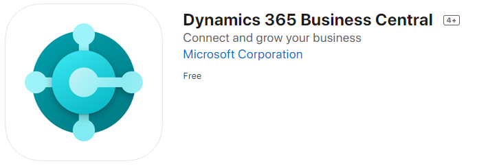

## Setting Up Devices with Microsoft Dynamics 365 Business Central App
Garage Hive can be used in devices such as phones and tablets, and most of its features are available. Here's how to install and set it up: 

1. Open the **App Store/Google Play Store** on the device and search for and install Microsoft Dynamics 365 Business Central.
2. Here are the links to the **Garage Hive App (Microsoft Dynamics 365 Business Central)** for **iOS** and **Android** mobile/tablet devices:
    * [**iOS**](https://apps.apple.com/sg/app/dynamics-365-business-central/id1093325047){:target="_blank"}   
    * [**Android**](https://play.google.com/store/apps/details?id=com.microsoft.dynamics.ProjectMadeira&hl=en_GB){:target="_blank"}

      

3. Once the App has been installed and it is open, select **Advanced Options**.
4. On the next page, choose the sign-in option as **On-Premises**.
5. In the **On-Premises** sign-in page, enter your service address, which you can find in your original login email from Garage Hive, and it should look like this: "https://yourtenantaddress.garagehive.co.uk/BC2". 
6. Check that your tenant's name is correct and that your BC number matches. If you can't find these details, contact a member of the Support Team.
7. When you're finished, click the arrow to go to the next page.

   

8. You will now see your login screen; enter the **User name** and **Password** for the device users. If you are on **Azure Active Directory (AAD)** platform, you'll see a different screen as shown below in Image 2.

       

9. Upon successful login, the home page willl appear.

   

[Go back to top](#top)
