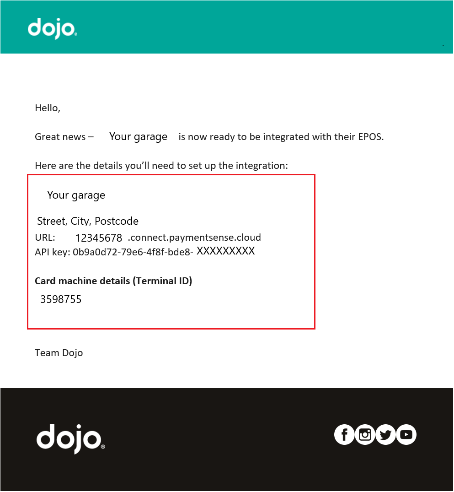
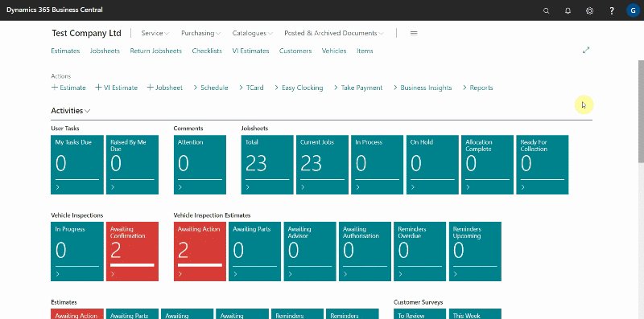
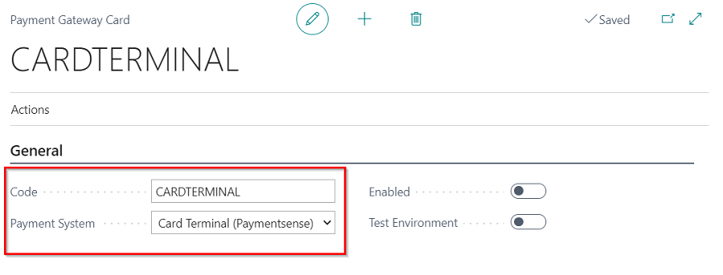
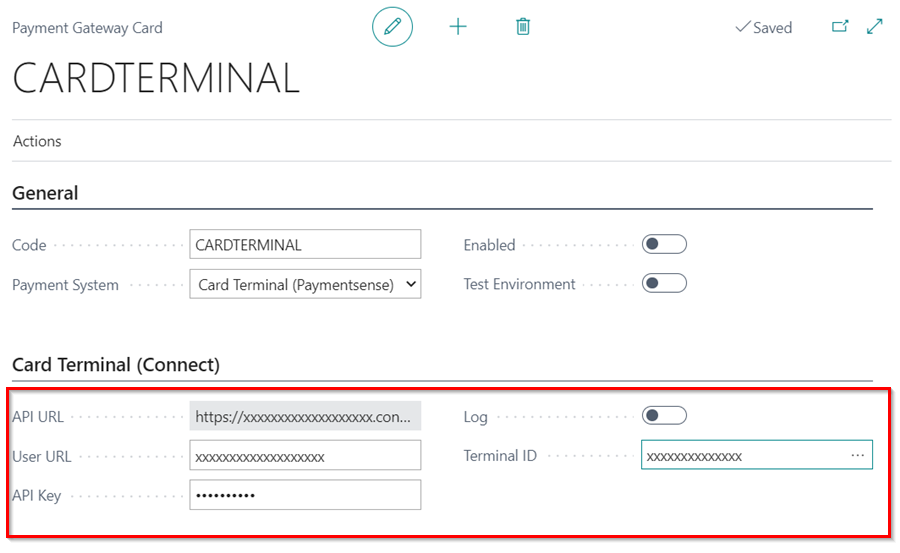
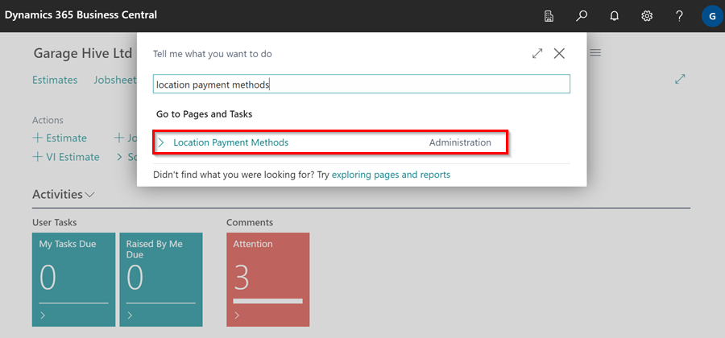
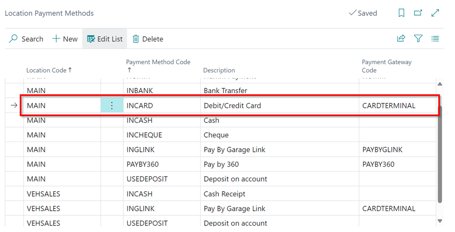

## Setting Up Payment by Card Terminal
To setup payment by **Card Terminal**:
1. **Payment Sense** will send you an email with the details you'll need to set up the integration; here's an example:

   

2. Open your Garage Hive system, in the top-right corner, choose the  icon, enter **Payment Gateways**, and select the related link.
3. Select **New** from the **Payment Gateways** page to add a new payment method.

   

4. In the **General** FastTab of the **Payment Gateway Card**, enter the payment method code; in this case, we'll add **CARDTERMINAL**.
5. Select **Card Terminal (Paymentsense)** in the **Payment System** field.

   

6. In the **Card Terminal (Connect)** FastTab, enter the details that are on the email from payment sense; that is **User URL**, **API Key** and the **Terminal ID**. After filling in the fields, enable the payment method by selecting the **Enabled** slider in **General** FastTab.

   

   

7. Click the **Back** arrow to exit the **Payment Gateway Card** and save your changes. Your new payment method is now active.
8. Once you have set up your payment card terminal, you need to add the payment to the desired location where the card will be used. To do this, search for **Location Payment Methods** by clicking on the search  icon located at the top right corner of the screen.

   

9. Choose the location you want by selecting the corresponding code in the **Location Code** column. In the **Payment Method Code** column, select **INCARD** as the payment method. 
10. Finally, select the card terminal you have set up by choosing the corresponding code in the **Payment Gateway Code** column.

   

[Go back to top](#top)

 



 

### See Also

[Taking a Payment and Posting a Jobsheet](garagehive-jobsheet-taking-payment.html){:target="_blank"} \
[Setting Up Payment by Garage Link for Access PaySuite](garagehive-payment-gateways.html){:target="_blank"} \
[Setting Up Payment by Garage Link for Dojo](garagehive-payment-gateways.html){:target="_blank"} \
[How to Use Humm Financing](garagehive-humm-financing.html){:target="_blank"} \
[How to Set Card Terminals Into Integration Mode](garagehive-setting-card-terminals-into-integration-mode.html){:target="_blank"} \
[Generating Paymentsense Card Machine End of Day, X Balance and Z Balance Report](garagehive-paymentsense-card-machine-x-and-z-report.html){:target="_blank"}
 
