

# Setting Up Payment by Garage Link for Pay360 in Garage Hive
Garage Link for **Pay360** is an online payment service that has been integrated with Garage Hive to assist Garages that use this service in connecting their accounts to Garage Hive for a more efficient and faster payment process.

## In this article
1. [Creating an Account with Pay360](#creating-an-account-with-pay360)
2. [ID Verification with Pay360 Partner](#id-verification-with-pay360-partner)
3. [Adding Pay360 to Garage Hive](#adding-pay360-to-garage-hive)

### Creating an Account with Pay360
1. To register with Pay360, please fill out the form below:

   > ## Pay360 registration form:

   <iframe width="852px" height="1000px" src="https://forms.office.com/e/Fms4ah6f1w?embed=true" frameborder="0" marginwidth="0" marginheight="0" style="border: none; max-width:100%; max-height:100vh" allowfullscreen webkitallowfullscreen mozallowfullscreen msallowfullscreen> </iframe>

2. After registering by filling out the form above, you will receive an email from **Pay360** inviting you to begin creating your account. In the email, click **Activate**.

   

3. You will be redirected to the **Pay360** website. Start by creating a password for your account, then check the **I'm not a robot** box and then click **Create Account**.

   

4. Select **Activate Your Account** on the next page, which opens the pages where you can enter your company information.

   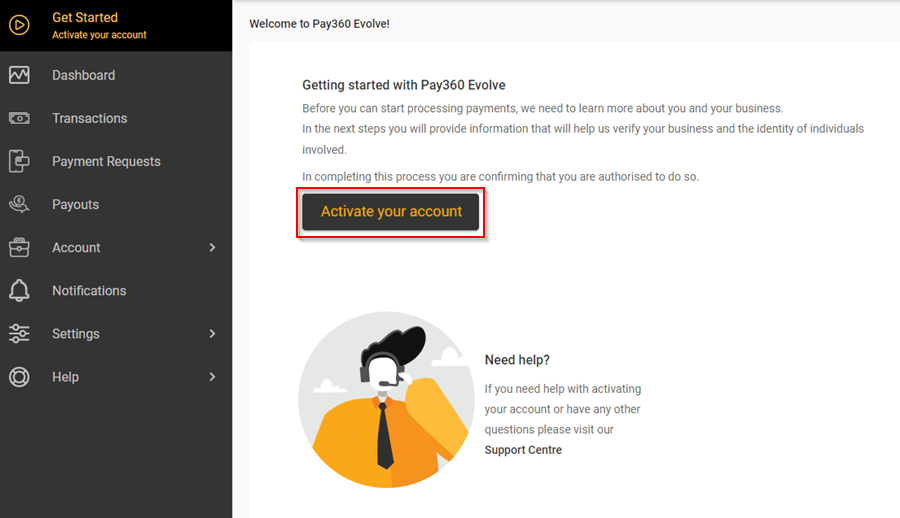

5. Start by entering **Business Details**, which must match the details found in the **Companies House** search. All fields marked with an asterisk (*) are required. When you're finished, click **Next**.

   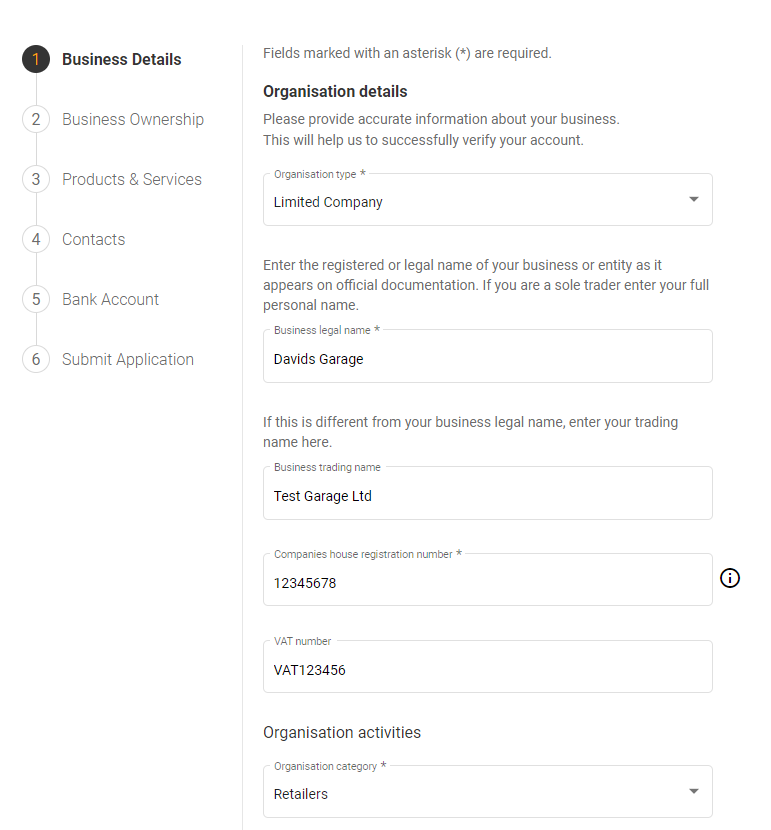

   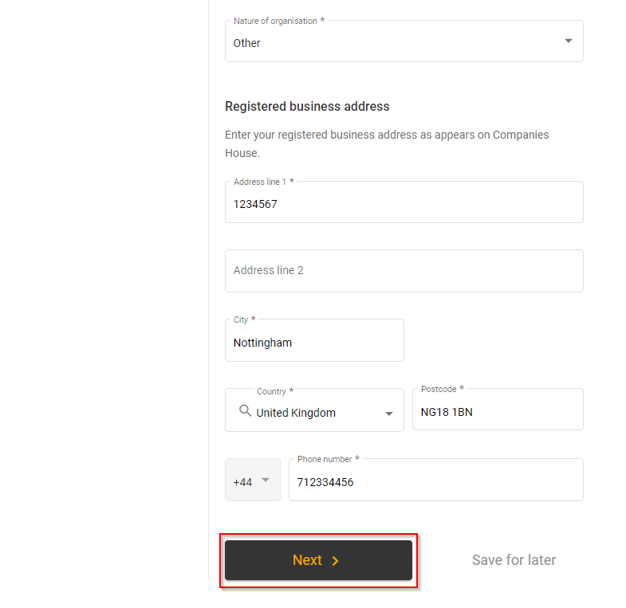

6. In the next page you need to add details of **Business Ownership**, which must also match the details found in the **Companies House** search. Click on **Add person**.

   

7. Enter the first person's information as needed, and then click **Save**.

   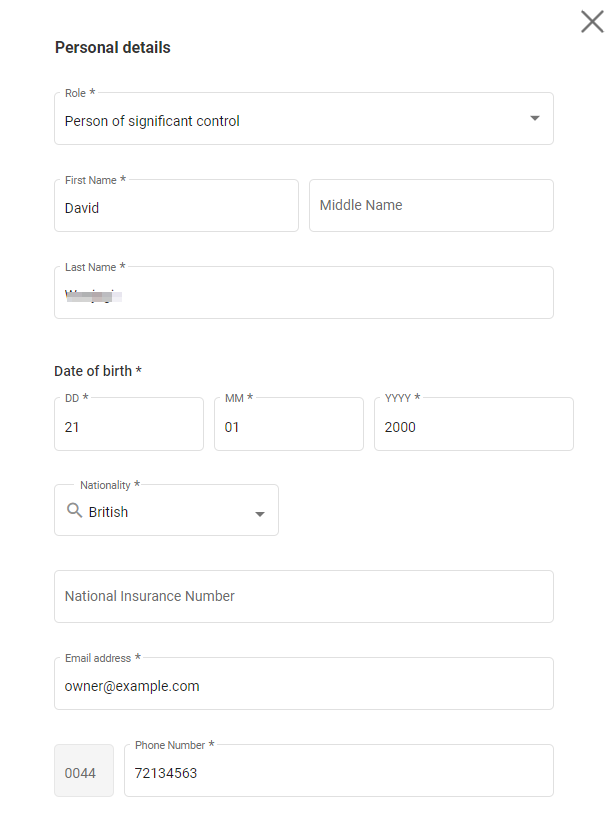

   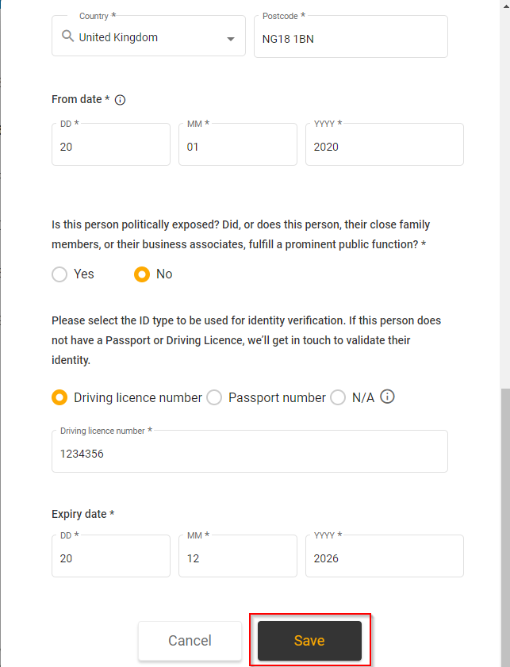

8. By clicking **Add person**, you can continue to add all of the people who are currently registered as the active business owners. After you've added everyone, click **Next**.

   

9. On the **Products & Services** page, specify whether you **sell physical goods**, **sell services to customers**, **sell digital services**, or you do all or some of the above. Check all the boxes that apply to your business.

   

10. On the same page, specify the business's **expected monthly turnover**, **expected average transaction value**, and **expected maximum transaction value**. When you're finished, click **Next**.

   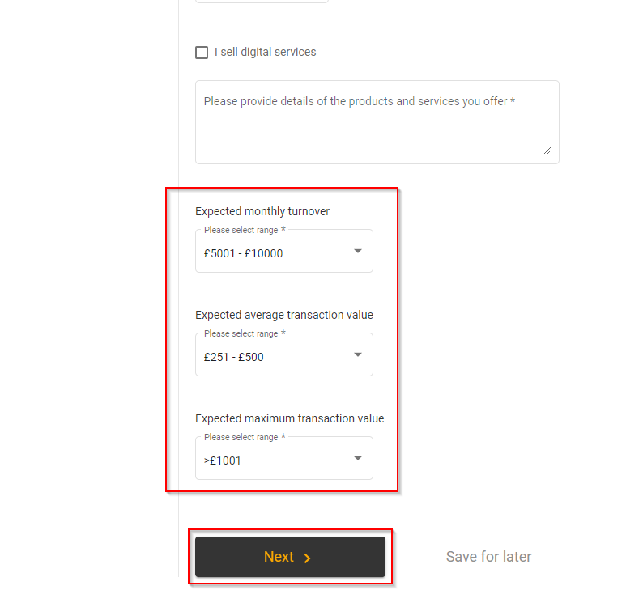

11. Add the **types** of contacts to the **Contacts** page, one for **Billing** queries and one for **Support** queries. You can choose from the previously added contacts under **Business Ownership** or add a new contact.

   

   

12. On the **Bank Account** page, enter the details of your **Bank Account**, and select **Bank Account Signatories**.

   

13. Click **Next** to confirm the bank details you've entered. If everything is correct, click **Next**. If not, select **Edit Bank Details**.

   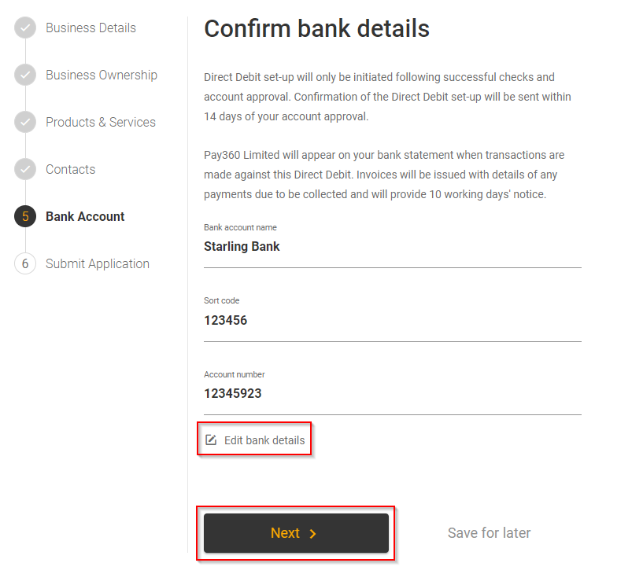

14. To submit the application, enter the details of the appointed representative, check the box to confirm you are authorised to act on behalf of the business, and **Download a copy of your Product Order**. Then click the **Submit application** button.

   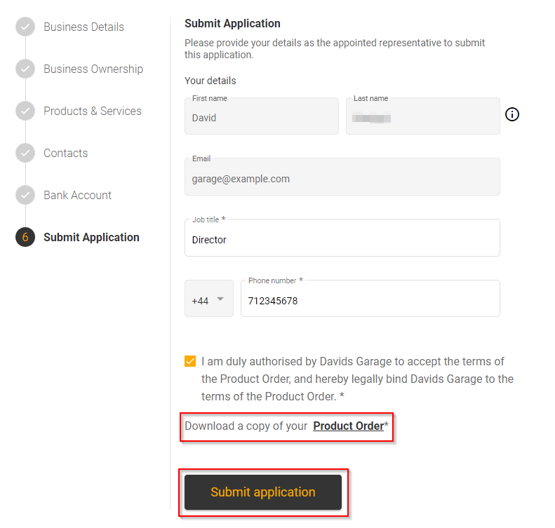

15. Your application will be successfully submitted, and you can return to the portal by clicking the **Return to portal** button.

   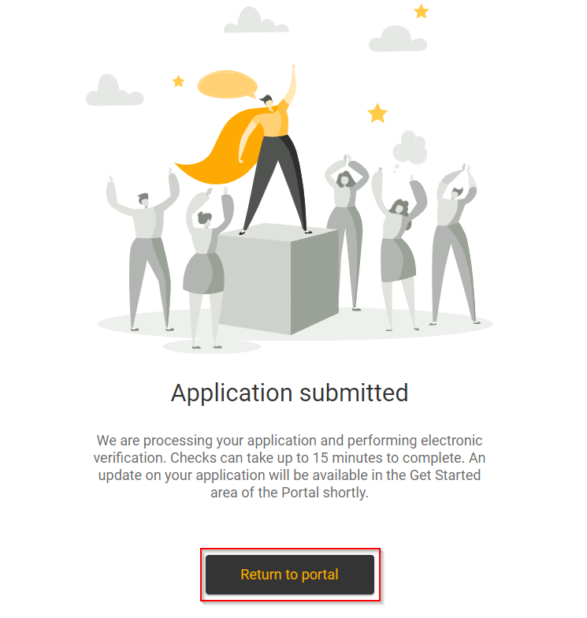

[Go back to top](#top)

### ID Verification with Pay360 Partner
After submitting your application, you will receive a new message informing you that **Pay360** will send an **ID Verification** email through their partner **NorthRow**. The email will be as follows:

   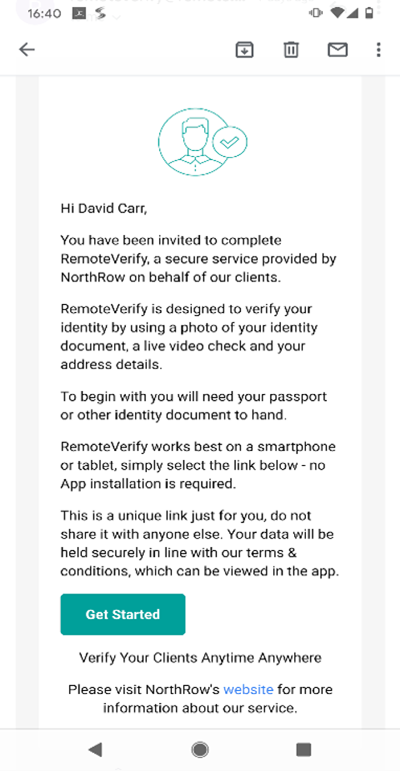

After receiving the email, follow these steps to complete the **Live ID Verification** check:
1. On the email, click the **Get Started** link. This opens the **NorthRow RemoteVerify** application. Scroll through the invitation screens until you reach the last one and click **Get Started**.

   

2. The next step will be **Document Identification** check. This could be your **Passport**, **Driving Licence**, or **ID Card**. Take a picture of your document to upload.

   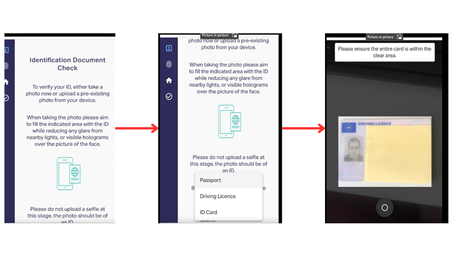

3. The next one will be **Liveness Check**. This is the step where you confirm that you are there. To begin, select **Proceed**.

   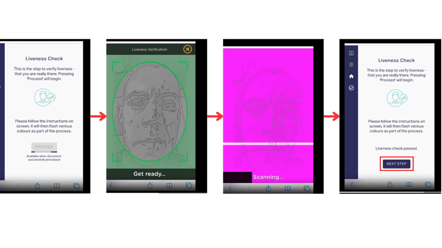

4. When you're finished, click **Next Step**. In the following step, you will enter your personal details, including your residential address.

   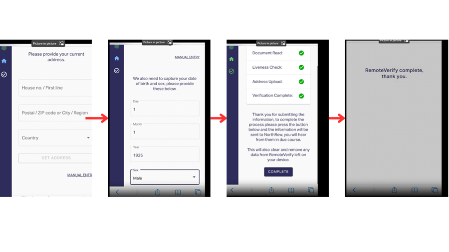

5. The RemoteVerify process will now be complete.
6. Additional documents, such as a bank statement, may also be requested by the Pay360 team. A notification requesting further documentation can be viewed on the Pay360 portal. You can upload the required documents by clicking the **Go to Documents** link in the notification or by going to the document section and uploading the required documents.

   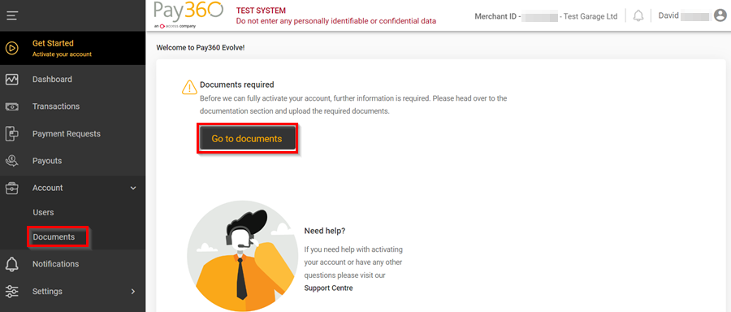

[Go back to top](#top)

### Adding Pay360 to Garage Hive
After creating an account with **Pay360**, you should now add **Pay360** as a **Payment Gateway** in Garage Hive:
1. In the top right corner, choose the  icon, enter **Payment Gateways**, and select the related link.

   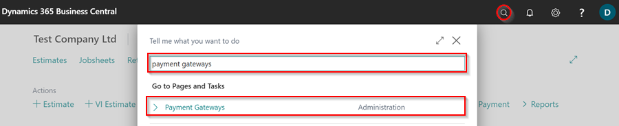

2. Click on **New** from the menu bar to add a new **Payment Gateway**.

   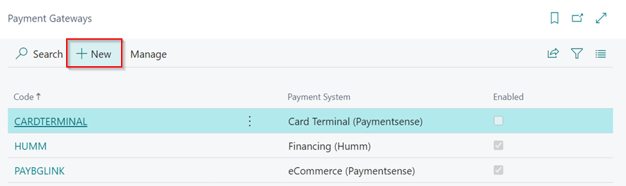

3. The **Payment Gateway Card** will require the **Pay360** **Merchant ID**, which can be found in the top right corner of the **Pay360** portal.

   

4. In the **Payment Gateway Card**, enter the **Code** as **Pay360**, the **Payment System** as **eCommerce (Pay360)**, and the **Merchant ID** from **Pay360** in the **Merchant ID** field.

   

5. To enable the **Pay360** payment gateway in Garage Hive, select the **Enabled** slider and close the **Payment Gateway** card.

   

6. To add the **Location Payment Methods**, choose the  icon, enter **Location Payment Methods**, and select the related link.
7. Select the locations where you want to use the **Pay360** payment gateway, then enter the **Payment Method Code**, **Description**, and **Payment Gateway Code** for **Pay360** on each location.

   

8. Creating payments in the **Location Payment Methods** page can be complex; please contact **GH Support** if you need assistance.

[Go back to top](#top)