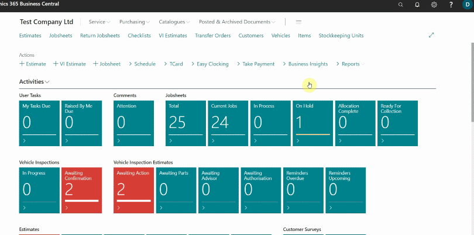

# Setting Up Payment by Glink
To setup payment by **Glink**:
1. In the top-right corner, choose the search icon, enter **Payment Gateways**, and select the related link.
2. From the **Payment Gateways** page, select **New** to add a new payment method.

   

3. In the **General** FastTab of the **Payment Gateway Card**, add the code of the payment method; in this case we'll name it **GLINKPAYMENT**.
4. Select **Payment System** field as **eCommerce (Paymentsense)**, and under **eCommerce (Connect-E)** FastTab select **v2** in the **API Version** field.
   
   

5. As a **GLink** customer, open the email sent to you with the subject **Set Up Online Checkout**, and **Login** to your account.

   

6. In your account, select **Account** on the left-hand side, and then locations. If single location, select your location in the main window (as it is the only one), if multiple locations, scroll through location and select the location you want to add the payment method. Location details will appear on the right-hand side.
7. Scroll down to **Remote Payments** under the **Location Details** and select website.

   

8. From the page that opens, copy the website address.

Garage Hive provides the following reports from the payments received for via the **Paymentsense Card Machine:**
 * **X Balance** - An X Balance report returns the current local session totals on the **Paymentsense Card Machine** without resetting them.
 * **Z Balance** - A Z Balance report returns the current local session totals on the **Paymentsense Card Machine** and resets them. Other than the reset of totals, a Z Balance report is the same as X Balance report.
 * **Banking** - A Banking report fetches the current banking totals from the bank and returns these totals. The banking totals are reset in line with banking times.
 * **End of Day** - An End of Day report performs a Z Balance report followed by a Banking report. 

### How to generate the reports:
1. From the **Service Advisor** role centre, select **Reports** from the actions bar, followed by **End of Day**, and then **Card Machine Report**.

   

2. Under the **GroupName** FastTab, select the card machine in the **Card Machine**, followed by the **Report Type**; in this case **X Balance** report and then click **OK**. The report will be generated.

   

3. To generate the **Z Balance** report, select **Z Balance** in the **Report Type** field, and click **OK**. The report will be generated.

   

4. To generate the **Banking** report, select **Banking** in the **Report Type** field, and click **OK**. The report will be generated.

   

5. To generate the **End of Day** report, select **End of Day** in the **Report Type** field, and click **OK**. The report will be generated.

