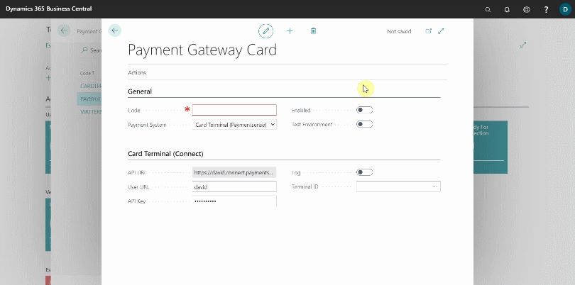
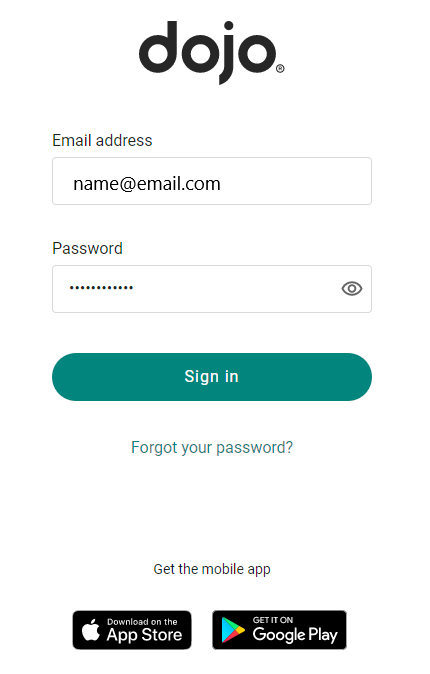
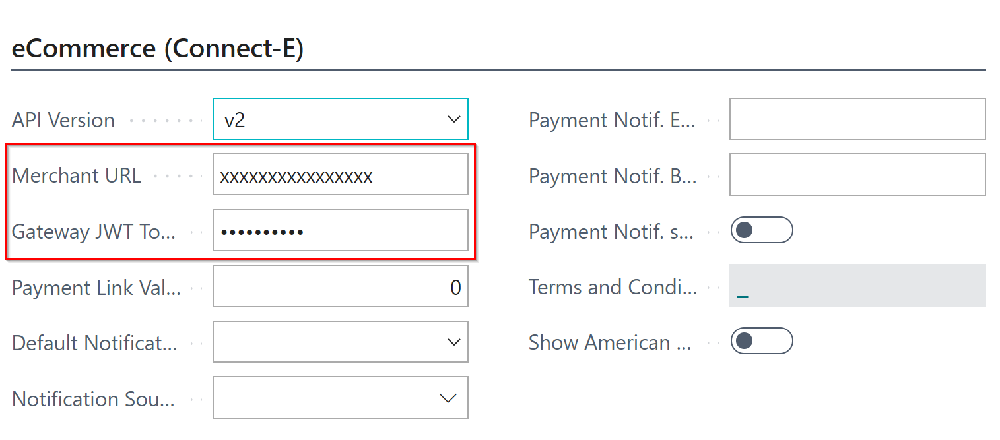
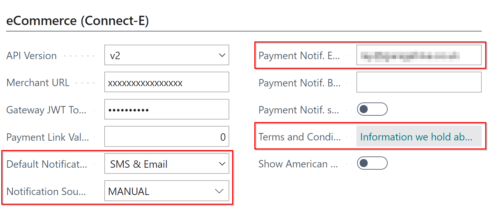
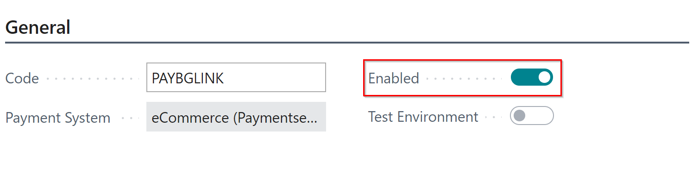

## In this article
1. [Setting Up Payment by Garage Link in Garage Hive](#setting-up-payment-by-garage-link-in-garage-hive)
2. [Testing the garage link setup](#testing-the-garage-link-setup)

### Setting Up Payment by Garage Link in Garage Hive
Garage Link is a payment gateway that is used for online payments. To setup payment by **Garage Link**:
1. In the top-right corner, choose the search icon, enter **Payment Gateways**, and select the related link.
2. Select **New** from the **Payment Gateways** page to add a new payment method.

   

3. In the **General** FastTab of the **Payment Gateway Card**, enter the payment method code; in this case, we'll add **PAYBYGLINK**. 
4. Select **eCommerce (Paymentsense)** in the **Payment System** field, and in the **eCommerce (Connect-E)** FastTab, select **v2** in the **API Version** field.
   
   

5. Open the email with the subject **Set Up Online Checkout** that was sent to you as a **GLink** customer, and then **Login** to your account. 

   

   

6. Select **Account** on the left-hand side of your account, followed by **Locations**. If you only have one location, select it in the main window; if you have multiple locations, scroll through them and select the location where you want to add the payment method. The location information will appear on the right-hand side.

   

7. Scroll down to **Remote Payments** in the **Location Details** section and click on the **Website** field.

   

8. Copy the **Website Address** from the page that appears and paste it into the **Merchant URL** in the Garage Hive’s **Payment Gateway Card**.
9.  Then, copy the **JWT Token** and paste it in the **Gateway JWT Token** field of the Garage Hive’s **Payment Gateway Card**.

     

     

10. Choose **SMS and Email** as the **Default Notification Type** and **Manual** as the **Notification Source Code** from the **Payment Gateway Card**.
11. You can add internal user email address(es) in the **Payment Notification Emails** that the system will use to notify the user(s) when the customer makes a payment.
12. Add the company's terms and conditions for the online payments in the **Terms and Conditions** field; Privacy and Refund policies must be included.

   

13. To enable the payment method, select the **Enabled** slider. 

   

14. Click the **Back** arrow to exit the **Payment Gateway Card** and save your changes. Your new payment method is now active.

### Testing the Garage Link setup
Once configured, it is recommended that you run a **£0.01** transaction as a test. Create a new jobsheet with your personal information, add a  or **consumable or a non-inventory item**, and then proceed to the **Take Payment** screen. Once on the **Take Payment** screen, select **Process** in the action bar and **Pay By Garage Link**.

Make sure the value is set to **£0.01**, select the notification type and enter your details. Once you receive the test SMS/Email please follow the link and complete the test payment. 



You can check the status of the payment in Garage Hive by selecting the "Payment Gateway Entries" from the action bar. 

You should also receive an email confirming the payment has been received. Once you've received payment for this job, post it with the penny on it.