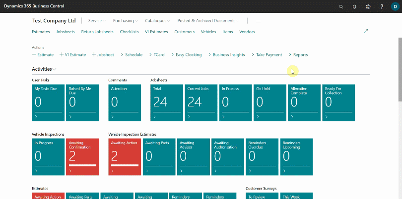
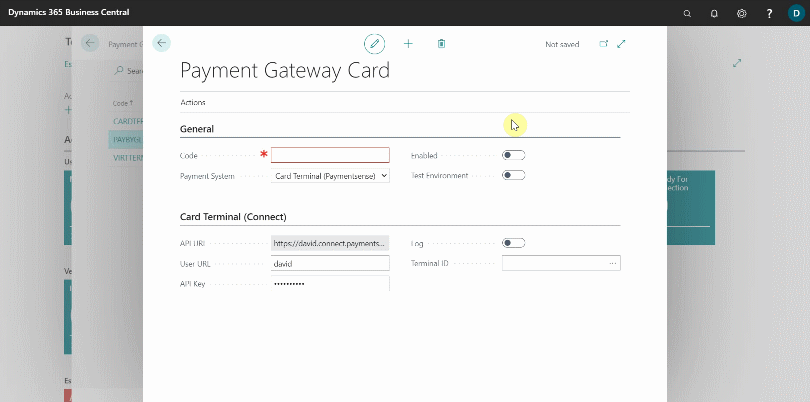
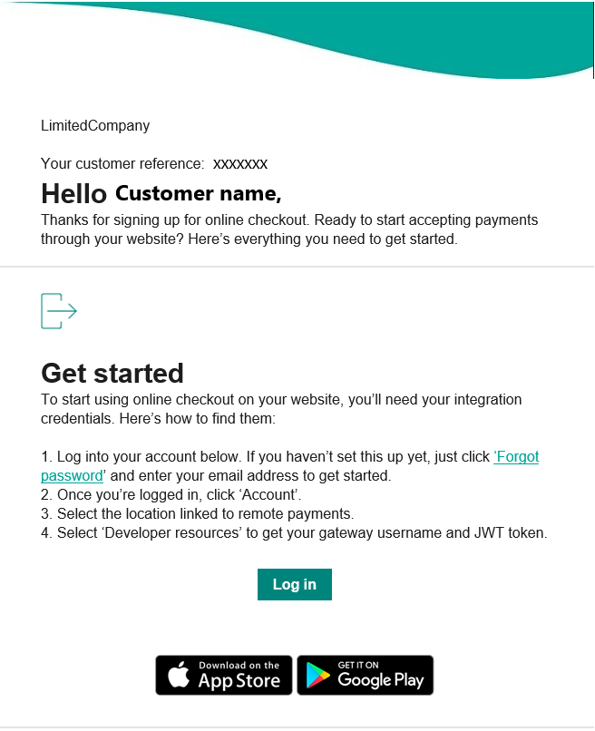
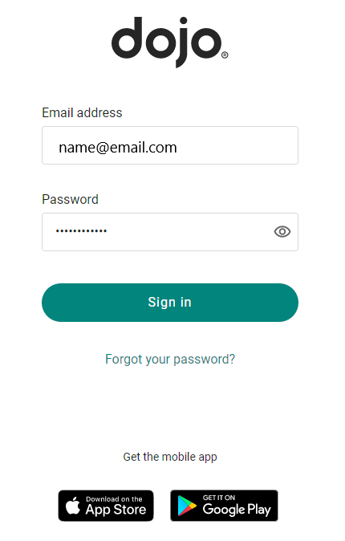
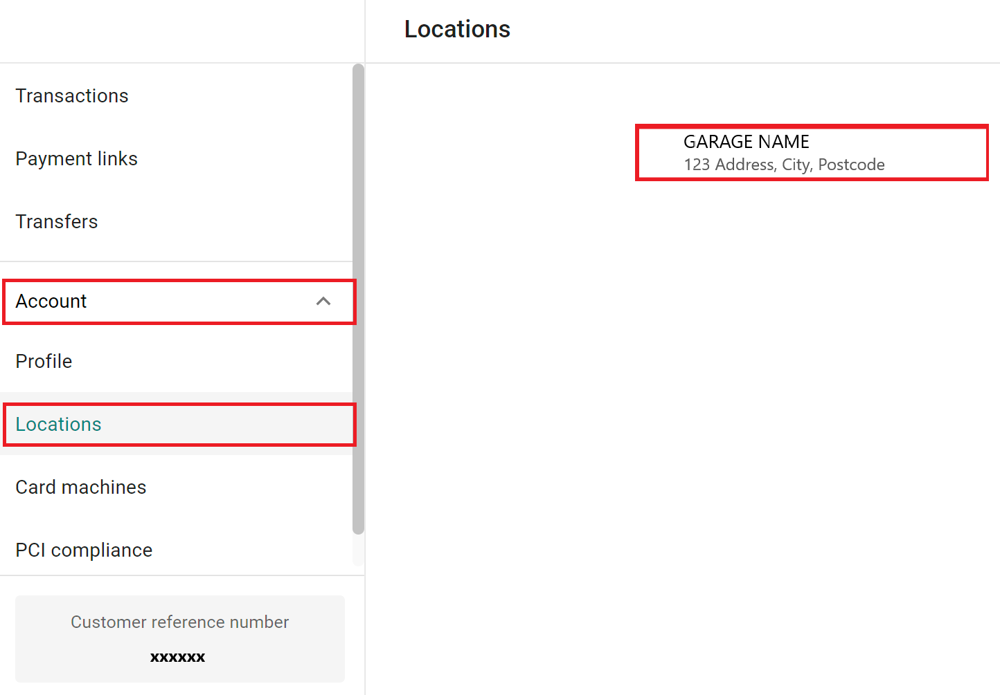
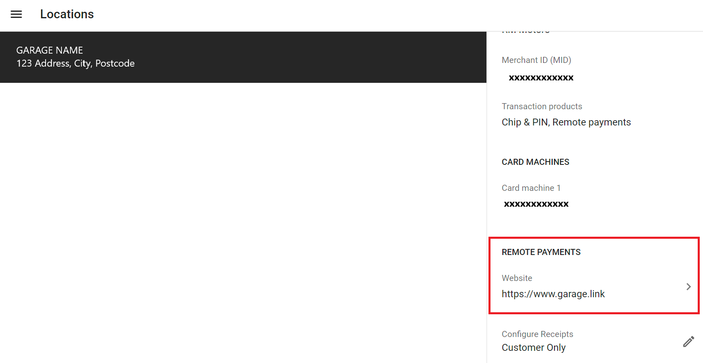
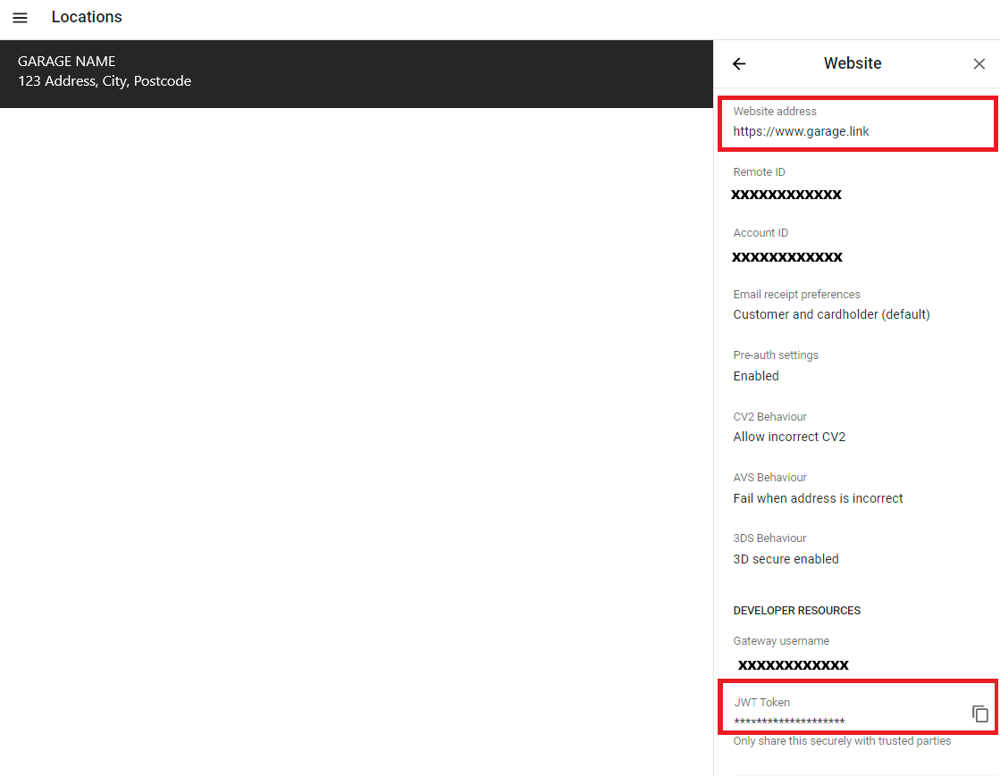
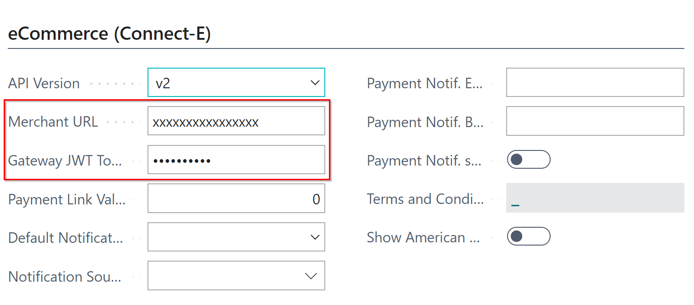
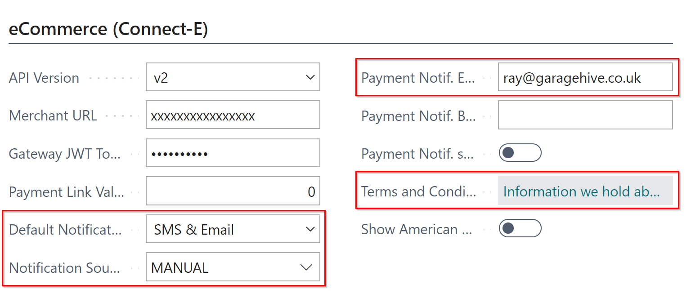
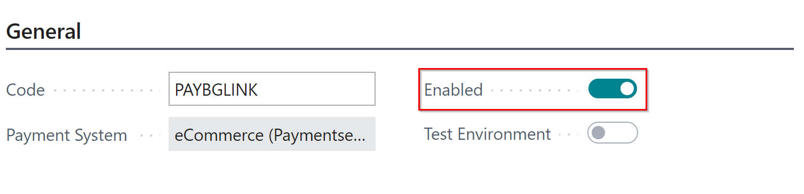

# Setting Up Payment Gateways in Garage Hive
There are two **Payment Gateways** available in Garage Hive:

## Payment by Garage Link
Garage Link is for online payments. To setup payment by **Garage Link**:
1. In the top-right corner, choose the search icon, enter **Payment Gateways**, and select the related link.
1. Select **New** from the **Payment Gateways** page to add a new payment method.

   

1. In the **General** FastTab of the **Payment Gateway Card**, enter the payment method code; in this case, we'll add **PAYBYGLINK**. 
1. Select **eCommerce (Paymentsense)** in the **Payment System** field, and in the **eCommerce (Connect-E)** FastTab, select **v2** in the **API Version** field.
   
   

1. Open the email with the subject **Set Up Online Checkout** that was sent to you as a **GLink** customer, and then **Login** to your account. 

   

   

1. Select **Account** on the left-hand side of your account, followed by **Locations**. If you only have one location, select it in the main window; if you have multiple locations, scroll through them and select the location where you want to add the payment method. The location information will appear on the right-hand side.

   

1. Scroll down to **Remote Payments** in the **Location Details** section and click on the **Website** field.

   

1. Copy the **Website Address** from the page that appears and paste it into the **Merchant URL** in the Garage Hive’s **Payment Gateway Card**.
1.  Then, copy the **JWT Token** and paste it in the **Gateway JWT Token** field of the Garage Hive’s **Payment Gateway Card**.

     

     

1. Choose **SMS and Email** as the **Default Notification Type** and **Manual** as the **Notification Source Code** from the **Payment Gateway Card**.
1. You can add internal user email address(es) in the **Payment Notification Emails** that the system will use to notify the user(s) when the customer makes a payment.
1. Add the company's terms and conditions for the online payments in the **Terms and Conditions** field; Privacy and Refund policies must be included.

   

1. To enable the payment method, select the **Enabled** slider. 

   

1. Click the **Back** arrow to exit the **Payment Gateway Card** and save your changes. Your new payment method is now active.
