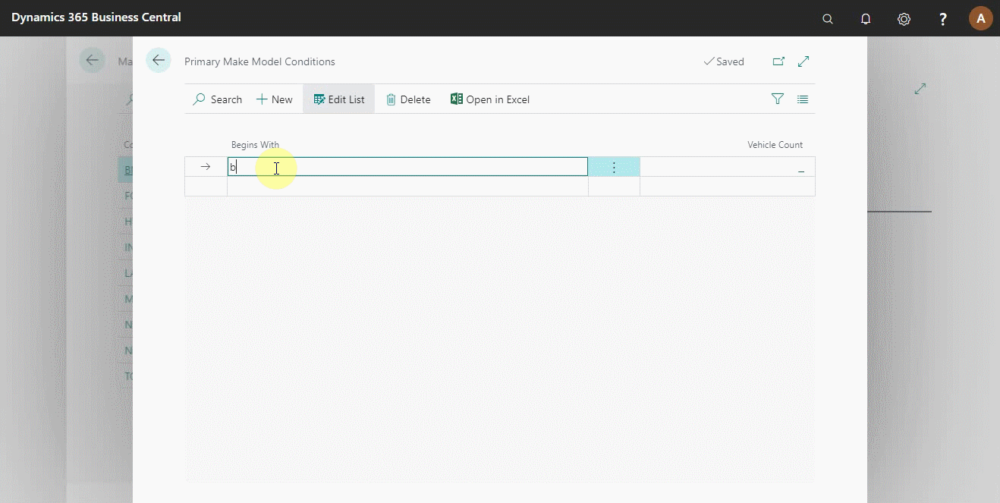

# Setting Up Primary Makes and Models

The primary make and model function helps to set conditions to apply when assigning a service package to a vehicle. The condition set defines which vehicle can use the service package and which to exclude.

## In this article

1. [Setting the primary makes](#setting-the-primary-makes)
2. [Setting the primary models](setting-the-primary-models)

### Setting the primary makes
To set the Primary Makes:
1. Search **Make List** from the  icon, at the top-right corner, select it from the options that appear.
2. The window that opens lists all the defined primary make vehicles to use when assigning a service package condition.

    

2. To add a new vehicle make, click on **+New**. 
3. From the Make Card that opens, add the **Code** as the vehicle's make and the **Name** as the name commonly used for the make. 
4. Select the **Primary Make** slider, to mark it as a primary make.

    

5. Or, you can click on **Manage**, and select **Edit**, to edit an existing vehicle make.

To set the condition for a particular primary make:
1. Click on **Related** from the menu bar and select **Make**. 
2. From the submenus that appear, select **Primary Make Conditions**. The primary make conditions help the system understand all the vehicle models under the selected primary make.

    

3. Edit the column **Begins With** to instruct the system to find all the vehicle models that begin with the defined condition. For example, if a vehicle model begins with BMW, it automatically falls under the primary make. 
4. **Vehicle Count** column indicates the number of vehicles that fall under the set condition.

### Setting the primary models
After setting the primary make conditions, you can now set the primary models. There are two ways of setting the primary models; one is by accessing the model list from the make list page:
1. Click on **Related**, and **Make** submenu.
2. Select **Models**.

    

3. Click on **+New** to add a new vehicle model. 
4. Select the **Make Code** from the dropdown list.
5. Add the vehicle model **Code**.
6. Select the **Primary Model** slider, to mark it as a primary model.

The second method:
1. Searching **Model List** in the  icon, at the top-right corner and select it from the list. 
2. The model list opens, and you can create a new model as explained above.

To set the condition for a particular primary model:
1. Click on  **Related**. 
2. Select **Primary Model Conditions**.

    

3. Add the conditions to the vehicle models in the page that opens.

### **See Also**

[Setting up service package conditions](/docs/service-package-conditions.html) \
[Setting up service packages](/docs/garagehive-service-packages.html) \
[Setting up service packages for online booking](/docs/garagehive-onlinebooking-service-packages.html) \
[Video: Service Package conditions](http://www.youtube.com/watch?v=DDrB5v6kzM0){:target="_blank"}