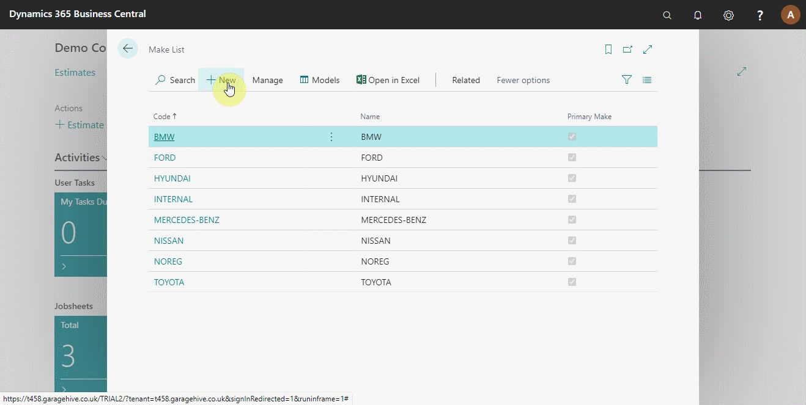

# Setting Up Primary Makes and Models

The primary make and model function helps to set conditions to apply when assigning a service package to a vehicle. The condition set defines which vehicle can use the service package and which to exclude.

#

To set the Primary Makes, search **Make List** from the search icon at the top-right corner and select it from the options that appear.

The window that opens lists all the defined primary make vehicles to use when assigning a service package condition. To add a new vehicle make, click on **+New**. From the Make Card that opens, add the **Code** as the vehicle's make, **Name** as the name commonly used for the make and select the **Primary Make** slider, to mark it as a primary make.

Select a vehicle make from the list to edit, click on **Manage**, and select **Edit**.

Click on **Related** from the actions bar and **Make** to set the condition for a particular primary make. From the submenus that appear, select **Primary Make Conditions**. The primary make conditions help the system understand all the vehicle models under the selected primary make.

The column **Begins With** instructs the system to find all the vehicle models that begin with the defined condition. For example, if a vehicle model begins with BMW, it automatically falls under the primary make. **Vehicle Count** column indicates the number of vehicles that fall under the set condition.

After setting the primary make conditions, you can now set the primary models. There are two ways of setting the primary models; one is by accessing the model list from the make list page. Click on **Related** and **Make**, and select **Models**.

Click on **+New** to add a new vehicle model. Select the **Make Code** from the dropdown list, add the vehicle model **Code** and select the **Primary Model** slider, to mark it as a primary model.

The second method is by searching **Model List** in the search icon at the top-right corner and select it from the list. The model list opens, and you can create a new model as explained above.

Now, set the **Primary Model Conditions** by clicking on **Related** and selecting **Primary Model Conditions**.

Add the conditions to the vehicle models in the page that opens.

### **See Also**

[Setting up service package conditions](/docs/service-package-conditions.html)  

[Setting up service packages](/docs/garagehive-service-packages.html)  

[Setting up service packages for online booking](/docs/garagehive-onlinebooking-service-packages.html)  

[Video: Service Package conditions](http://www.youtube.com/watch?v=DDrB5v6kzM0){:target="_blank"}  