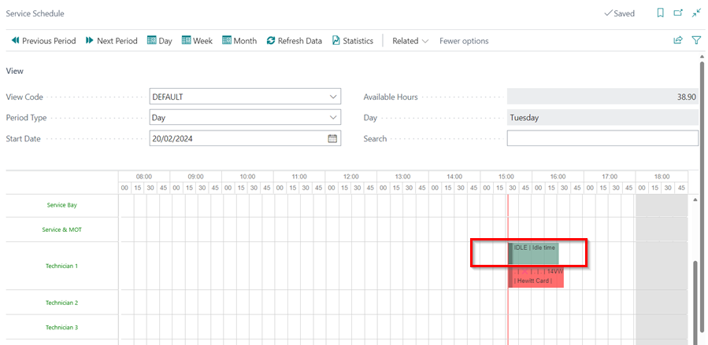

## How to Setup the Service Schedule
The service schedule can be set up on the **Service Schedule Setup** page. To get to this page, choose the  icon in the top right corner, enter **Service Schedule Setup**, and select the related link.

   

Below are some setups that can be done on the **Service Schedule Setup** page:

1. [Change the time format](#change-the-time-format)
2. [Change the way the resource name appears in the schedule](#change-the-way-the-resource-name-appears-in-the-schedule)
3. [Show the unavailable time in the schedule](#show-the-unavailable-time-in-the-schedule)
4. [Delete allocations older than one year in the schedule](#delete-allocations-older-than-one-year-in-the-schedule)
5. [Show idle allocations in the schedule](#show-idle-allocations-in-the-schedule)

### Change the time format
The time displayed at the top of the schedule view can be changed to either **12HR** or **24HR**.

   

To change in the **Service Schedule Setup** page, select either **12HR** or **24HR** in the **Time Format** field under the **General** FastTab.

   

[Go back to top](#top)

### Change the way the resource name appears in the schedule
The resource name can appears as just the **Resource No.**, the **Description** or the **Resource No.** with the **Description** in the schedule view. 

   

To change in the **Service Schedule Setup** page, select the **No.**, the **Description** or the **No.** with the **Description** in the **Resource Name in Schedule** field under the **General** FastTab.

   

[Go back to top](#top)

### Show the unavailable time in the schedule
In the schedule, the unavailable time is highlighted in grey. You could choose whether or not to display the unavailable time in the schedule.

   

You can change the **Show Unavailable Time** slider under the **General** FastTab on the **Service Schedule Setup** page.

   

[Go back to top](#top)

### Delete allocations older than one year in the schedule
Select the **Delete Old Allocations** slider on the **Service Schedule Setup** page to setup the system to always delete allocations older than one year.

   

[Go back to top](#top)

### Show idle allocations in the schedule
You can also enable or disable the display of idle allocations such as **Holiday** for a technician.

   

You can change this in the **Service Schedule Setup** page by selecting or deselecting the **Show Idle Allocations** slider.

   

[Go back to top](#top)