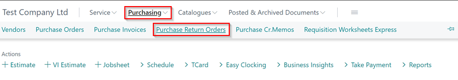
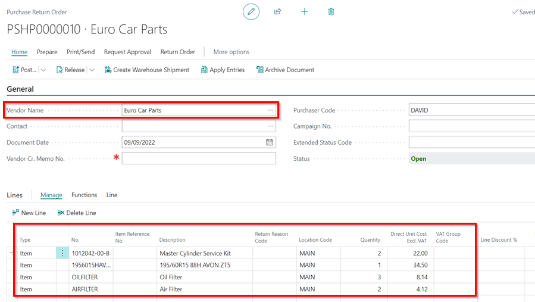
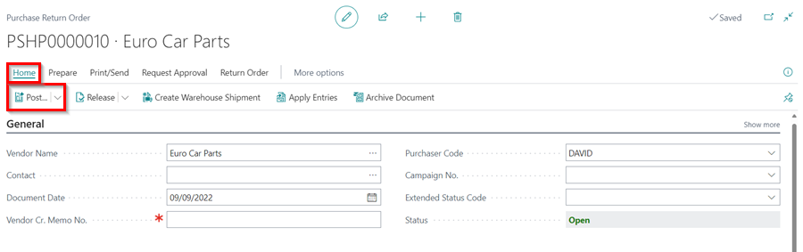
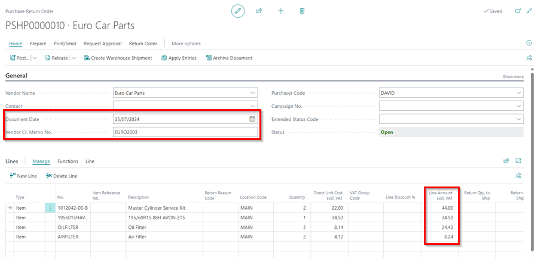
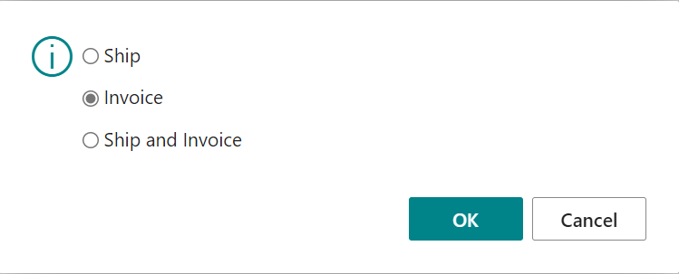
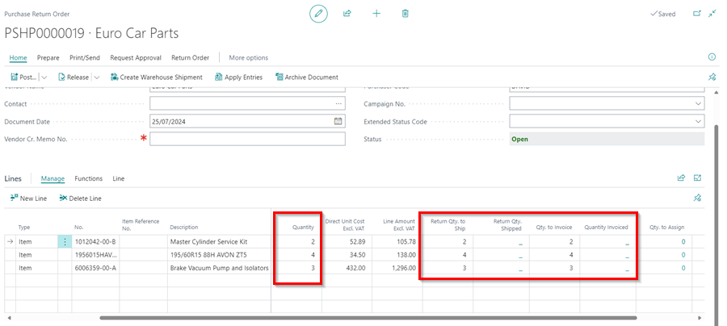
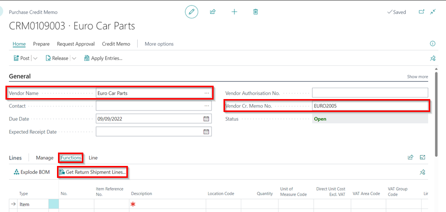
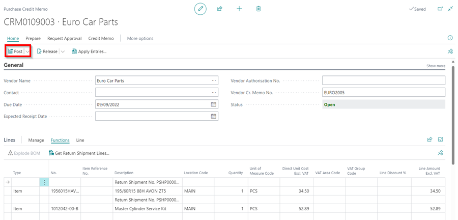
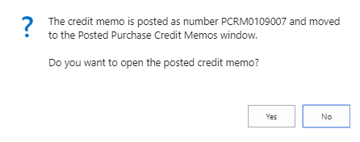

# Creating a Purchase Return Order and Purchase Credit Memo
Purchase return orders are documents that you use to manage and track all of your returns. They facilitate you in tracking items you ship back to the supplier and receiving a credit memo when the supplier processes them.

## In this article+

1. [Shipping and Invoicing Parts in a Purchase Return Order with a One Credit Memo from the Supplier](#shipping-and-invoicing-parts-in-a-purchase-return-order-with-a-one-credit-memo-from-the-supplier)
2. [Shipping and Invoicing Parts in a Purchase Return Order with More than one Credit Memo from the Supplier](#shipping-and-invoicing-parts-in-a-purchase-return-order-with-more-than-one-credit-memo-from-the-supplier)
3. [Creating a Purchase Credit Memo when Parts have been shipped and credit note does not match Purchase Return Order](#creating-a-purchase-credit-memo-when-parts-have-been-shipped-and-credit-note-does-not-match-purchase-return-order)

### Shipping and Invoicing Parts in a Purchase Return Order with a One Credit Memo from the Supplier
1. From the role centre navigation menu, click on **Purchasing** and then select **Purchase Return Orders**.

   

2. Click on **New** to create a new purchase return order.
3. Enter the vendor name in the **Vendor Name** field and the items to return in the **Lines** sub-page.

   

4. When the purchase return order is created, the items must be returned to the supplier for a credit memo to be processed. Select **Posting** from the actions bar and then select **Post** from the submenus.

   

5. You have three options in the pop-up menu: **Ship**, **Invoice**, and **Ship and Invoice**. Select **Ship** and click **OK** while you wait for the supplier's credit memo. This indicates that the items have been returned to the supplier, and you are now awaiting a credit memo from the supplier.

   

6. After receiving a credit memo from the supplier, enter all the details on the credit memo in the purchase return order and ensure they match; the **Document Date**, **Vendor Cr. Memo No.**, and the **Line Amounts**.

   

7. Click on **Posting** from the actions bar and then select **Post** from the submenus.
+8. Select **Invoice** from the three options and click **OK**. This posts the purchase return order to update the relevant ledger accounts and balance the stock levels.

   

### Shipping and Invoicing Parts in a Purchase Return Order with More than one Credit Memo from the Supplier
The Garage Hive system allows you to ship and invoice parts from a single **Purchase Return Order** at for parts with different Credit Memo from the supplier. Here is the procedure:
1. Open the Purchase Return Order with the parts that have two different Credit Memos from the supplier. Scroll down to the **Lines** sub-page.
1. Take note of the columns **Quantity**, **Return Qty. to Ship**, **Return Qty. Shipped**, **Qty to Invoice** and **Qty Invoiced**.

   

1. When you enter a value in the **Quantity** column, the **Return Qty. to Ship** and **Qty. to Invoice** columns are automatically filled in, but you can edit them.
1. To **Ship** some parts, for example, delete the value from the **Return Qty. to Ship** column in the Purchase Return Order for the parts you don't want to ship.
1. Then select **Posting**, followed by **Post** in the actions bar. Select **Ship** from the options in the pop-up menu and click **OK**.
1. The number of items shipped is recorded in the column **Return Qty. Shipped**.

   

1. When the other items are ready to ship, repeat step **5**.
1. After shipping the parts, you may receive different Credit Memos for the parts on the Purchase Return Order. You must invoice separately for each Credit Memo parts.
1. Enter the **Vendor Cr. Memo No.** for one of the Credit Memos, then scroll down to the **Lines** sub-page and delete the value of column **Qty to Invoice** for the parts that are not in the Credit Memo to invoice.
1. Then select **Posting**, followed by **Post** in the actions bar. Select **Invoice** from the options in the pop-up menu and click **OK**.
1. The number of items on the Credit Memo are invoiced and recorded in the column **Qty Invoiced**.

   

1. After you've invoiced one of the Credit Memos, delete its number from the **Vendor Cr. Memo No.** field. Take the other Credit Memo and enter its number in the **Vendor Cr. Memo No.** field. Confirm the **Qty. to Invoice** column contains the correct values that correspond to the credit memo, then select **Posting** followed by **Post** from the actions bar.
1. Select **Invoice** from the options in the pop-up menu and click **OK**.

   

1. If there are no more parts to invoice, the Purchase Return Order will disappear, and a Purchase Credit Memo will be created.

### Creating a Purchase Credit Memo when Parts have been shipped and credit note does not match Purchase Return Order 
There are several ways in which to post a purchase return order after the parts have been shipped. 

Firstly, if the credit note matches the parts within the purchase return order, you can simply, Post, Ship and Invoice. 

Alternatively, if the parts shipped come back on two different credit notes, use the following steps: - 

*   From the home screen select the **Purchasing** button followed by **Purchase Cr.Memos**. 

*   Select **+ new**

*   Fill in Vendor Name. 

*   Within the Lines section of the Purchase Credit Memo, ensure **More Options** is selected. 

*   Select **Functions** followed by **Get Return Shipment Lines**.  

*   Find the relevant parts from the pop up box and select **Ok**.  
        -   Repeat this step for each item on the Vendor Invoice.

*  This will add all the parts onto the Purchase Credit Memo. 

*  Once you have all of the parts from the Credit Note from your supplier on the Purchase Credit Memo. Select **Posting** followed by **Post**.  

*   You will then see a pop up asking "Do you want to post the credit memo"  -  **Select Yes**

*   Another pop up will appear - **Select No**

