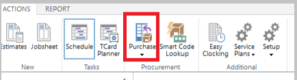
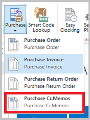
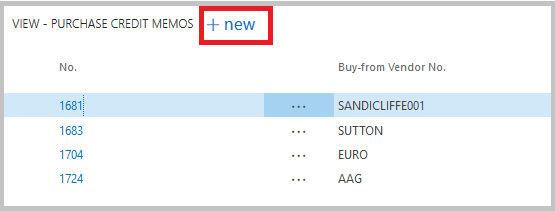
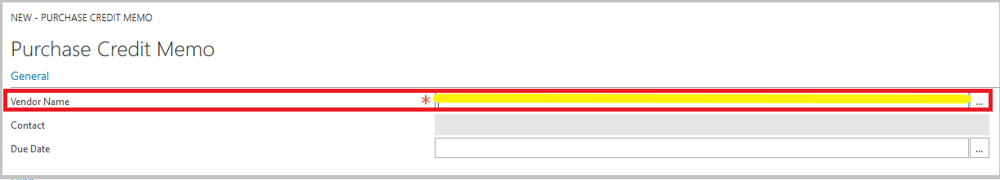
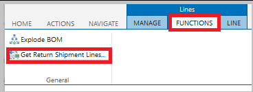
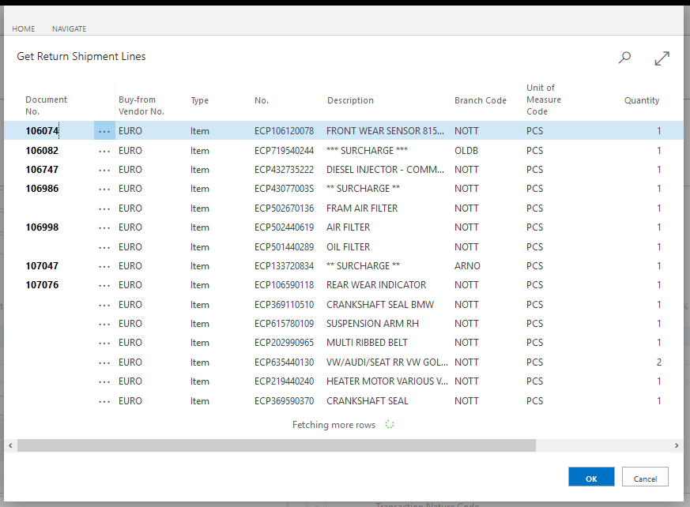
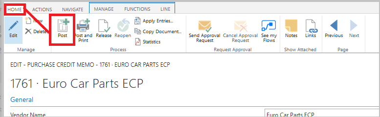
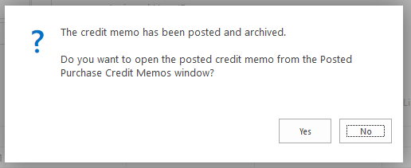

#   Creating a Purchase Credit Memo when Parts have been shipped and credit note does not match Purchase Return Order.   

There are several ways in which to post a purchase return order after the parts have been shipped. 

Firstly, if the credit note matches the parts within the purchase return order, you can simply, Post, Ship and Invoice. 

Alternatively, if the parts shipped come back on two different credit notes, use the following steps: - 

*   From the home screen select the Purchase button within the *Ribbon*. 

*   Within the drop down box select **Purchase Cr. Memo.** 

*   Select **+ new**

*   Fill in Vendor Name. 

*   Along the top of the *Ribbon* select the *Functions* tab followed by the **Get Return Shipment Lines**. 

*   Find the relevant parts from the pop up box.  
        -   Repeat this step for each item on the Vendor Invoice.

*   Along the top of the *Ribbon* select the *Home* tab followed by the **Post** button. 

*   You will then see a pop up asking "Do you want to post the credit memo"  -  **Select Yes**

*   Another pop up will appear - **Select No**

