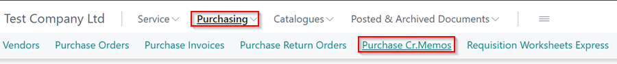

#   Creating a Purchase Credit Memo when Parts have been shipped and credit note does not match Purchase Return Order.   



There are several ways in which to post a purchase return order after the parts have been shipped. 

Firstly, if the credit note matches the parts within the purchase return order, you can simply, Post, Ship and Invoice. 

Alternatively, if the parts shipped come back on two different credit notes, use the following steps: - 

*   From the home screen select the **Purchasing** button followed by **Purchase Cr.Memos**. 

*   Select **+ new**

*   Fill in Vendor Name. 

*   Within the Lines section of the Purchase Credit Memo, ensure **More Options** is selected. 

*   Select **Functions** followed by **Get Return Shipment Lines**.  

*   Find the relevant parts from the pop up box and select **Ok**.  
        -   Repeat this step for each item on the Vendor Invoice.

*  This will add all the parts onto the Purchase Credit Memo. 

*  Once you have all of the parts from the Credit Note from your supplier on the Purchase Credit Memo. Select **Posting** followed by **Post**.  

*   You will then see a pop up asking "Do you want to post the credit memo"  -  **Select Yes**

*   Another pop up will appear - **Select No**

