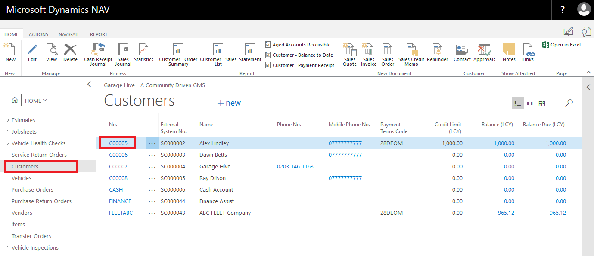
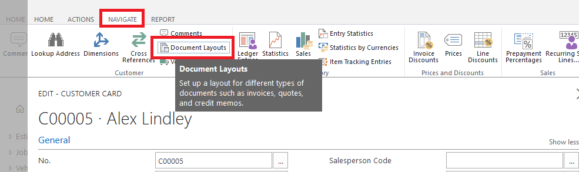
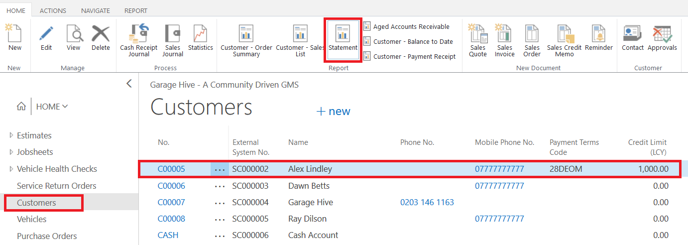
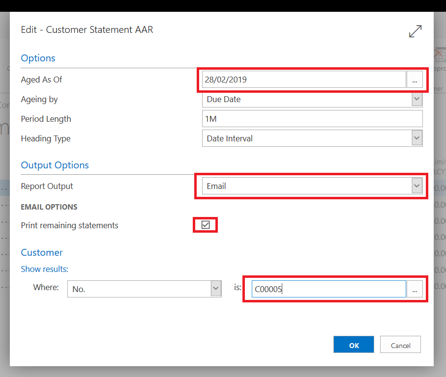

# How to setup customer card's to email statements



You can email customer statements directly from Garage Hive, to do this you need to complete some setup in the customer card. 

The default email address you enter on the homepage of a customer card isn't the email address that the statement will be emailed to. **You must complete the following set up for the statement email function to work.** 

Open the customer card, select Navigate and open "Document Layouts"

You must use the following settings - 

* **Useage** - Customer Statement
* **Report ID** - 25006973
* **Report Caption** - Customer Statement AAR
* **Custom Layout Description** - Blank
* **Sent To Email** - Customers Email
* **Use for Email Body** - Blank
* **Email Body Layout Description** - Blank

When running the statement report, selecting the "Report Output" to "Email" will now email the customer statement. 

# How to email statements

Emailing statements is achieved using the same report as printing statements. 

Go to your list of customers, in the action bar find the "Statement" report. 

Set the "Aged As Of" date to the date you want to run the statement from, typically the end of the previous month. 

Change the "Report Output" to "Email"

Tick the "Print Remaining Statements" if you are running statements for multiple customers, this will produce a PDF of all customers that don't have an email set. 

If you want to email a particular customer, make sure you enter the customer's account number at the bottom of the report. 

# See Also
[How to Print Statements](/docs/garagehive-statements-how-to-print.html "How to print Statements")
