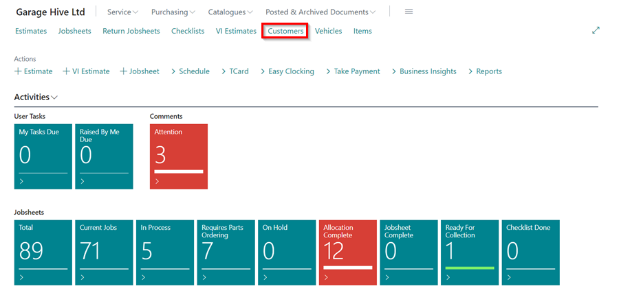
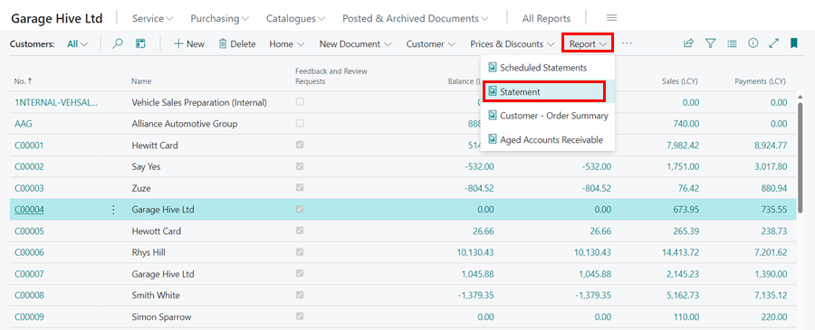

# How to Email Customer's Statements 
You can email customer statements directly from Garage Hive, but you must first complete some setup in the customer card.

## In this article
1. [How to setup customer cards to send statements via email](#how-to-setup-customer-cards-to-send-statements-via-email)
2. [Sending customer statements via email](#sending-customer-statements-via-email)

### How to Setup Customer Cards to Send Statements via Email



To setup the customer card:
1. First select **Customers** from the Role Centre, and then select the specific **Customer Card** to setup.

   

2. Select **Customer** from the menu bar in the customer card, followed by **Document Layouts** in the submenus.

   

3. Fill in the following settings as indicated:
   * **Usage** - Customer Statement
   * **Report ID** - 25006141
   * **Report Caption** - Customer Statement AAR
   * **Custom Layout Description** - *Leave it blank*
   * **Send To Email** - Customer's Email
   * **Use for Email Body** - *Leave it blank*
   * **Email Body Layout Description** - *Leave it blank*

   

   

4. When running the statement report, changing the **Report Output** to **Email** option will now email the customer statement.
   
### Sending Customer Statements via Email
To send the customer statement via email:
1. Select the **Customers** list from the Role Centre, choose **Report** from the actions bar, and then select **Statement**.

   

2. Select **Aged As Of** as the date you want to run the statement from. Typically, this should be the date from which you still have outstanding invoices from the customer. In this case, we'll use the end of the previous month.
3. The **Aged By** field can be set to the **Due Date**, **Posting Date**, or **Document Date**. This specifies the end date for running the statement. In this case, we will select **Due Date**.

   

4. Select the **Period Length** for which you want to view the statement. For days, use **D**, such as **5D**, for months, **M**, such as **1M**, and for years, **Y**, such as **1Y**.
5. Choose the **Heading Type** as either **Date Interval**, which will appear as **01/12/21...31/12/21**, or **Number of Days**, which will appear as **1 - 31 days** on the balance amounts heading.
6. Select **Email** as the **Report Output** under **Output Options**.
7. Select the **Print Although Email is Missing** slider if you are running statements for multiple customers; this will produce PDF statements of all customers that don't have an email setup yet. 
8. If you want to email a particular customer, make sure you enter the customer's account number at the **Filter: Customer** field.
9. Click the **OK** button. The statement will now be sent to the customer that has an email setup.

   

 

# See Also
[How to Print Statements](/docs/garagehive-statements-how-to-print.html "How to print Statements")
