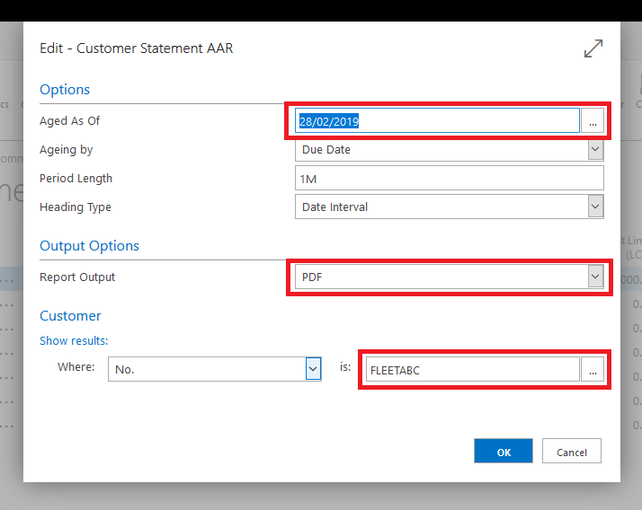

# How to Print Statements



You can print or email statements to customers.

Go to your list of customers - In the action bar find the "Statement" report. 

Set the "Aged As Of" date to the date you want to run the statement from, typically the end of the previous month. 

Change the "Report Output" to your desired output.

Tick the "Print Remaining Statements" if you are running statements for multiple customers via email, this will produce a PDF of all customers that don't have an email set. 

If you want to print a particular customer, make sure you enter the customer's account number at the bottom of the report. 

# See Also
[How to Email Statements](/docs/garagehive-statements-how-to-email.html "How to email Statements")
