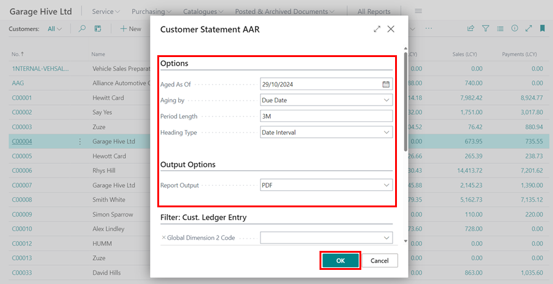
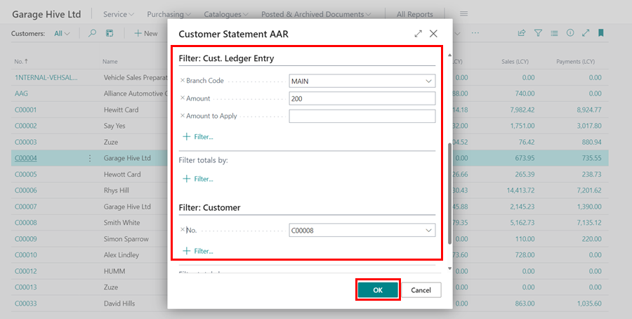
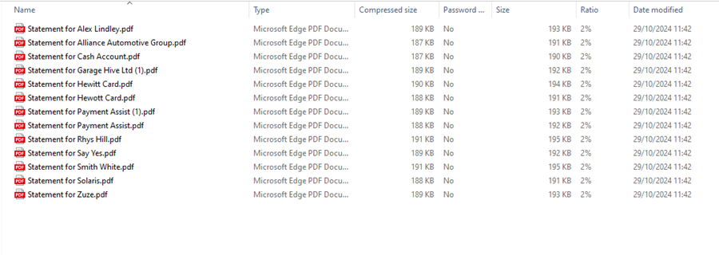

# How to Print Customer Statements
To print customer statements:
1. From the Role Centre, select **Customers**.
2. On the **Customers** list page, Choose the customer whose statement you wish to print, then click on **Report** from the menu bar and choose **Statement**.

   

3. Choose **Aged As Of** as the date the statement should be run up to. This date should typically reflect the ending date for the statement. For instance, if you want to view invoices up to the present day, choose today's date.
4. The **Aged By** field can be set to the **Due Date**, **Posting Date**, or **Document Date**. This specifies the end date for running the statement. In this case, we will select **Due Date**.
5. Select the **Period Length** for which you want to view the statement. For days, use **D**, such as **5D**, for months, **M**, such as **1M**, and for years, **Y**, such as **1Y**.
6. Choose the **Heading Type** as either **Date Interval**, which will appear as **01/12/21...31/12/21**, or **Number of Days**, which will appear as **1 - 31 days** on the balance amounts heading.
7. Select **Print**, **Preview**, **PDF**, **Email**, **Excel**, or **XML** as the **Report Output** under **Output Options**. In this case, we'll use **PDF**.

   

8. You can now **Filter** the **Customer Ledger Entry** based on your preferences, such as **Branch Code**, **Amount**, **Amount to Apply**, and so on.
9. You can also filter the statement based on the ***Customer** details if you only want to see for one customer under the **Filter: Customer** field or leave this field blank if you want to view statements for all customers. Select the **OK** button.

   

10. The statement(s) will now be ready. In this case, the statements will be downloaded as a **Zip file** for all of your customers, which you can open and **Print**.

   

[Go back to top](#top)

 

# See Also
[How to Email Statements](/docs/garagehive-statements-how-to-email.html "How to email Statements")
