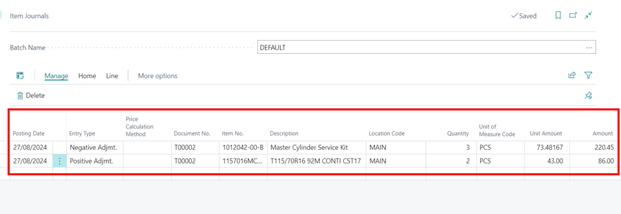
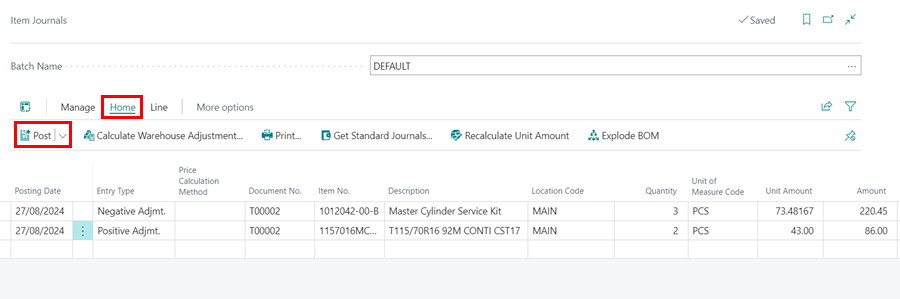

# How to carry out Stock Adjustments 
Stock adjustment is required when there are discrepancies between the Physical Stock count and the System Stock count. This corrective measure ensures the accuracy of the stock count by addressing confirmed physical discrepancies. The following procedure describes how to make stock adjustments in Garage Hive:

1. In the top-right corner, choose the  icon, enter Item Journals, and select the related link.
1. If you are doing this for the first time, In the **Batch Name** field, select the ellipsis (...), and click on **Edit List**.

   

1. Ensure that the batch name is set to **Default**.

   

1. Enter the **Posting Date** as the date you want the adjustment to be recorded. In the **Entry Type** select **Positive Adjmt.** to increase the stock, or **Negative Adjmt.** to decrease the stock in the system.
1. Select the item to adjust in the **Item No.** column, enter the **Location Code** for the item, and enter the number of items to adjust in the **Quantity** column.
1. If you want to adjust the item cost too, enter the new cost in the **Unit Amount**.

   

1. Add as many items as you need, specifying whether it’s a Negative or Positive adjustment.
1. When done, select **Home** from the menu bar, followed by **Post**.

   

1. Click **Yes** in the pop-up notification.

   

1. The stock will now be successfully adjusted.
