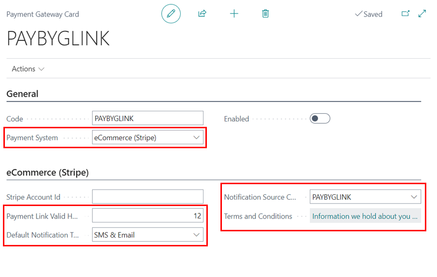
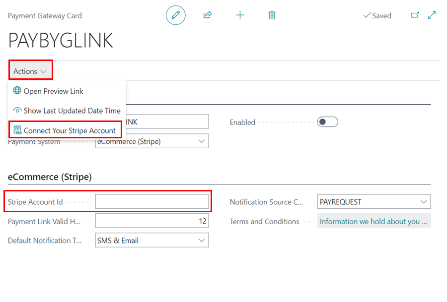
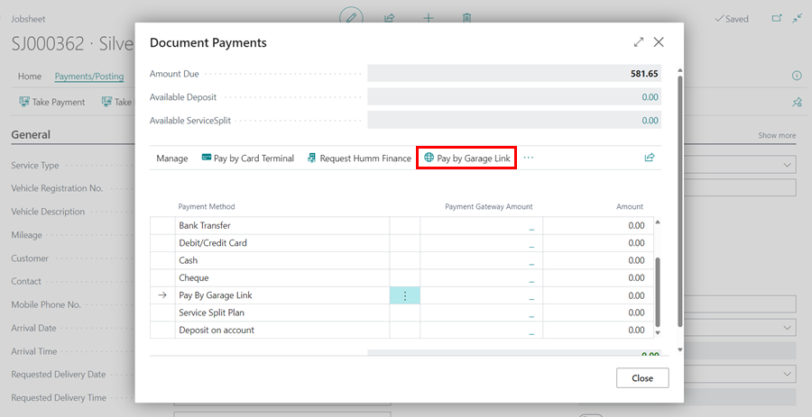
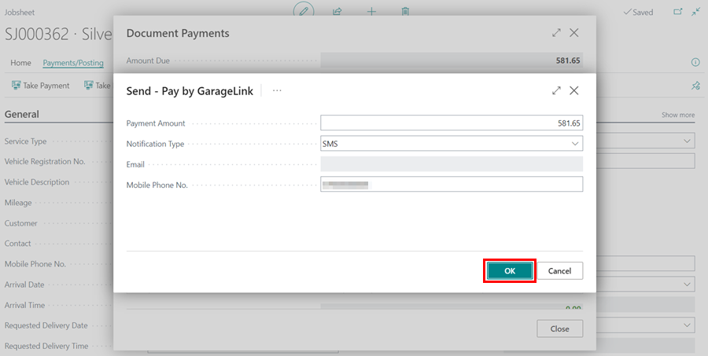
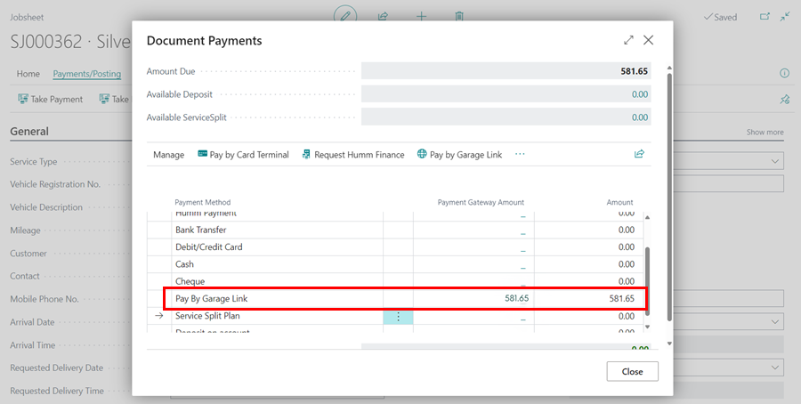

# We are still working on this article!
We are currently reviewing this article before it is published, check back later.

# Setting Up Payment by Garage Link for Stripe in Garage Hive

## In this article
1. [Setting Up Payment with Stripe](#setting-up-payment-with-stripe)
2. [Take Payment using Stripe Payment Method](#take-payment-using-stripe-payment-method)

### Setting Up Payment with Stripe
Garage Link for Stripe is a payment gateway used for online transactions powered by **Stripe**. Before setting it up in the Garage Hive system, make sure you've created a Stripe account at [stripe.com](https://dashboard.stripe.com/register). To set up Garage Link for Stripe in Garage Hive:
1. In the top-right corner, choose the  icon, enter **Payment Gateways**, and choose the related link.

   

2. On the **Payment Gateways** page, click to open and edit the **PAYBYGLINK** payment gateway.

   

3. In the **Payment Gateway Card**, set the **Payment System** to **eCommerce (Stripe)**.
4. In the **eCommerce (Stripe)** section, specify how many hours the payment link should be valid for in **Payment Link Valid Hours**. Choose the **Default Notification Type**, set the Notification **Source Code** to **PAYBYGLINK**, and enter your **Terms and Conditions** in the provided field.

   

5. To get your **Stripe Account ID**, click on **Actions** from the menu bar and choose **Connect Your Stripe Account**. 

   

6. You will be redirected to the **Stripe** dashboard. Follow the instructions until your **Account ID** is displayed. Copy it and return to Garage Hive.

   

7. Paste the **Account ID** in the **Stripe Account ID** field, and click on the **Enabled** slider to enable the payment method in your system.

   

[Go back to top](#top)

### Take Payment using Stripe Payment Method
To take payment using **Stripe** from a document:
1. Select **Payments/Posting** from the menu bar, and choose **Take Payment**.

   

2. In the **Document Payments** page, click on **Pay By Garage Link** in the menu bar.

   

3. Select **Stripe** in the next page, and click **OK**.

   

4. Enter the **Payment Amount** (the default is the total document amount), choose the **Notification Type**, and provide the **Email or Mobile Phone No.** for the notification. Click **OK**.

   

5. The customer will receive a **Payment Request** message with a link for the payment.

   

6. When the customer clicks the link, they will be taken to a payment page where they can enter their card details and complete the payment.

   

7. The payment will now be updated in the **Payment Gateway Amount** for Stripe. Enter the amount paid in the **Amount** column, and close the **Document Payments** page.

   

[Go back to top](#top)