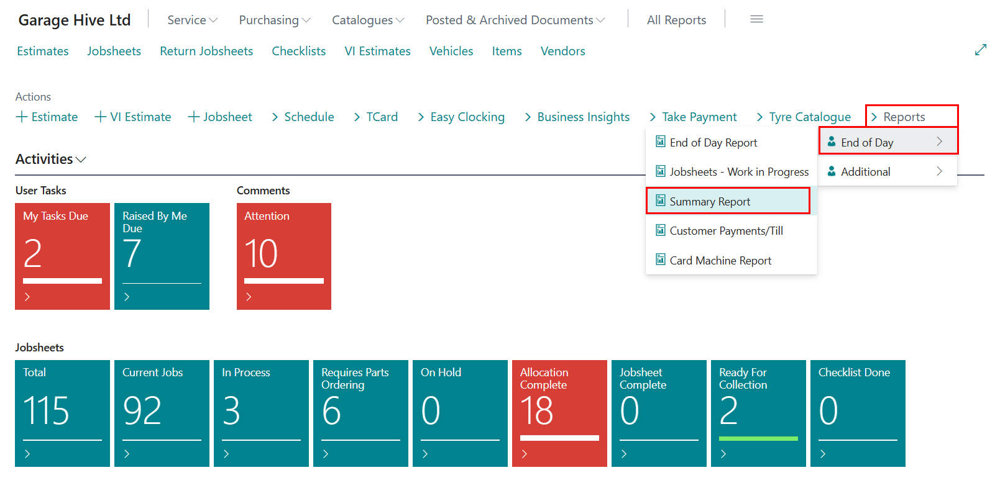
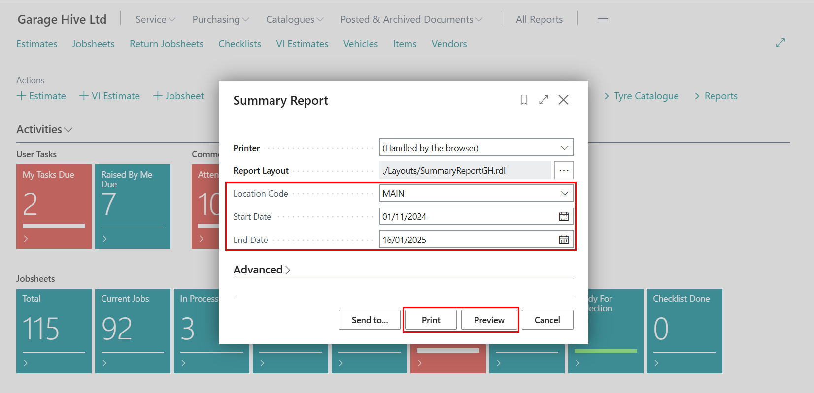

## Summary Report 
The **Summary** report provides an overview of Sales, Technicians, and Purchases insights for a specified time period. It includes details on labour sales, technician working hours, outstanding purchase orders, and other related information. Here is how to open the report:
1. In the the Role Centre, select **Reports**, followed by **End of Day** and then **Jobsheets - Work in Progress**. 

   

2. Choose the **Location Code** and specify the period you want to view by entering the dates in the **Start Date** and **End Date** fields. 

   

3. Once generated, the Summary report will display several figures for the selected date range, including:
   * Labour Sales Total
   * Parts/Tyres Sales
   * External Service Costs
   * Gross Takings
   * Costs
   * Gross Profit

4. Additionally, it provides detailed information for each technician, such as:
   * Hours Worked
   * Labour Hours (Sold)
   * Jobs Completed (Invoiced)
   * Labour Sales
   * Productivity Efficiency %
   * Recovery Rate

     

   

